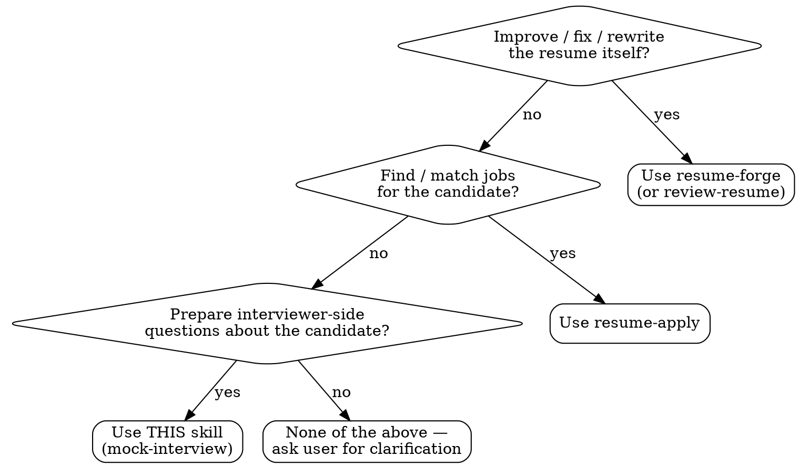
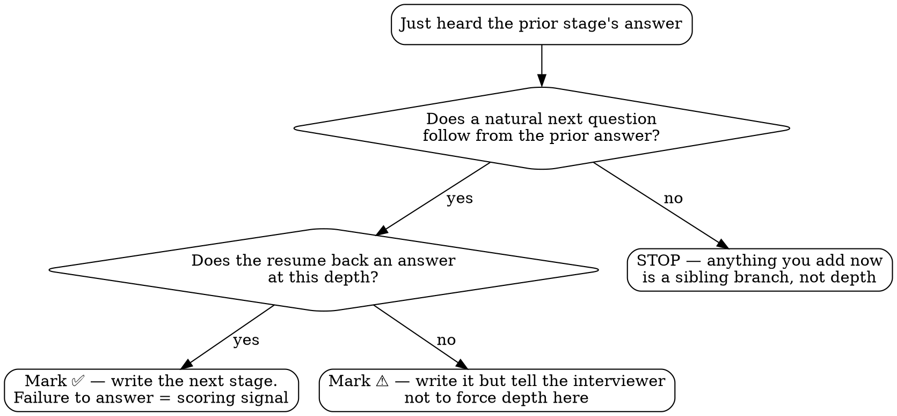

# Mock Interview Questions

## Overview

Generate **interviewer-side** mock-interview question sets from a candidate's resume, with drill-down chains that probe each main question to 2–3 deeper levels.

**Core principle**: Each follow-up question must be a natural next question to the candidate's *previous answer*. Same thread, one level deeper — not a different branch.

**This is a collaborative co-design process with the interviewer, NOT a one-shot generator.** The two rules below are mandatory and define how this skill works.

## Rule 1 — Co-Design + Council, Not One-Shot (Mandatory)

Default LLM behavior is to silently produce a finished question set in one shot, then stop. **That is the #1 failure this skill prevents.** Two disciplines, neither opt-in:

### 1a. Per-question ping-pong with the interviewer

Do not dump a finished set. Build it *with* the interviewer, question by question. For each question, surface your decision rationale — direction, expected answer keywords, and resume evidence (not hidden chain-of-thought) — and get the interviewer's input BEFORE finalizing:

- **Direction**: "이 질문 이런 방향(키워드 X)으로 가려는데 어때?"
- **Follow-up candidates**: "이 답변 다음 꼬리질문 후보가 (A) …, (B) … 인데 뭐가 더 좋아?"
- **Happy-case keywords + evidence**: "이 질문엔 이런 키워드로 답이 나와야 할 것 같고, 이력서 근거가 X라서 ✅(또는 ⚠️)로 봤는데 동의해?"

Incorporate the interviewer's answer, then move on. You may batch the stages of ONE chain (one area) into a single checkpoint message, but **never batch multiple areas or the full set, and never ask for a blanket rubber-stamp** — each stage's direction / keywords / evidence must be individually visible and individually confirmable, and you wait for per-stage feedback before the next area. **The process and its granularity ARE the product** — the interviewer's domain judgment is what makes the keywords and evidence correct.

### 1b. Council validation to unanimous APPROVE

Send the interviewer-agreed draft through a multi-model council on the 10 review axes (see `references/council-iteration.md`). **Default path**: iterate to unanimous APPROVE, bringing each round's conflicts back to the interviewer. **Explicit opt-out path**: run exactly one council round silently — auto-apply verified factual-error fixes and consensus fixes, no user arbitration — then ship. This is the DEFAULT final step, not a conditional gate.

### The only opt-out

The interviewer *explicitly* says "빠르게 / 그냥 한 번에 / 알아서 다 만들어줘". The bare filler "그냥" alone (e.g., "그냥 질문 좀 뽑아줘") is a casual discourse marker, NOT an opt-out. Even on a real opt-out, run **exactly one silent council round** — auto-apply verified factual-error fixes and consensus fixes, no user arbitration, then ship; never zero. Factual errors are never waved through in fast mode. Absent an explicit signal, ping-pong and council are the default.

| Rationalization | Reality |
|-----------------|---------|
| "User asked casually, so just produce it in one shot" | Ping-pong is default. No explicit "빠르게" → ping-pong. |
| "Council takes time, skip it" | Council is default. The only opt-out is an explicit user signal. |
| "Asking per question is too much" | That granularity IS the deliverable. Skipping it produces keywords/evidence the interviewer never validated. |
| "I'll show the whole draft, then they can edit" | One-shot-then-edit is not co-design. Surface direction/keywords/evidence per question, before finalizing. |

## Rule 2 — Drill-down Chain ≠ Branching Tree

Default LLM behavior is to produce a branching tree when asked for "3-level follow-ups." That is wrong.

| Wrong (branching tree) | Right (drill-down chain) |
|------------------------|--------------------------|
| Q → Q-A / Q-B / Q-C (3 keyword branches) → each branches again | Q → natural next question from Q's answer → natural next question from that answer → … |
| Interviewer jumps onto a different path based on answer keyword | Interviewer goes one level deeper on the same thread |
| Tree depth = 2–3, but each path is shallow | Chain depth = 2–3, each level deepens the same topic |

**Test**: If Q3 would still make sense without hearing the Q2 answer, it is a sibling branch, not a depth chain.

## When to Use — Skill Selection Decision

Resume-related skills overlap on keywords. Use this flowchart to choose the right one.



Triggers that map to THIS skill:
- User provides a resume (PDF/markdown) and asks for interview questions
- User mentions "꼬리질문 / follow-up questions / drill-down / 2단계 / 3단계 깊이"
- User wants to prepare to interview a candidate (NOT to be interviewed)

## Workflow

```
1. Read the resume. If PDF/image, emit a markdown rendering as Part 1 of the deliverable. If already markdown, reference directly.
2. Extract project-by-project facts.
3. Identify 5–10 candidate high-signal areas (trade-off decision, design rationale, or operational depth).
   → PING-PONG: present the area list, ask "이 영역들 어때? 더 팔 곳 / 뺄 곳?" Incorporate before continuing.
4. For each agreed area, present the chain as ONE checkpoint (Rule 1a batching): show the Main question and each stage — direction / happy-case keywords / evidence / ✅⚠️ marker individually visible — and wait for the interviewer's per-stage feedback before moving to the next area. Apply the Chain Depth Decision flowchart per stage; stop the chain when it says stop (depth 2 with ⚠️ is normal). Never rubber-stamp a whole chain; never batch multiple areas into one checkpoint.
5. Assemble the agreed draft per Required Deliverable Structure (incl. [Interviewer Guide] blocks, 1-page summary).
6. COUNCIL VALIDATION (default): load references/council-iteration.md via Read tool, run council on the 10 review axes, iterate to unanimous APPROVE, bring each round's conflicts back to the interviewer. (If the interviewer opted out: run exactly one silent council round — auto-apply verified factual-error fixes and consensus fixes, no user arbitration — then ship.)
7. Ship after unanimous APPROVE (or the interviewer explicitly stops).
```

> Steps 3, 4, and 6 are interactive. Do NOT run 1→7 silently and present a finished artifact unless the interviewer explicitly opted out ("빠르게 / 그냥 한 번에 / 알아서 다 만들어줘" — bare "그냥" alone does NOT count).

## Chain Depth Decision

The most common per-chain failure is grinding to stage 3 when the resume cannot support it. Use this flowchart at each potential next stage.



**Rule**: Going deeper than the resume supports is not "thoroughness" — it forces the candidate to invent answers under pressure, inflating false negatives.

## Anatomy of a Good Stage

Use numeric main-question IDs (`Q1`, `Q2`, …). Never use letter suffixes (`Q-A`, `Q-B`, `Q-C`) — those signal sibling branching, which Rule 2 forbids.

```markdown
### Q{n} → stage-{N} drill-down (✅ or ⚠️)

> [Natural next question from the prior stage's expected answer]

**Why this question is natural**: [1-2 sentence rationale referencing the prior answer thread]

**Happy-case answer keywords**
- [Concrete senior-discriminating points]
- [Operational signals — not buzzwords]
- *(Bonus, if mentioned spontaneously)* [Vendor / framework nuance — extra credit only; absence is not a scoring penalty]

**Resume evidence**: [Direct quote from resume OR explicit "depends on candidate's operational judgment" if ⚠️]
```

## Marker Convention (Mandatory)

Every drill-down stage MUST carry exactly one marker:

| Marker | Meaning | Interviewer Implication |
|--------|---------|-------------------------|
| **✅** | Directly stated in resume — candidate has evidence to answer | Failure to answer is a scoring signal |
| **⚠️** | No direct resume backing — general operational knowledge area | Failure to answer is normal; do not force chain deeper |

**Why this matters**: Without markers, the interviewer applies the same expectation to backed and unbacked stages — producing false negatives in ⚠️ areas.

**Mixed-backing stage** (happy-case keywords mix resume-direct facts with operational-judgment items): set the marker to the **weakest backing level** (conservative), OR move operational items into a `*(Bonus, if mentioned spontaneously)*` sub-bullet so the stage body stays ✅. Both are legitimate. **Leaving the stage marked ✅ while mixing in unbacked keywords is unsafe** — the interviewer will hold the candidate to ✅-grade expectation on items the resume does not actually back.

## Happy-case Keyword Rules

Keywords must be **senior-discriminating**, not surface vocabulary:

- ✅ "queue capacity = arrival rate × allowable wait (Little's Law)" — dimensional reasoning
- ❌ "ThreadPoolExecutor", "queue", "backpressure" — buzzword soup

**Three layers per stage**:
- **Primary** — average expected answer
- **Strong senior signal** — vendor nuance, dimensional analysis, anti-pattern recognition
- *(Bonus, if mentioned spontaneously)* — extra credit; absence is not a scoring penalty

**Anti-pattern trap handling**: When candidates commonly pick a wrong option (e.g., `CallerRunsPolicy` breaks HTTP-pool isolation), keep that option visible in the keyword list AND attach a separate `[Interviewer Guardrail]` probe to verify the candidate recognizes the trap.

## Question Framing — Real Facts, Not Hypotheticals

When asking about something the candidate may not have done, the tempting escape is the hypothetical — "If X had been the case, then …". Avoid it:

- Hypotheticals collapse to zero signal when the candidate says "that didn't apply to me" — nowhere to go next.
- The candidate reasons on top of an invented premise, weakening discrimination.

**Pattern**: ask a factual question, then let the chain naturally terminate or deepen based on the answer.

```markdown
> Did the external site's webhook retry policy depend on your response code?

[Interviewer Guide — follow-up]
- "No, they didn't retry on response code" → chain naturally terminates (normal). Move to next area.
- "Yes, they retried based on response code" → enter the deepening question:
  "How did you respond on 0 affected rows to avoid retry storms?"
```

One answer signals termination, the other deepening. Both are valid signals. Hypothetical framing forces both onto the same path and loses the signal.

## Visual Separation for Multi-Question Stages

When a stage naturally contains 2+ questions, **do not put them in a single quote block** — the interviewer reads them aloud in one breath.

```markdown
**[Interviewer Guide — first utterance]**
> [Question 1]

[Happy-case keywords for Q1]

**[Interviewer Guide — second utterance (only if Q1 answer is sufficient)]**
> [Question 2 — natural deepening from Q1 answer]

[Happy-case keywords for Q2]
```

Conditional deepening uses a yes/no gate:

```markdown
**[Interviewer Guide — yes/no gate]**
> [Yes/no question]

**[Interviewer Guide — follow-up handling]**
- "No" → chain naturally terminates (normal)
- "Yes" → proceed to the next utterance
```

## Fact-Check High-Risk Areas

Common LLM factual errors. Verify before including in happy-case keywords:

| Area | Common error | Accurate fact |
|------|-------------|---------------|
| MySQL `GET_LOCK()` | "No auto-release" | Connection-scoped auto-release on session termination. Real issue: no lease/TTL, so the lock can stay held when the owning session hangs or its connection leaks without closing |
| `jmap` | "Deprecated" | Per Oracle JDK docs, classified as experimental/unsupported (not deprecated). `jcmd` preferred |
| MySQL composite index + range | "Only first column in key_len" | `key_len` includes the equality prefix **plus the first range column**. The second range column is a post-filter (ICP / `Using where`) |
| Queue capacity sizing | "Processing time × wait time" (dimensional error: time²) | **Arrival rate × allowable wait** (Little's Law, L = λW) |
| `CallerRunsPolicy` | "Normal backpressure choice" | When the isolated pool is reached from an HTTP/Tomcat thread, this defeats the isolation — anti-pattern |
| LLM zero-retry | "Zero-retry for all errors" | Major LLM vendors (OpenAI, Anthropic, etc.) officially recommend exponential backoff for `429 Rate Limit` — this is the exception |

This table is meant to grow. Add new factual pitfalls as you discover them.

## Domain Mapping — Optional, Opt-In Only

**Default: do not generate domain-mapping questions.** A company name in the resume/prompt is not a license to auto-generate domain-specific probes.

**Opt-in triggers**: "Map to company X context" / "Include domain-fit questions" / "Add [domain] mapping".

Bad mapping is worse than no mapping. Example: mapping medical-reservation concurrency to an exchange's matching engine is **the wrong analogy** — matching engines are single-threaded in-memory while reservation systems use distributed locks. The correct analog is balance-hold / withdrawal-limit. Verify entity and pattern correctness for every mapping.

## Required Deliverable Structure

1. **Part 1 — Resume body extracted as markdown**: For PDF/image resumes, render the resume content at the top (personal info, experience, projects, activities). Interviewers cross-check facts without reopening the PDF.
2. **Part 2 — Areas (5–10)**: Main → stage-1 → stage-2 → (stage-3 if backed). Every stage carries a marker.
3. **Interviewer Usage Guide**: Progression principles, area priority, time allocation for 60/90-minute modes.
4. **1-page Compressed Summary** (table): area name, main one-liner, drill-down stages, time — scannable at a glance.
5. **Red / Green Flag Checklist**: signals for evaluating responses.

## Council Validation (Default Final Step)

**This is the corrected design.** Earlier versions made council an opt-in "quality gate" — that was wrong. Council is the DEFAULT final step.

Send the interviewer-agreed draft through a multi-model council on the **10 review axes** (chain naturalness, resume-backing accuracy, happy-case senior discrimination, factual accuracy, depth appropriateness, utterance separation, difficulty calibration, question fairness, domain-mapping accuracy, area coverage — full definitions in `references/council-iteration.md`).

**Do not expect one round.** Typically 3–7 rounds. "round-2-pass + minor polish" ≠ ship-ready.

**The only opt-out**: interviewer explicitly says "빠르게 / 그냥 한 번에 / 알아서 다 만들어줘" (bare "그냥" alone does NOT count). Even then, run **exactly one silent council round** — auto-apply verified factual-error fixes and consensus fixes, no user arbitration — then ship. Opt-out reduces ping-pong and iteration depth; it never skips the first factual round.

**REQUIRED**: load `references/council-iteration.md` via the Read tool. Do not run council from memory — the strict prompt format, the 10 review axes, feedback triage, conflict→user-interview, and stop conditions all live there.

## Common Rationalizations (Stop Signals)

| Excuse | Reality |
|--------|---------|
| "User asked casually — produce it in one shot" | Ping-pong is default. No explicit "빠르게" → ping-pong per question. |
| "Council takes time — skip it" | Council is the default final step. Opt-out requires an explicit user signal. |
| "A tree structure is richer" | The user specified a chain. Richness comes from depth, not sibling branches. |
| "Listing keywords is enough" | Keyword lists become buzzword soup. Operational signals, dimensional reasoning, vendor nuance discriminate seniors. |
| "Company name appeared — auto-add domain mapping" | Domain mapping is opt-in. Auto-adding produces bad analogies and gets rejected. |
| "This fact is common knowledge" | See the fact-check table. LLMs get these wrong often. |
| "The interviewer will know to break it up" | A single visual block gets read aloud as one block. Use [Interviewer Guide] separators. |
| "All stages must reach depth 3" | Depth 3 is a ceiling, not a floor. Stopping at depth 2 is normal — the ⚠️ marker signals it. |

## Red Flags — Stop and Restart

If any of these appear, **stop and correct**:

- Presenting a finished question set in one shot without per-question ping-pong (and the user did NOT opt out)
- Shipping without council validation — the default path requires council to unanimous APPROVE; opt-out fast mode requires exactly one silent round. Zero council rounds is ALWAYS a red flag.
- Finalizing direction / keywords / evidence without asking the interviewer "이거 어때?"
- Sibling-branch notation (`Q-A`, `Q-B`, `Q-C` used as follow-ups)
- Any stage without a marker
- Two or more questions packed into a single quote block
- Domain-mapping area present when the user did not request one
- Happy-case lists that are buzzword soup
- All areas uniformly reach depth 3 regardless of resume backing strength

## Bottom Line

This skill is a collaborative co-design loop, not a generator. Build the question set *with* the interviewer one question at a time (Rule 1a), keep every follow-up a true depth chain (Rule 2), then validate to unanimous council APPROVE (Rule 1b). The process and its granularity are the product — a finished artifact dumped in one shot, however polished, is the failure mode this skill exists to prevent.
