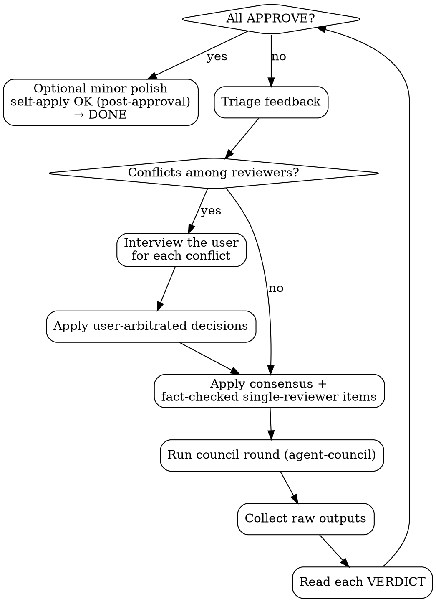

# Council Iteration — Process Rules

> **Reference for**: the `mock-interview` skill's DEFAULT council-validation step (Rule 1b). Council to unanimous APPROVE is the default final step, **NOT a conditional gate**. The multi-round *loop pattern* below is reusable for other quality-critical artifacts (designs, specs, PRs), but the review axes are interview-question-specific — other skills must substitute their own axes.
>
> **Underlying mechanism**: the `agent-council` skill (single-round `start` / `collect` / `clean` infrastructure). This reference is the multi-round policy layer on top of it.

## When to Apply This Reference

**For `mock-interview` (the default path)**: ALWAYS apply, after the interviewer-agreed draft. Council to unanimous APPROVE is the default — there is no "should I run council?" decision. The ONLY fast-mode exception is the interviewer's explicit `빠르게 / 그냥 한 번에 / 알아서 다 만들어줘` signal (bare "그냥" alone does NOT count). Even then, do NOT skip council: run **exactly one silent council round** — auto-apply verified factual-error fixes and consensus fixes, no user arbitration — then ship. Opt-out reduces ping-pong and iteration depth; it never skips the first factual round.

**For other artifacts (only when this loop pattern is reused outside this skill)**: apply under these optional triggers —
- The user explicitly asked to **iterate**: "반복", "다시 리뷰", "받아내야지 승인까지", "iterate", "run council again"
- The user said "high quality output needed" AND the artifact is non-trivial
- A single `agent-council` round returned `round-2-pass` / "ship with minor polish" / `NEEDS_REVISION`
- You are tempted to self-apply minor polish and ship — the exact case this loop prevents
- Skip only for trivial artifacts, genuine time-critical fixes, or objective single-review tasks (lint, compile)

## The Iron Rule — Unanimous Unconditional APPROVE Only

```
"round-2-pass with minor polish" ≠ APPROVE
"approve with caveats" ≠ APPROVE
"ship as-is acceptable but consider X" ≠ APPROVE

UNANIMOUS APPROVE = every reviewer outputs exactly APPROVE in Section 1.
```

**Anything less = NEEDS_REVISION = run another round after applying fixes.**

> **APPROVE with a non-empty WEAKNESSES section is still APPROVE.** Section 3 (WEAKNESSES) is mandatory even on APPROVE to surface nuance — those items are non-blocking optional polish, NOT conditions. Do not re-classify an APPROVE as NEEDS_REVISION because its WEAKNESSES list is non-empty; that creates an infinite loop. The Section 1 verdict token is what counts. Exception: if a WEAKNESSES item under an APPROVE verdict cites a verifiable factual error, apply it as post-approval polish before shipping — the fact-check override still holds; it just doesn't re-open the loop.

This is the single most violated rule. Default behavior treats "round-2-pass" or "approve with optional polish" as ship-ready. It is not.

## Strict Prompt Format Per Round

Every council round MUST require reviewers to produce these exact sections (machine-parseable):

```markdown
### Section 1: VERDICT
APPROVE | NEEDS_REVISION  (uppercase, single token, no qualifiers)

### Section 2: PROS
3–5 specific strengths.

### Section 3: WEAKNESSES (mandatory even if APPROVE)
What is still suboptimal? Quote the source.

### Section 4: IMPROVEMENT ACTIONS
For each weakness: concrete edit. Format:
[Area X] Current "..." → Replace "..." or [structural action].

### Section 5: ANTICIPATED DISAGREEMENTS
Self-flag points where you expect other reviewers may disagree. State your defense.

### Section 6: PRIORITY OF EDITS (skip if APPROVE)
P0 / P1 / P2.
```

**Why mandatory WEAKNESSES even at APPROVE**: surfaces nuance reviewers would otherwise hide. Often the most useful signal.

**Why mandatory ANTICIPATED DISAGREEMENTS**: lets you identify conflicts in a single round instead of discovering them after the next round.

## The 10 Review Axes (Interview-Question-Specific)

When validating an interview-question artifact, the council prompt MUST instruct reviewers to evaluate along these 10 axes. Each was discovered to catch a distinct, recurring defect class. Drop an axis and that defect class slips through.

| # | Axis | What the reviewer checks | Defect class it catches |
|---|------|--------------------------|-------------------------|
| 1 | **Chain naturalness** | Is each stage a natural next question to the prior answer, or a sibling branch? Would stage-N still make sense without hearing stage-(N-1)'s answer? | Fake chains (branching disguised as depth) |
| 2 | **Evidence-line honesty** | Does each stage's Resume-evidence line honestly state whether it is anchored in the resume or probes past it? Any stage claiming a direct resume quote it does not actually have? | Mislabeled backing → interviewer misreads a failure |
| 3 | **Happy-case senior discrimination** | Are keywords operational signals / dimensional reasoning / vendor nuance, or buzzword soup? | Keyword lists that any buzzword-dropper passes |
| 4 | **Factual accuracy** | Any wrong technical fact in happy-case keywords? (Cross-check the Fact-Check High-Risk Areas table.) | Interviewer mis-scoring a correct candidate |
| 5 | **Depth appropriateness** | Does each chain drill to its natural terminus (solid ground or the edge of the candidate's knowledge), or stop short while a natural next question on the same thread still followed? Is any "deepening" actually a sibling branch? | Chains cut off before the Socratic collapse point |
| 6 | **Utterance separation** | Are multi-question stages split into [Interviewer Guide] blocks, or packed into one quote block? | Interviewer reads 3 questions aloud at once |
| 7 | **Difficulty calibration** | Is the difficulty right for the candidate's years of experience? Junior-too-shallow / staff-too-deep? | Wrong-level questions for the candidate |
| 8 | **Question fairness** | Any no-win gotcha or hypothetical-escape framing? Any question with no winning answer? | Unfair questions that punish good candidates |
| 9 | **Domain-mapping accuracy** (only if a mapping section exists) | Is each analogy technically correct? | Wrong analogies (e.g., reservation lock → matching engine) |
| 10 | **Area coverage / prioritization** | Are the selected 5–10 areas the highest-signal ones in the resume? Any glaring high-signal project omitted, or a low-signal area over-probed? | A set that passes axes 1–9 but probes the wrong third of the resume |

The council prompt should ask reviewers to score or flag findings per axis, not give a single undifferentiated verdict. This is what makes the WEAKNESSES section actionable.

## Process Loop



## Feedback Triage Rules

After each round, classify every feedback item into one of these buckets:

| Bucket | Definition | Action |
|--------|-----------|--------|
| **Consensus** | 2+ reviewers agree | Auto-apply |
| **Single-reviewer, fact-verifiable** | One reviewer cites docs/sources; the orchestrator can check | Verify → if true, auto-apply; if false, reject with a note |
| **Single-reviewer, opinion** | One reviewer's preference, not fact-checkable | Apply only if low-cost AND aligned with skill best practice |
| **Conflict** | 2+ reviewers prescribe different actions for the same issue | **Interview the user for arbitration — never decide silently.** (Opt-out fast mode only: drop the unresolved *opinion* conflict and ship the interviewer-agreed baseline draft plus the round's auto-applied consensus/factual-error fixes — no arbitration. If the conflict is rooted in a verifiable factual error, the fact-check override still applies — verify and fix before shipping.) |
| **Subjective ceiling** | All reviewers note a higher-ceiling possibility (e.g., "staff-level answer") | Optional; mention to the user but do not apply without consent |

**Fact-check override**: a single reviewer's NEEDS_REVISION based on a verifiable fact (e.g., "MySQL `GET_LOCK()` is connection-scoped") is **not rejected just because the other two said APPROVE**. Verify the fact. If true, apply. Other reviewers being wrong does not make the fact wrong.

## Conflict Detection — Use the ANTICIPATED DISAGREEMENTS Field

Reviewers self-flag where they expect disagreement. Treat that as a candidate-conflict list:
1. Cross-reference each self-flagged disagreement with the other reviewers' actual positions.
2. If two reviewers prescribe different actions for the same issue → **Conflict bucket**.
3. If only one reviewer flagged it and the others did not push back → Single-reviewer bucket.

Faster than scanning every paragraph for clashes.

## User Interview Format (Conflicts Only)

When a conflict goes to the user, present:

```markdown
## ⚠️ Conflict — your decision needed: [Topic]

**Option A (Reviewer X)**: [Position + rationale]
- Pros: ...
- Cons: ...

**Option B (Reviewer Y)**: [Position + rationale]
- Pros: ...
- Cons: ...

**Option C (combine both)**: [If feasible]

**My recommendation**: [Pick one with reasoning, but mark as recommendation only]

Which option?
```

Always offer a "do nothing / reject both" implicit option. Never present one option as the only path.

## When to Stop Iterating

Stop ONLY when:
1. Unanimous unconditional APPROVE across all reviewers, OR
2. The user explicitly says "ship now" / "stop iterating" / "good enough" — for this skill, the opt-out signal `빠르게 / 그냥 한 번에 / 알아서 다 만들어줘` maps here, but only after the mandatory single silent round, OR
3. Diminishing returns AND the user agrees to stop (cost-benefit interview with the user)

**Do NOT stop on:**
- "round-2-pass" / "approve with minor polish"
- Reviewer fatigue you imagine ("they probably won't find anything new")
- Cost concerns you decide unilaterally — ask the user

## Common Rationalizations (Stop Signals)

| Excuse | Reality |
|--------|---------|
| "round-2-pass is shippable" | If the user set the strict bar → NEEDS_REVISION. Bar lowering is the user's call only. |
| "Three polish items — I'll just self-apply and finish" | Self-apply + skip review = an unreviewed change shipped. Apply, then run council again. |
| "Asking the user every time is too noisy" | Consensus is auto-applied. The user is asked only on conflicts. Asking is cheap. |
| "This fact-check came from only one reviewer — reject" | If the source verifies, apply. Other reviewers missed it, not a vote. |
| "The next round costs tokens" | Without an explicit user signal to stop, this is your inference. Ask or proceed. |
| "Five rounds is enough" | Not until unanimous APPROVE. Without an explicit stop signal, keep going. |

## Red Flags — Stop and Restart the Loop

If any of these appear, re-examine the round you just completed:

- All reviewers said `round-2-pass` but the orchestrator reported `APPROVE`
- Polish self-applied and the same round labeled ship-ready
- A conflict resolved silently by orchestrator pick (no user interview)
- A single-reviewer NEEDS_REVISION rejected by vote (no fact verification)
- The `ANTICIPATED DISAGREEMENTS` field ignored
- Loop stopped at round N when N was never specified by the user

## Cost / Benefit Reality

- One council round: ~3–5 minutes, 3-model token cost. 3–7 rounds is in the normal range.
- One wrong self-decided ship: user's follow-up correction time + trust loss. **Much more expensive.**

This pattern optimizes for quality assurance, not for time or cost. To accelerate, get explicit user consent.

## Bottom Line

`agent-council` provides single-round advice. This reference turns that advice into a convergence loop. Without it, council calls end as "one-round advisory + self-judged ship," which falls short of the user's quality bar. With it, the council call becomes a real blocking checkpoint — a gate that actually gates, not the opt-in "quality gate" earlier versions wrongly made it.
