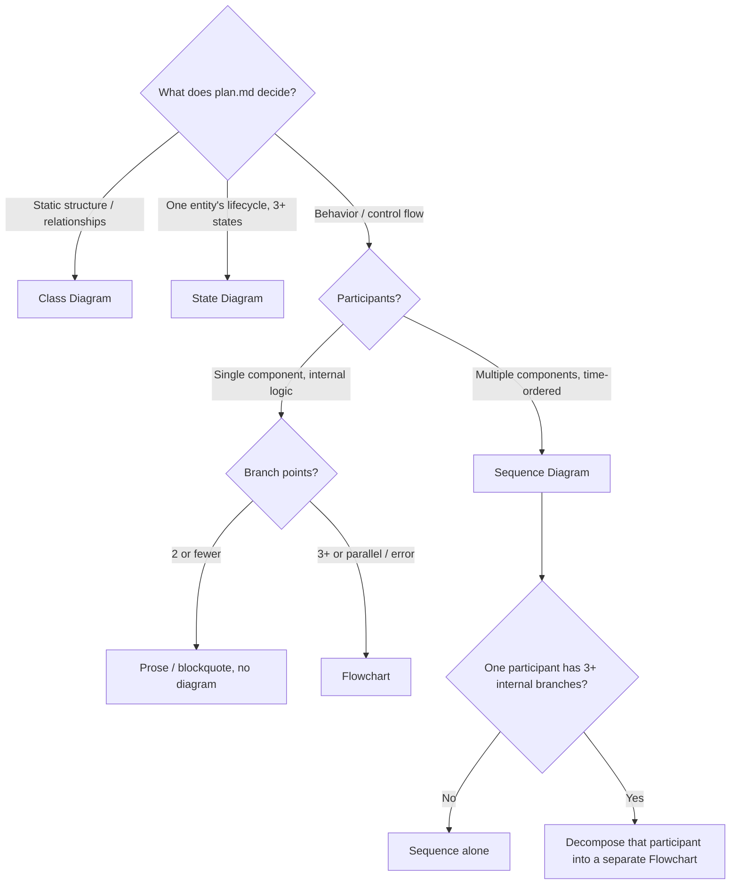

# Diagram Guide (Stage A)

Selection criteria and authoring rules for diagrams rendered in the Stage A HTML presentation. A diagram is **Readability Enrichment** — it makes flow or structure already decided in `plan.md` *visible*. It never authors plan content and never touches `plan.md` on disk.

## Stage A Fidelity Bounds (read first)

A diagram is the highest-density enrichment, so the fidelity bound is strictest:

- **Ephemeral only.** Diagrams render into the HTML presentation only. NEVER write a diagram or its source into `plan.md` — Invariant 3 keeps `plan.md` the unmodified single source of truth; every re-render redraws from it. Inject the ` ```mermaid ` fence into the render-time markdown string, not into the file on disk.
- **Re-visualize decided flow only.** Drawing an edge forces a commitment: who calls whom, in what order, which component owns what. If you cannot draw an arrow or relationship without making a decision `plan.md` did not already make, **STOP** — that is a plan defect, not a diagram opportunity. Return to revise the plan and re-run the pipeline; do not invent the missing edge at render time. A diagram can never be vaguer than the plan it visualizes.
- **MAY, never MUST.** The Necessity Test gates existence. Most plans need no diagram. *Exception*: the Stage A bird's-eye view (ownership table + flow mermaid derived from the decision log) is REQUIRED on structural enumeration — its existence is governed by `review-pipeline.md`, not the Necessity Test. This guide still governs type selection, guardrails, and presentation for all diagrams including the bird's-eye.

## Necessity Test

> "Does a diagram reveal flow or structure that prose alone cannot efficiently convey?"
> NO -> no diagram. Prose or a blockquote callout is enough.

**Decision-log mermaid.** Each D-item in the unified decision log records one decided commitment. An optional in-band mermaid re-visualizes the DECIDED D-items only — it MUST NOT invent ownership or edges beyond what the decided items already record. The diagram (and any mermaid derived from the log) is never a source of truth; the decided decision log in `plan.md` remains the single authority. The standard `MAY, never MUST` rule applies to discretionary enrichment diagrams: omit the mermaid if the Necessity Test returns NO. *Exception*: the Stage A bird's-eye flow mermaid's existence is governed by `review-pipeline.md` — REQUIRED on structural enumeration (Complex/Architecture flag) unless every structural (solo) D-item declares `Edges: none`; the Necessity Test does not gate it.

## 1. Diagram Types

| Diagram | Reveals | Mermaid keyword | Use in a plan presentation when |
|---|---|---|---|
| Sequence | Time-ordered interaction between multiple participants | `sequenceDiagram` | the plan defines a runtime control flow across components (who calls whom, in what order) |
| Class | Static structure / relationships between modules or domain objects | `classDiagram` | an architecture plan defines module or type relationships |
| State | A single entity's lifecycle (3+ states) | `stateDiagram-v2` | the plan defines state transitions for one entity |
| Flowchart | Branching logic inside a single component | `flowchart TD` | one component has 3+ branch points, parallel paths, or error paths |

## 2. Selection Decision Tree



## 3. Scenario Mapping

| Scenario (already decided in plan) | Diagram | Why |
|---|---|---|
| Scheduler -> worker -> repo -> detector runtime flow | Sequence | time-ordered, multi-participant |
| Order: CREATED -> PAID -> SHIPPED -> DELIVERED | State | single-entity lifecycle |
| Module or type relationships in an architecture plan | Class | static structure |
| Payment branching: card/bank/point + retry + partial | Flowchart | single component, 3+ branches |
| Inter-service flow + one service's 5-branch internal logic | Sequence + Decomposition Flowchart | different abstraction levels, not duplication |
| Same flow drawn as both Sequence and Flowchart at one level | Prohibited | same-level duplication — pick one |
| A single if-else | Prose | 2 branches, diagram is overkill |

## 4. Guardrails

| Rule | Why |
|---|---|
| No duplication of the same flow at the same abstraction level | redundant representation |
| Flowchart only at 3+ branch points | overkill below that — use prose |
| System-to-system flow -> Sequence (never Flowchart) | Flowchart is for one component's internals |
| Max ~15 nodes per diagram | readability — split into subgraphs or narrow scope |
| Decomposition: a Sequence participant with 3+ internal branches MAY get its own Flowchart | complementary multi-level view, not duplication |
| State Diagram is for lifecycle, not branching logic | branching -> Flowchart |

## 5. Presentation Protocol

Every diagram is presented in 3 parts — the same shape as a blockquote callout, where the Why and Interpretation re-surface plan context and author nothing new:

1. **Why** (before): what this diagram lets the reader verify — at least one concrete objective. Not "this shows the flow."
2. **Diagram**: the Mermaid block. Render-time markdown only, never `plan.md`.
3. **Interpretation** (after): 2-3 lines naming specific structural observations the reader should take away.

**Anti-pattern:** a diagram with a generic or empty Why / Interpretation, or with no surrounding context at all.
