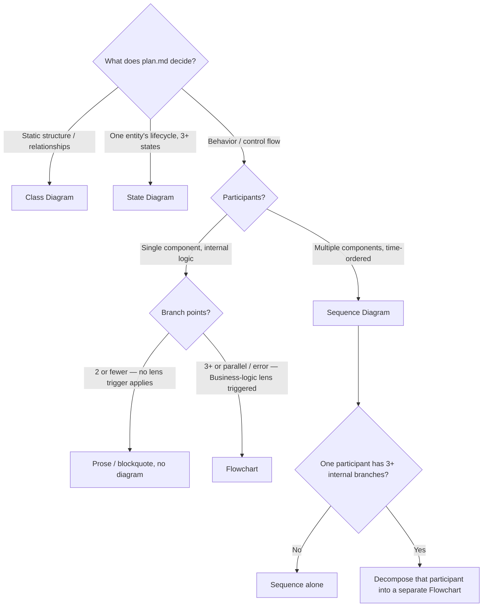

# Diagram Guide (Stage A)

Selection criteria and authoring rules for diagrams rendered in the Stage A HTML presentation. A diagram is **Readability Enrichment** — it makes flow or structure already decided in `plan.md` *visible*. It never authors plan content and never touches `plan.md` on disk.

## Stage A Fidelity Bounds (read first)

A diagram is the highest-density enrichment, so the fidelity bound is strictest:

- **Ephemeral only.** Diagrams render into the HTML presentation only. NEVER write a diagram or its source into `plan.md` — Invariant 3 keeps `plan.md` the unmodified single source of truth; every re-render redraws from it. Inject the ` ```mermaid ` fence into the render-time markdown string, not into the file on disk.
- **Re-visualize decided flow only.** Drawing an edge forces a commitment: who calls whom, in what order, which component owns what. If you cannot draw an arrow or relationship without making a decision `plan.md` did not already make, **STOP** — that is a plan defect, not a diagram opportunity. Return to revise the plan and re-run the pipeline; do not invent the missing edge at render time. A diagram can never be vaguer than the plan it visualizes.
- **Diagrams are the plan's review surface.** A reviewer should be able to verify the design by reading the diagram set without reading all the prose. Diagram count therefore SHOULD scale with plan size — a large plan with many components, APIs, and stateful entities warrants many diagrams. There is no numeric cap, no consolidation-to-minimize pressure, and no "too many diagrams = scope defect" tripwire. Suppressing diagrams makes large plans unverifiable; that is the problem this rule exists to prevent.
- **Trigger-based REQUIRED.** Each lens in the **Lens Taxonomy** section has a trigger FACT. When that FACT holds in `plan.md`, the lens's diagram is REQUIRED — not optional, not a judgment call. The only reason not to draw a lens is that its trigger FACT is false (the plan genuinely has no API, no stateful entity, etc.). A triggered lens with no source in `plan.md` is a plan gap to fix, not an excuse to skip the diagram.
- **Diagrams show runtime behavior.** Every diagram renders the behavior the implemented plan would produce: flows, call sequences, state transitions, object structures. They are not illustrative; they are the commitment surface the reviewer signs off on.
- **Grouped placement.** All diagrams for a plan render together in the generated Bird's-Eye section, ordered macro → micro (component/flow → sequence → single-component zoom-ins such as state, flowchart, or class) — never scattered through the plan body. Each diagram keeps its own Why → Diagram → Interpretation (§5). A reader verifies the whole design in one place instead of hunting for views.

## Lens Taxonomy (trigger-based REQUIRED)

Diagrams are organized by lens (the altitude or concern each diagram addresses). When a lens's trigger FACT holds in `plan.md`, that lens's diagram is REQUIRED. Use the existing four mermaid types — do not introduce new ones.

| Lens / Altitude | Trigger FACT — diagram REQUIRED when this holds | Mermaid type |
|---|---|---|
| System topology (bird's-eye) | plan has >= 2 components | `flowchart` |
| Module / API | plan adds or changes an API or module interaction | `sequenceDiagram` (one per API) |
| User / Actor | a user-facing scenario exists | `sequenceDiagram` (actor) or `flowchart` (user flow) |
| Domain state | an entity has a non-trivial lifecycle / state transitions | `stateDiagram-v2` |
| Domain / Service object | new or changed data shapes / service structure | `classDiagram` |
| Business logic | complex branching logic | `flowchart` |

The System topology lens (bird's-eye) has a SINGLE existence trigger: the diagram is REQUIRED when the plan has >= 2 components, and `review-pipeline.md` gates its existence on that same fact. Separate existence from content source: *existence* is governed by ">= 2 components"; the *content source* of the richest form — the decision-log-derived ownership table plus its flow mermaid — is governed by structural enumeration (Complex/Architecture). So when the plan has >= 2 components but carries NO structural enumeration (e.g. a Scoped plan), the System topology diagram still EXISTS, drawn from the plan-decided component interactions / topology, while the decision-log ownership table is omitted; when there IS structural enumeration, the richer ownership-table + flow mermaid is drawn. This is a content-source distinction, not an existence escape: the diagram is never skipped once >= 2 components holds.

**Decision-log mermaid.** Each D-item in the unified decision log records one decided commitment. An in-band mermaid (rendered inline within the decision log, distinct from the grouped Bird's-Eye lens set) re-visualizes the DECIDED D-items only — it MUST NOT invent ownership or edges beyond what the decided items already record. The diagram is never a source of truth; the decided decision log in `plan.md` remains the single authority. The same trigger rule applies: draw it when the trigger holds, skip it only when the trigger FACT is false.

## 1. Diagram Types

| Diagram | Reveals | Mermaid keyword | Use in a plan presentation when |
|---|---|---|---|
| Sequence | Time-ordered interaction between multiple participants | `sequenceDiagram` | the plan defines a runtime control flow across components (who calls whom, in what order) |
| Class | Static structure / relationships between modules or domain objects | `classDiagram` | an architecture plan defines module or type relationships |
| State | A single entity's lifecycle (3+ states) | `stateDiagram-v2` | the plan defines state transitions for one entity |
| Flowchart | Branching logic inside a single component | `flowchart TD` | one component has 3+ branch points, parallel paths, or error paths |

## 2. Selection Decision Tree

This tree selects the mermaid type given a triggered lens. It is not an existence gate — use it only after confirming that a lens's trigger FACT holds. If no lens trigger holds for a given concern, no diagram is needed (the "Prose / no diagram" leaf below). The tree does not override a triggered lens.



## 3. Scenario Mapping

| Scenario (already decided in plan) | Diagram | Lens triggered |
|---|---|---|
| Plan has >= 2 components, any runtime interaction | Flowchart (system topology) | System topology lens — REQUIRED |
| Scheduler -> worker -> repo -> detector runtime flow | Sequence | Module/API lens — REQUIRED |
| Order: CREATED -> PAID -> SHIPPED -> DELIVERED | State | Domain state lens — REQUIRED |
| Module or type relationships in an architecture plan | Class | Domain/Service object lens — REQUIRED |
| Payment branching: card/bank/point + retry + partial | Flowchart | Business logic lens — REQUIRED |
| User checkout flow with steps and decisions | Sequence (actor) or Flowchart | User/Actor lens — REQUIRED |
| Inter-service flow + one service's 5-branch internal logic | Sequence + Decomposition Flowchart | Module/API lens + Business logic lens — both REQUIRED; different altitudes, not duplication |
| Same flow drawn as both Sequence and Flowchart at one level | Prohibited | same-level duplication — pick one |
| A single if-else inside a component | Prose | No lens trigger holds (2 branches; Business logic lens requires complex branching) |

## 4. Guardrails

| Rule | Why |
|---|---|
| No duplication of the same flow at the same abstraction level | redundant representation |
| Flowchart only at 3+ branch points | overkill below that — use prose |
| Time-ordered who-calls-whom across components -> Sequence; static component topology (>= 2 components) -> Flowchart (System topology lens) | distinct altitudes: Sequence captures call ordering over time, Flowchart captures the static topology |
| Max ~15 nodes per diagram | readability — split into subgraphs or a separate decomposition diagram; NEVER by aggregating decided ownership members into one node (that erases decided ownership — a fidelity violation, not a readability fix) |
| Decomposition: a Sequence participant with 3+ internal branches MAY get its own Flowchart | complementary multi-level view, not duplication |
| State Diagram is for lifecycle, not branching logic | branching -> Flowchart |

## 5. Presentation Protocol

Every diagram is presented in 3 parts — the same shape as a blockquote callout, where the Why and Interpretation re-surface plan context and author nothing new:

1. **Why** (before): what this diagram lets the reader verify — at least one concrete objective. Not "this shows the flow."
2. **Diagram**: the Mermaid block. Render-time markdown only, never `plan.md`.
3. **Interpretation** (after): 2-3 lines naming specific structural observations the reader should take away.

**Anti-pattern:** a diagram with a generic or empty Why / Interpretation, or with no surrounding context at all.

## 6. Sequence Authoring Rules

Once `sequenceDiagram` is selected, these rules govern how it is drawn. They are the completeness direction of fidelity: the no-invention bound (Fidelity Bounds above) stops a diagram from saying MORE than the plan; these stop it from saying LESS.

| Rule | Why |
|---|---|
| Every synchronous call is drawn as an activation pair — `A->>+B: call` … `B-->>-A: return value`. Activation bars and return edges are one syntax unit; neither is omittable | a call without a visible activation and return hides the response contract the reviewer must verify |
| A message with no return is explicitly marked async/fire-and-forget (`A-)B:` or a `Note` declaring it) | the reader must be able to distinguish "no response by design" from "author forgot the return edge" |
| Participant labels are the plan's canonical component names, verbatim — no shortening, no renaming | a shortened label (e.g. a dropped domain prefix) erases the ownership identity the plan decided |
| Message labels carry only signatures, fields, and value shapes that appear in `plan.md` — compressing plan prose into an invented signature is invention | the reader treats a drawn signature as a decided contract |
| If the plan decomposes an ownership boundary into N named members, the diagram's view of that boundary shows N members — reduce node count via subgraphs or a separate decomposition diagram, never by collapsing decided members into one node | aggregation silently erases decided ownership |

## 7. Post-Draw Self-Audit

After drawing any diagram and BEFORE injecting it into the render-time markdown, verify the drawn mermaid against `plan.md`:

- [ ] Every synchronous call has its paired activation + return edge, or an explicit async marker
- [ ] Every participant/node label appears verbatim in `plan.md`
- [ ] Every decided ownership member within the diagram's scope appears as a node
- [ ] No signature, field, edge, or relationship in the diagram is absent from `plan.md`
- [ ] Every claim in the Interpretation corresponds to an edge or node actually drawn — the Interpretation describes the diagram, not the plan

Fix any failed item before injection. If an item cannot be fixed without making a decision `plan.md` never made, that is a plan defect — STOP per Fidelity Bounds and revise the plan instead.
