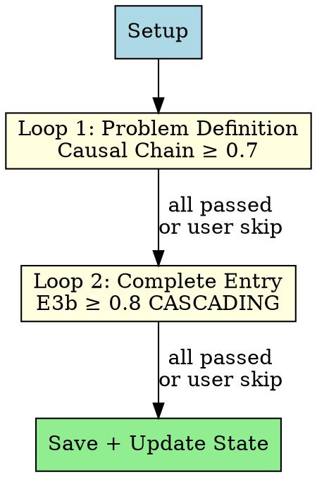
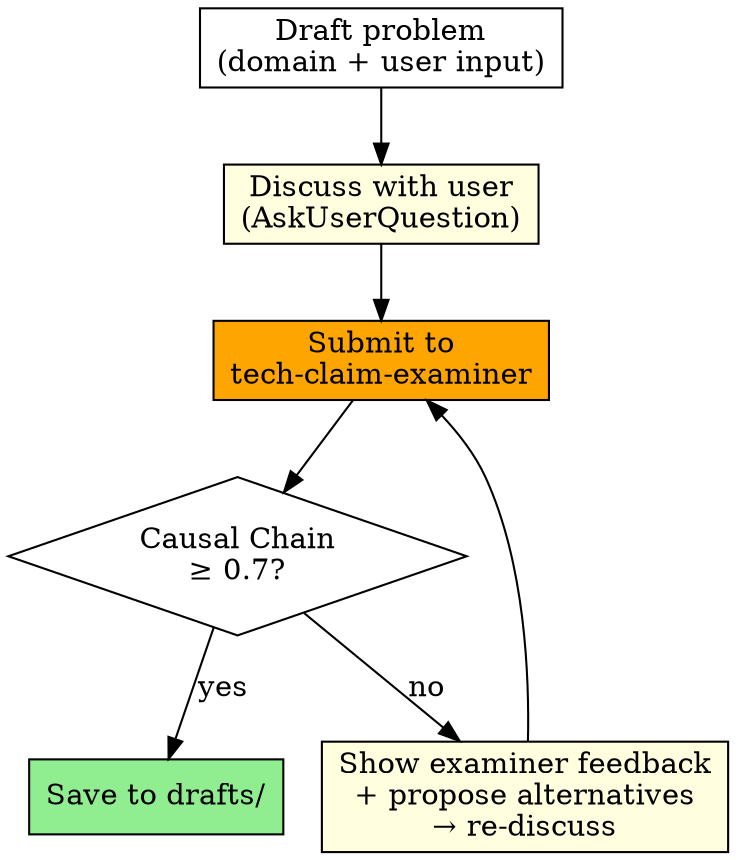
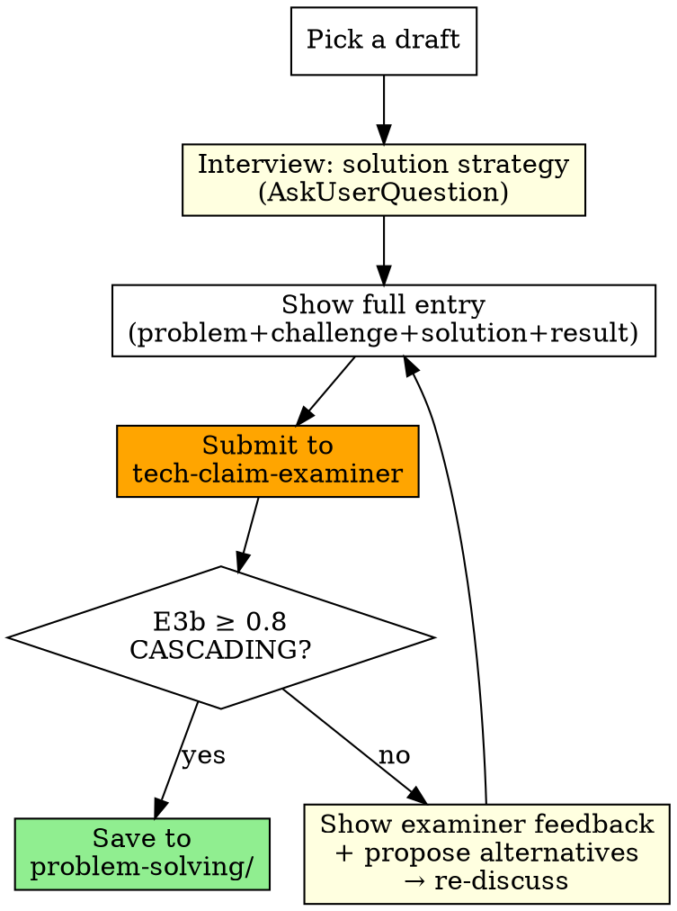

# Resume Forge

Collaboratively source, refine, and complete resume problem-solving entries with the user. Two feedback loops progressively elevate quality.

## Principles

- **Delegate scoring**: All evaluation goes to `tech-claim-examiner`. This skill only checks pass/fail thresholds
- **Free-form discussion**: Never force structured choices in AskUserQuestion. Use open-ended questions
- **Critical partner**: Do not blindly accept user input. Challenge, propose alternatives, surface trade-offs
- **Show full text**: Always show the complete entry before discussing. Never show fragments
- **Guided interview**: Ask ONE focused question per turn. With each question, propose 2-3 candidate directions or framings — show the user what strong material looks like and how to frame their experience. Don't just extract raw facts; coach toward a compelling entry

## Workflow



---

### Phase 0: Setup

1. **Load existing state** — scan `$OMT_DIR/review-resume/` (drafts/, problem-solving/, forge-references/) and check for prior state in `$OMT_DIR/state/resume-forge/`. Show the user what already exists. **Use existing problem-solving/ entries as dedup and differentiation criteria when proposing new scenarios** — never re-propose the same topic; approach similar domains from a different angle
2. **CRITICAL: Source mining + User interview (ALWAYS, NEVER SKIP)** — The user IS a source. Mine from everywhere until good problems emerge:
   - **Interview the user**: Ask about their hardest problems, biggest wins, what kept them up at night. **One question per turn** — with each question, suggest candidate directions: "이런 포인트가 있으면 차별화될 것 같은데", "이 각도로 풀어내면 강할 것 같아". Dig deep. Follow up. The user's memory is the richest source
   - **External sources**: company Notion (MCP), Jira/Linear, file system docs, Slack threads, past Claude sessions, reference resumes — whatever the user can provide access to
   - **Iterate**: propose candidate problems from what you've gathered, get user feedback, mine more, propose again. This loop continues until enough good problems are found — NOT a one-shot questionnaire
   - Save digested analysis to `$OMT_DIR/review-resume/forge-references/`. Record filenames in state JSON `sources` array
3. **Target count** — AskUserQuestion: how many scenarios? (skip if resuming and count already set)
4. **Create/update session state** — `$OMT_DIR/state/resume-forge-{sessionId}.json` (see State section)

---

### Phase 1: Loop 1 — Problem Definition

**Source mining does NOT stop at Phase 0.** If a problem needs more context during Loop 1 or Loop 2, go back to the user, mine more sources, ask deeper questions. Phase 0 is the initial pass — mining continues throughout.

Iterate per scenario:



**User says "다음" (next)** → skip current scenario, move on. Allowed at any point in both Loop 1 and Loop 2. Skipped scenarios stay in their current location (drafts/ or wherever they are) with state unchanged (`pending`).

**Examiner invocation** — `tech-claim-examiner` subagent_type:

```
Evaluate the Causal Chain Depth of this problem definition.

## Candidate Profile
{user role, experience level, domain}

## Bullet Under Review
{full problem definition + technical challenges}

## Technical Context
{tech stack, system scale, domain background}
```

Invoke via `Agent(subagent_type="tech-claim-examiner", ...)`. Check **Causal Chain Depth score** in response. ≥ 0.7 = pass.

---

### Phase 2: Loop 2 — Complete Entry

Pick from drafts/ one by one (skip scenarios where `loop2.status == "passed"`), fill in solution strategy + results.

**User says "다음"** → skip current scenario (stays in drafts/, state remains `pending`), move to next.



**Solution interview protocol:**
- **One question per turn**: Never batch multiple questions. Ask a single focused question, wait for the answer, then follow up
- **Suggest directions**: With each question, propose 2-3 candidate directions or framings based on what you know. Example: "Saga 패턴으로 명시적으로 구현한 건지, 이벤트 체인 + 수동 보정이었는지가 기술적 깊이를 좌우할 것 같아" — show what strong material looks like
- **Real experience validation**: if real, dig deep into specifics; if fabricated, validate technical plausibility
- **Alternative surfacing**: why this approach was chosen and what alternatives were rejected (and why)
- **Trade-off extraction**: limitations of chosen approach and why they were accepted

**Examiner invocation:**

```
Evaluate this complete resume entry.

## Candidate Profile
{user role, experience level, domain}

## Bullet Under Review
{full entry: problem definition + technical challenges + solution strategy + results}

## Technical Context
{tech stack, system scale, domain background}
```

Invoke via `Agent(subagent_type="tech-claim-examiner", ...)`. Check **Constraint Cascade Score (E3b)** in response. ≥ 0.8 = pass. ("CASCADING" is the examiner's grade label for ≥ 0.8 — no separate check needed.)

On pass: remove from drafts/ → save to problem-solving/. Update state `loop2.status` to `"passed"` with score.
On fail: state stays `"pending"`. Show examiner feedback + propose alternatives → re-discuss.

---

## Storage

```
$OMT_DIR/review-resume/
├── sources/              # review-resume skill: company research, JD analysis (DO NOT USE)
├── forge-references/     # resume-forge: digested work history from Notion, Jira, docs, threads, etc.
│   └── {kebab-case}.md   # e.g. mineiss-project-context.md, jira-key-issues.md
├── drafts/               # Loop 1 passed (problem definition only, awaiting Loop 2)
│   └── {kebab-case}.md
├── problem-solving/      # Loop 2 passed (complete entries, note-system compatible)
│   └── {kebab-case}.md
└── ...
```

**Draft file format:**

```markdown
---
tags: [go, kafka, resilience]
loop1_score: 0.85
---

# Scenario Title

- **sub_title**: ...
- **caption**: Company · YYYY.MM ~ YYYY.MM
- **skills**: ...

**Problem Definition**
...

**Technical Challenges**
...
```

**Complete entry:** follows `review-resume/references/note-system.md` candidate file format (tags frontmatter + body).

---

## Session State

`$OMT_DIR/state/resume-forge-{sessionId}.json` (follows ralph state pattern — sessionId from Claude's `input.sessionId`):

```json
{
  "session_id": "abc123-def456",
  "created_at": "2026-04-10T12:00:00",
  "sources": ["existing-notes", "current-resume"],
  "target_count": 9,
  "scenarios": [
    {
      "id": "c1-pipeline-throughput",
      "title": "Attribute inference pipeline",
      "loop1": { "status": "passed", "score": 0.85 },
      "loop2": { "status": "passed", "score": 0.815 }
    },
    {
      "id": "c2-return-workflow",
      "title": "Return workflow automation",
      "loop1": { "status": "passed", "score": 0.85 },
      "loop2": { "status": "pending" }
    }
  ]
}
```

### Session Recovery

On new session start:
1. List `$OMT_DIR/state/resume-forge-*.json` and pick the most recent by `created_at` field
2. Read the state JSON. Skip scenarios where `loop1.status == "passed"` (go to Loop 2). Skip scenarios where `loop2.status == "passed"` (fully complete)
3. **Scan forge-references/** (if directory exists) — `ls $OMT_DIR/review-resume/forge-references/` → read the first ~10 lines of each file to understand domain/content. Read in full any reference relevant to the current scenario
4. If all scenarios have `loop1.status == "passed"`, skip directly to Phase 2
5. Candidate Profile info (user role, experience): ask the user once in Phase 0 setup, or infer from `caption` field in drafts

### Cleanup

When all scenarios have `loop2.status == "passed"`, delete the state file (`$OMT_DIR/state/resume-forge-{sessionId}.json`). All data lives in drafts/ and problem-solving/ — the state file is only needed during active forging.

---

## Writing Direction

The examiner's core question: **"If I hire this person based on this claim, will they actually deliver?"**

Entries that pass share these traits:
- **"Why this over alternatives?"** — every tech choice has a rejected alternative with a reason
- **"What constraints forced this?"** — the problem shape dictated the solution, not the other way around
- **"What did you give up?"** — trade-offs are explicit and accepted with justification
- **Cascade discovery** — "tried A → discovered constraint → pivoted to B" narrative, not "designed the perfect solution upfront"
- **Scale-appropriate** — solutions match the actual system scale, not over-engineered for hypothetical load

Entries that fail:
- List technologies without explaining why they were chosen
- Describe the solution without showing the problem's complexity
- Claim results without measurable baselines (before → after)
- Read like architecture decision records instead of problem-solving stories

---

## Anti-Patterns

| Don't | Why |
|---|---|
| Force structured choices in AskUserQuestion | Users prefer free-form feedback. Closed questions limit discussion |
| Show problem/solution in fragments | Without full context, discussion is inefficient. Always show complete text |
| Blindly accept user opinions | Critical debate produces better outcomes |
| Judge examiner scoring criteria yourself | Scoring is the examiner's job. This skill only checks pass/fail |
| Attempt E3b 0.8 without solution strategy | Causal Chain works with problem-only, but E3b requires solution strategy |
| Use technical terms without verification | Outbox, priority queue, etc. — align definitions with user to prevent misunderstanding |
| Batch multiple questions in one turn | Cognitive overload — user answers shallowly or skips hard questions. One focused question + candidate directions per turn |
