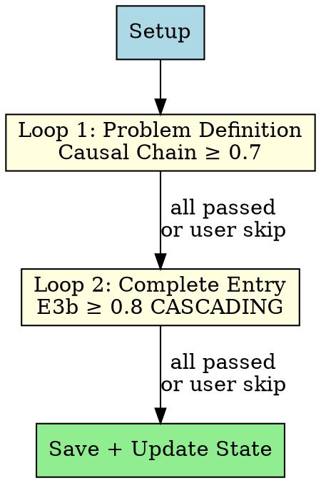
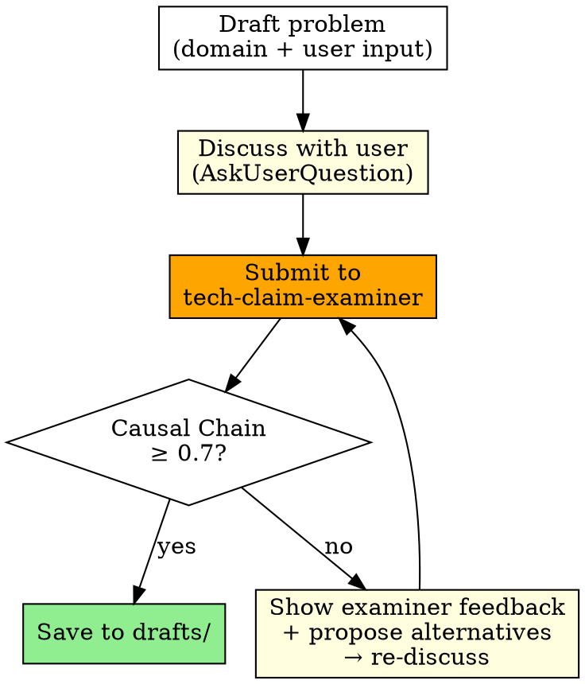
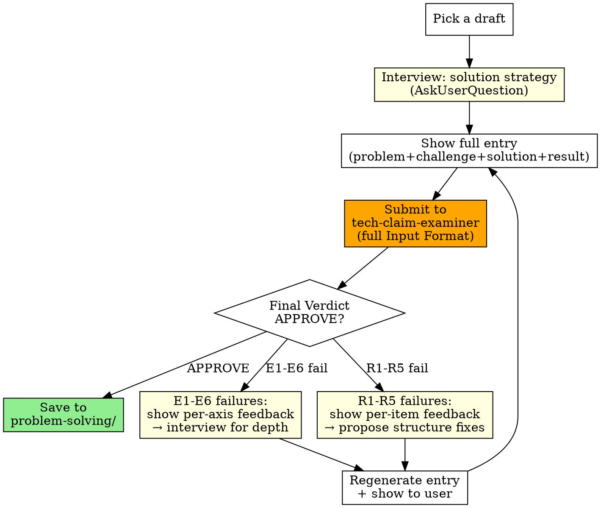

# Resume Forge

Collaboratively source, refine, and complete resume problem-solving entries with the user. Two feedback loops progressively elevate quality.

## Principles

- **Delegate scoring**: All evaluation goes to `tech-claim-examiner`. This skill only checks pass/fail thresholds
- **Free-form discussion**: Never force structured choices in AskUserQuestion. Use open-ended questions
- **Critical partner**: Do not blindly accept user input. Challenge, propose alternatives, surface trade-offs
- **Show full text**: Always show the complete entry before discussing. Never show fragments
- **Guided interview**: Ask ONE focused question per turn. With each question, propose 2-3 candidate directions or framings — show the user what strong material looks like and how to frame their experience. Don't just extract raw facts; coach toward a compelling entry

## Workflow



---

### Phase 0: Setup

1. **Load existing state** — scan `$OMT_DIR/review-resume/` (drafts/, problem-solving/, forge-references/) and check for prior state in `$OMT_DIR/state/resume-forge/`. Show the user what already exists. **Use existing problem-solving/ entries as dedup and differentiation criteria when proposing new scenarios** — never re-propose the same topic; approach similar domains from a different angle
2. **CRITICAL: Source mining + User interview (ALWAYS, NEVER SKIP)** — The user IS a source. Mine from everywhere until good problems emerge:
   - **Interview the user**: Ask about their hardest problems, biggest wins, what kept them up at night. **One question per turn** — with each question, suggest candidate directions: "이런 포인트가 있으면 차별화될 것 같은데", "이 각도로 풀어내면 강할 것 같아". Dig deep. Follow up. The user's memory is the richest source
   - **External sources**: company Notion (MCP), Jira/Linear, file system docs, Slack threads, past Claude sessions, reference resumes — whatever the user can provide access to
   - **Iterate**: propose candidate problems from what you've gathered, get user feedback, mine more, propose again. This loop continues until enough good problems are found — NOT a one-shot questionnaire
   - Save digested analysis to `$OMT_DIR/review-resume/forge-references/`. Record filenames in state JSON `sources` array
3. **Target count** — AskUserQuestion: how many scenarios? (skip if resuming and count already set)
4. **Create/update session state** — `$OMT_DIR/state/resume-forge-{sessionId}.json` (see State section)

---

### Phase 1: Loop 1 — Problem Definition

**Source mining does NOT stop at Phase 0.** If a problem needs more context during Loop 1 or Loop 2, go back to the user, mine more sources, ask deeper questions. Phase 0 is the initial pass — mining continues throughout.

Iterate per scenario:



**User says "다음" (next)** → skip current scenario, move on. Allowed at any point in both Loop 1 and Loop 2. Skipped scenarios stay in their current location (drafts/ or wherever they are) with state unchanged (`pending`).

**Examiner invocation** — `tech-claim-examiner` subagent_type:

```
Evaluate the Causal Chain Depth of this problem definition.

## Candidate Profile
{user role, experience level, domain}

## Bullet Under Review
{full problem definition + technical challenges}

## Technical Context
{tech stack, system scale, domain background}
```

Invoke via `Agent(subagent_type="tech-claim-examiner", ...)`. Check **Causal Chain Depth score** in response. ≥ 0.7 = pass.

---

### Phase 2: Loop 2 — Complete Entry

Pick from drafts/ one by one (skip scenarios where `loop2.status == "passed"`), fill in solution strategy + results.

**User says "다음"** → skip current scenario (stays in drafts/, state remains `pending`), move to next.



**Solution interview protocol:**
- **One question per turn**: Never batch multiple questions. Ask a single focused question, wait for the answer, then follow up
- **Suggest directions**: With each question, propose 2-3 candidate directions or framings based on what you know. Example: "Saga 패턴으로 명시적으로 구현한 건지, 이벤트 체인 + 수동 보정이었는지가 기술적 깊이를 좌우할 것 같아" — show what strong material looks like
- **Real experience validation**: if real, dig deep into specifics; if fabricated, validate technical plausibility
- **Alternative surfacing**: why this approach was chosen and what alternatives were rejected (and why)
- **Trade-off extraction**: limitations of chosen approach and why they were accepted

**Examiner invocation:**

Use the rubric's full Input Format. Missing fields cause loose evaluation.

```
# Technical Evaluation Request

## Candidate Profile
- Experience: {years} years
- Position: {position}
- Target Company/Role: {company} / {role} (if unknown: "No specific target — evaluate against big tech standards")

## Bullet Under Review
- Section: Problem-Solving > {scenario title}
- Original: "{MUST be the full original text from the draft file — never summarize}"

## Technical Context
- Technologies/approaches mentioned in this bullet: {identified directly from bullet text}
- JD-related keywords: {if available from Phase 0 sources, else "N/A"}
- Loop 1 findings: {Causal Chain Depth score and any notes from Loop 1}

## Target Company Context
- If known: {company, scale indicators, team size, core values, key challenges}
- If unknown: "No specific target — evaluate against big tech standards"

## Proposed Alternatives (if re-dispatching after feedback)
### Alternative 1: {summary}
{revised text}
### Alternative 2: {summary}
{revised text}
(On first dispatch: "None — Phase A evaluation of the original entry only.")
```

<critical>
MUST send the full original text from the draft file. NEVER summarize, paraphrase, or shorten the entry. Less text → LLM fills gaps with charity → inflated scores. Read the draft file and copy the full content verbatim.
</critical>

Invoke via `Agent(subagent_type="tech-claim-examiner", ...)`.

**Pass criteria — ALL must be met:**
- E1-E6: all PASS
- E3b Constraint Cascade Score ≥ 0.8 (CASCADING)
- R1-R5: all PASS
- Final Verdict: APPROVE

**On APPROVE:** Remove from drafts/ → save to problem-solving/. Update state `loop2.status` to `"passed"` with examiner scores.

**On REQUEST_CHANGES:**

**Step 1. Feedback 분류**

Examiner 결과를 두 카테고리로 분리:
- **E1-E6 failures** (소재 깊이 부족) → Source Extraction으로 해결
- **R1-R5 failures** (가독성 문제) → 구조/포맷 수정으로 해결 (인터뷰 불필요)

R1-R5 failures는 같은 소재를 재배치/압축하면 되므로 즉시 수정. E1-E6 failures가 핵심 — 아래 Source Extraction 프로토콜을 적용.

**Step 2. Interview Hints → 질문 변환**

Examiner는 각 FAIL axis에 Interview Hints를 제공합니다. 이걸 그대로 사용하지 말고, **기술 맥락 + 구체적 상황 + 예시**를 포함한 질문으로 변환:

```
BAD (추상적):
  "Were there any tradeoffs?"

GOOD (구체적, 맥락 포함):
  "Redis 도입할 때 cache consistency와 response speed 사이에서 고민한 적 있나요?
   예를 들어 cache TTL 기준은 어떻게 정했고, stale data로 문제된 적은?"
```

변환 원칙:
1. **진단 맥락**: 왜 이 질문을 하는지 배경 제공
2. **구체적 타겟**: 막연한 "경험"이 아니라 특정 상황/결정/수치를 타겟
3. **예시 포함**: 사용자가 유사 사례를 떠올릴 수 있도록

**Step 3. Source Extraction (5-Stage)**

FAIL axis별로 순차 진행. 각 Stage에서 **한 번에 하나의 질문만**:

| Stage | 방법 | 설명 |
|-------|------|------|
| 1. Direct | Hints 기반 직접 질문 | "이 부분에서 구체적으로 어떤 결정을 했나요?" |
| 2. Bypass | 같은 gap을 3가지 각도로 | "다른 방식으로 물어볼게요 — 그때 가장 어려웠던 제약이 뭐였나요?" |
| 3. Adjacent | 관련 인접 경험 탐색 | "비슷한 문제를 다른 프로젝트에서 겪은 적은?" |
| 4. Daily Work | 일상 업무 속 숨겨진 소재 | "운영하면서 반복적으로 불편했던 것, 모니터링하면서 발견한 것은?" |
| 5. Domain Suggest | 도메인 기반 소재 제안 | AI가 회사/도메인/기술 스택 맥락에서 "보통 이런 일이 생기는데" 제안 |

**Stage 5 — 도메인 기반 소재 제안:**

4-Stage로 사용자 기억에서 더 이상 못 뽑으면, AI가 도메인 전문가로서 소재를 제안합니다:
- 사용자의 회사 규모, 도메인, 기술 스택, FAIL axis를 종합
- "이 맥락이면 보통 이런 문제가 생기는데, 혹시 이런 경험 있었나요?" 형태로 2-3개 제안
- 예: "위탁판매 정산이면 PG 환불 타이밍이랑 정산 주기가 안 맞아서 차액이 생기는 케이스가 많은데, 이런 경험 있나요?"
- 예: "Go로 concurrent processing 하면 goroutine leak이나 channel deadlock이 흔한데, 그런 이슈 겪으셨나요?"
- 사용자가 "아 맞다 그거!" → 새 소재로 엔트리 재구성
- 사용자가 전부 부정 → 현재 소재로 best entry 생성 → 마지막 dispatch

**Source Quality Check:**

각 Stage에서 사용자가 소재를 제공할 때마다 3요소를 확인:

| 요소 | 정의 | 없으면 |
|------|------|-------|
| Fact | 무엇이 일어났는가 | "경험 있음" — 내용 불명 → 다음 Stage |
| Context | 왜/어디서/어떻게 | Fact만으로는 엔트리화 불가 → 추가 질문 |
| Verifiability | 수치, before/after, 측정 가능한 결과 | 검증 불가 → examiner FAIL 예상 → 추가 질문 |

3요소 충족 시 → 엔트리 재구성. 미충족 시 → 다음 Stage.

**Step 4. 엔트리 재구성 + Re-dispatch**

1. 발굴한 소재 + R1-R5 수정을 반영하여 엔트리 재구성
2. 전체 엔트리를 사용자에게 보여주고 확인
3. Examiner에 re-dispatch (revised entry를 Proposed Alternative로)
4. APPROVE될 때까지 반복, 또는 사용자 opt-out ("다음")

State stays `"pending"` until APPROVE.

---

## Storage

```
$OMT_DIR/review-resume/
├── sources/              # review-resume skill: company research, JD analysis (DO NOT USE)
├── forge-references/     # resume-forge: digested work history from Notion, Jira, docs, threads, etc.
│   └── {kebab-case}.md   # e.g. mineiss-project-context.md, jira-key-issues.md
├── drafts/               # Loop 1 passed (problem definition only, awaiting Loop 2)
│   └── {kebab-case}.md
├── problem-solving/      # Loop 2 passed (complete entries, note-system compatible)
│   └── {kebab-case}.md
└── ...
```

**Draft file format:**

```markdown
---
tags: [go, kafka, resilience]
loop1_score: 0.85
---

# Scenario Title

- **sub_title**: ...
- **caption**: Company · YYYY.MM ~ YYYY.MM
- **skills**: ...

**Problem Definition**
...

**Technical Challenges**
...
```

**Complete entry:** follows `review-resume/references/note-system.md` candidate file format (tags frontmatter + body).

---

## Session State

`$OMT_DIR/state/resume-forge-{sessionId}.json` (follows ralph state pattern — sessionId from Claude's `input.sessionId`):

```json
{
  "session_id": "abc123-def456",
  "created_at": "2026-04-10T12:00:00",
  "sources": ["existing-notes", "current-resume"],
  "target_count": 9,
  "scenarios": [
    {
      "id": "c1-pipeline-throughput",
      "title": "Attribute inference pipeline",
      "loop1": { "status": "passed", "score": 0.85 },
      "loop2": { "status": "passed", "score": 0.815 }
    },
    {
      "id": "c2-return-workflow",
      "title": "Return workflow automation",
      "loop1": { "status": "passed", "score": 0.85 },
      "loop2": { "status": "pending" }
    }
  ]
}
```

### Session Recovery

On new session start:
1. List `$OMT_DIR/state/resume-forge-*.json` and pick the most recent by `created_at` field
2. Read the state JSON. Skip scenarios where `loop1.status == "passed"` (go to Loop 2). Skip scenarios where `loop2.status == "passed"` (fully complete)
3. **Scan forge-references/** (if directory exists) — `ls $OMT_DIR/review-resume/forge-references/` → read the first ~10 lines of each file to understand domain/content. Read in full any reference relevant to the current scenario
4. If all scenarios have `loop1.status == "passed"`, skip directly to Phase 2
5. Candidate Profile info (user role, experience): ask the user once in Phase 0 setup, or infer from `caption` field in drafts

### Cleanup

When all scenarios have `loop2.status == "passed"`, delete the state file (`$OMT_DIR/state/resume-forge-{sessionId}.json`). All data lives in drafts/ and problem-solving/ — the state file is only needed during active forging.

---

## Writing Direction

The examiner's core question: **"If I hire this person based on this claim, will they actually deliver?"**

Entries that pass share these traits:
- **"Why this over alternatives?"** — every tech choice has a rejected alternative with a reason
- **"What constraints forced this?"** — the problem shape dictated the solution, not the other way around
- **"What did you give up?"** — trade-offs are explicit and accepted with justification
- **Cascade discovery** — "tried A → discovered constraint → pivoted to B" narrative, not "designed the perfect solution upfront"
- **Scale-appropriate** — solutions match the actual system scale, not over-engineered for hypothetical load

Entries that fail:
- List technologies without explaining why they were chosen
- Describe the solution without showing the problem's complexity
- Claim results without measurable baselines (before → after)
- Read like architecture decision records instead of problem-solving stories

---

## Anti-Patterns

| Don't | Why |
|---|---|
| Force structured choices in AskUserQuestion | Users prefer free-form feedback. Closed questions limit discussion |
| Show problem/solution in fragments | Without full context, discussion is inefficient. Always show complete text |
| Blindly accept user opinions | Critical debate produces better outcomes |
| Judge examiner scoring criteria yourself | Scoring is the examiner's job. This skill only checks pass/fail |
| Attempt E3b 0.8 without solution strategy | Causal Chain works with problem-only, but E3b requires solution strategy |
| Use technical terms without verification | Outbox, priority queue, etc. — align definitions with user to prevent misunderstanding |
| Batch multiple questions in one turn | Cognitive overload — user answers shallowly or skips hard questions. One focused question + candidate directions per turn |
