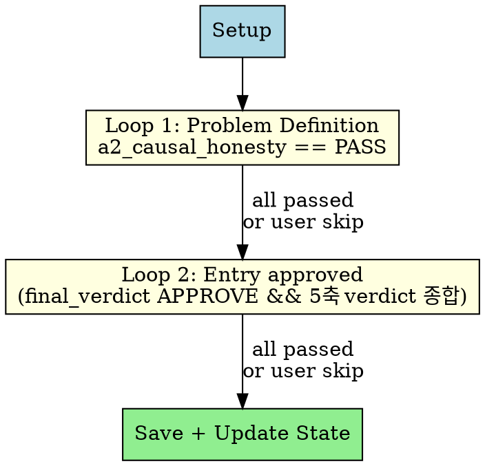
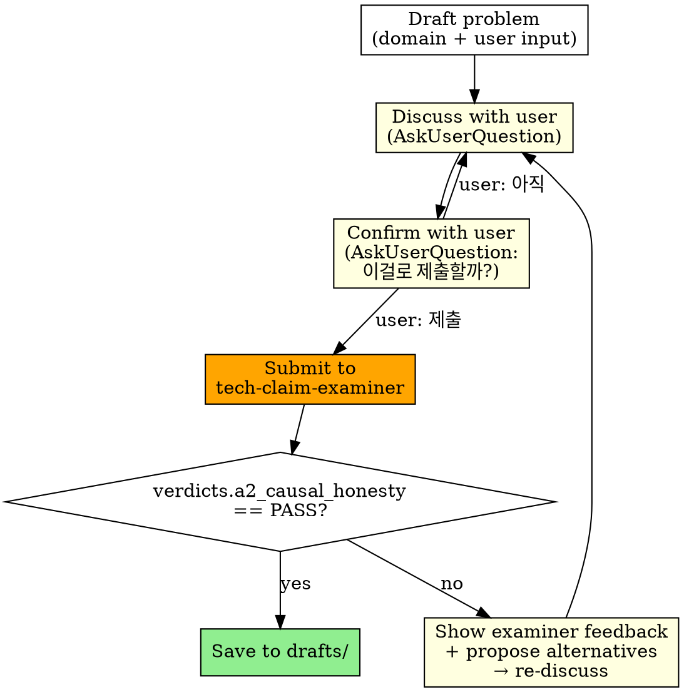
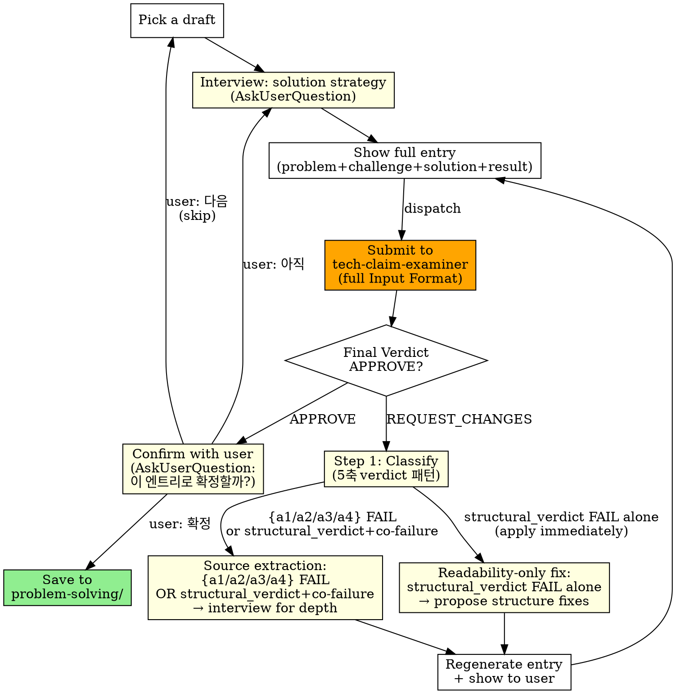

# Resume Forge

> **Axis-aware orchestrator boundary**: This skill is the axis-aware orchestrator of `tech-claim-examiner`. It consumes the **full examiner schema including INTERNAL fields** (verdicts.a1-a5, critical_rule_flags.*, reasoning, evidence_quote) for source-extraction routing and Loop 1/2 gate decisions. The blackbox contract rule that restricts review-resume to PUBLIC fields **does not apply here** — see `skills/tech-claim-rubric/output-schema.md` for full contract.

Collaboratively source, refine, and complete resume problem-solving entries with the user. Two feedback loops progressively elevate quality.

## Principles

- **Delegate scoring**: All evaluation goes to `tech-claim-examiner`. This skill only checks pass/fail thresholds
- **Free-form discussion**: Never force structured choices in AskUserQuestion. Use open-ended questions
- **Critical partner**: Do not blindly accept user input. Challenge, propose alternatives, surface trade-offs. When the user proposes a content direction change, state your assessment before applying it:
  - BAD: User: "파티션 설계 내용도 넣자" → "좋아, 반영할게" → structural_verdict FAIL (scanability low: detail spill)
  - GOOD: User: "파티션 설계 내용도 넣자" → "structural_verdict 기준상 design rationale 없는 구현 디테일로 읽힐 가능성이 높다 — 넣을까, 한 문장 언급으로 깊이를 암시할까?"
  - GOOD (agree): User: "goroutine이 아니라 속성 병렬 처리가 핵심 아니야?" → "맞다, goroutine은 Go 구현체 디테일이고 설계 결정은 속성 병렬 추론이다" → 바로 반영
- **Show full text**: Always show the complete entry before discussing. Never show fragments
- **Guided interview**: Ask ONE focused question per turn. With each question, propose 2-3 candidate directions or framings — show the user what strong material looks like and how to frame their experience. Don't just extract raw facts; coach toward a compelling entry

## Workflow



---

### Phase 0: Setup

1. **Load existing state** — scan `$OMT_DIR/review-resume/` (drafts/, problem-solving/, forge-references/) and check for prior state in `$OMT_DIR/state/resume-forge/`. Show the user what already exists. **Use existing problem-solving/ entries as dedup and differentiation criteria when proposing new scenarios** — never re-propose the same topic; approach similar domains from a different angle
2. **CRITICAL: Source mining + User interview (ALWAYS, NEVER SKIP)** — The user IS a source. Mine from everywhere until good problems emerge:
   - **Interview the user**: Ask about their hardest problems, biggest wins, what kept them up at night. **One question per turn** — with each question, suggest candidate directions: "이런 포인트가 있으면 차별화될 것 같은데", "이 각도로 풀어내면 강할 것 같아". Dig deep. Follow up. The user's memory is the richest source
   - **External sources**: company Notion (MCP), Jira/Linear, file system docs, Slack threads, past Claude sessions, reference resumes — whatever the user can provide access to
   - **Iterate**: propose candidate problems from what you've gathered, get user feedback, mine more, propose again. This loop continues until enough good problems are found — NOT a one-shot questionnaire
   - Save digested analysis to `$OMT_DIR/review-resume/forge-references/`. Record filenames in state JSON `sources` array
3. **Target count** — AskUserQuestion: how many scenarios? (skip if resuming and count already set)
4. **Create/update session state** — `$OMT_DIR/state/resume-forge-{sessionId}.json` (see State section)

---

### Phase 1: Loop 1 — Problem Definition

**Source mining does NOT stop at Phase 0.** If a problem needs more context during Loop 1 or Loop 2, go back to the user, mine more sources, ask deeper questions. Phase 0 is the initial pass — mining continues throughout.

Iterate per scenario:



**Confirmation Gate** — After discussing the problem definition with the user, show the complete draft and ask via AskUserQuestion: "이 문제 정의로 examiner에게 제출할까요?" User responds:
- **"제출" / 확인**: Proceed to examiner
- **"아직"**: Return to discuss — refine together, then confirm again. This is NOT "다음" (skip). "아직" means "keep improving this scenario"; "다음" means "skip to next scenario"

**User says "다음" (next)** → skip current scenario, move on. Allowed at any point in both Loop 1 and Loop 2. Skipped scenarios stay in their current location (drafts/ or wherever they are) with state unchanged (`pending`).

**Examiner invocation** — `tech-claim-examiner` subagent_type:

```
Evaluate the causal honesty of this problem definition.

## Candidate Profile
{user role, experience level, domain}

## Bullet Under Review
{full problem definition + technical challenges}

## Technical Context
{tech stack, system scale, domain background}
```

Invoke via `Agent(subagent_type="tech-claim-examiner", ...)`. Check `verdicts.a2_causal_honesty.verdict` in response. `PASS` = Loop 1 gate cleared.
<!-- Loop 1 uses strict == PASS (not != FAIL) because causal honesty is the entry filter for Loop 2.
     A P1 on a2_causal_honesty at this stage means the claim is not yet ready to elaborate; it must be
     revised before proceeding. P1 is resolved in Loop 2 only after the user has confirmed the entry. -->

---

### Phase 2: Loop 2 — Complete Entry

Pick from drafts/ one by one (skip scenarios where `loop2.status == "passed"`), fill in solution strategy + results.

**User says "다음"** → skip current scenario (stays in drafts/, state remains `pending`), move to next.



**Confirmation Gate (post-APPROVE confirm)** — After examiner returns `final_verdict == APPROVE`, ask via AskUserQuestion: "이 엔트리로 확정하시겠습니까?" User responds:
- **"확정" / 확인**: Save to problem-solving/ and update state
- **"아직"**: Return to interview — dig deeper into solution details, refine the entry, then re-dispatch to examiner. This is NOT "다음" (skip). "아직" means "keep improving this entry"; "다음" means "skip to next scenario"
- **"다음"**: Skip current scenario (stays in drafts/, state remains `pending`), move to next

**Solution interview protocol:**
- **One question per turn**: Never batch multiple questions. Ask a single focused question, wait for the answer, then follow up
- **Suggest directions**: With each question, propose 2-3 candidate directions or framings based on what you know. Example: "Saga 패턴으로 명시적으로 구현한 건지, 이벤트 체인 + 수동 보정이었는지가 기술적 깊이를 좌우할 것 같아" — show what strong material looks like
- **Real experience validation**: if real, dig deep into specifics; if fabricated, validate technical plausibility
- **Alternative surfacing**: why this approach was chosen and what alternatives were rejected (and why)
- **Trade-off extraction**: limitations of chosen approach and why they were accepted

**Examiner invocation:**

Use the rubric's full Input Format. Missing fields cause loose evaluation.

```
# Technical Evaluation Request

## Candidate Profile
- Experience: {years} years
- Position: {position}
- Target Company/Role: {company} / {role} (if unknown: "No specific target — evaluate against big tech standards")

## Bullet Under Review
- Section: Problem-Solving > {scenario title}
- Original: "{MUST be the full original text from the draft file — never summarize}"

## Technical Context
- Technologies/approaches mentioned in this bullet: {identified directly from bullet text}
- JD-related keywords: {if available from Phase 0 sources, else "N/A"}
- Loop 1 findings: {verdicts.a2_causal_honesty.verdict and any notes from Loop 1}

## Target Company Context
- If known: {company, scale indicators, team size, core values, key challenges}
- If unknown: "No specific target — evaluate against big tech standards"

## Proposed Alternatives (if re-dispatching after feedback)
### Alternative 1: {summary}
{revised text}
### Alternative 2: {summary}
{revised text}
(On first dispatch: "None — initial evaluation of the original entry only.")
```

<critical>
MUST send the full original text from the draft file. NEVER summarize, paraphrase, or shorten the entry. Less text → LLM fills gaps with charity → inflated scores. Read the draft file and copy the full content verbatim.
</critical>

Invoke via `Agent(subagent_type="tech-claim-examiner", ...)`.

**Pass criteria — ALL must be met:**
- `final_verdict == APPROVE`
- `verdicts.a1_technical_credibility.verdict != FAIL`
- `verdicts.a2_causal_honesty.verdict != FAIL`
- `verdicts.a3_outcome_significance.verdict != FAIL`
- `verdicts.a4_ownership_scope.verdict != FAIL`
- `count(P1 across A1-A4) < 3`  ← cumulative P1 허용 상한: P1 최대 2개
- `structural_verdict ∈ {PASS, P1}`
- `critical_rule_flags.r_phys.triggered == false`
- `critical_rule_flags.r_cross.triggered == false`

(P1 verdicts on any axis do not block APPROVE but surface in `interview_hints`. As of v3.1 verdict arity unification, this applies to A1-A4 + structural_verdict uniformly — formerly only A4 emitted P1.) <!-- allow-forbidden -->

**On APPROVE:** Present entry to user via Confirmation Gate (post-APPROVE). On user "확정": Remove from drafts/ → save to problem-solving/. Update state `loop2.status` to `"passed"`. On user "아직": return to interview for further refinement and re-dispatch.

**On REQUEST_CHANGES:**

**Step 1. Classify Feedback (5축 verdict 패턴)**

`skills/tech-claim-rubric/output-schema.md` §A5 Co-failure Disambiguation Full Routing Matrix를 참조하여 emitted verdicts와 flags 기반으로 routing을 결정한다. 우선순위 순:

- **r_phys.triggered == true** → Source extraction with impossibility explanation (사용자에게 physically impossible 수치 설명 요청)
- **r_cross.triggered == true** → Source extraction with contradiction explanation (사용자에게 cross-entry contradiction 설명 요청)
- **count(P1 across A1-A4) >= 3** → Source extraction starting with weakest P1 axis
- **{a1, a2, a3, a4} 중 FAIL 있음 AND structural_verdict ∈ {PASS, P1}** → per-axis Stage 1-4 Source extraction (FAIL 축 interview hints 기반 depth 보강)
- **{a1, a2, a3, a4} 중 FAIL 있음 AND structural_verdict == FAIL** → Stage 5 multi-axis synthesis (co-failure: axis FAIL + structural FAIL 동시 발생)
- **structural_verdict == FAIL + {a1, a2, a3, a4} 모두 PASS/P1 + count(P1 across A1-A4) < 3** → Readability-only fix (no interview needed — 재구성·압축만으로 해결)

Readability-only fixes can be applied by rearranging/compressing the same material — apply immediately. Source extraction failures require new depth material — apply the Source Extraction protocol below.

**Step 2. Convert Interview Hints → Specific Questions**

The examiner provides Interview Hints for each FAIL axis. Do NOT use them verbatim — transform them into questions that include **technical context + specific situation + examples**:

```
BAD (abstract):
  "Were there any tradeoffs?"

GOOD (specific, with context):
  "Redis 도입할 때 cache consistency와 response speed 사이에서 고민한 적 있나요?
   예를 들어 cache TTL 기준은 어떻게 정했고, stale data로 문제된 적은?"
```

Conversion principles:
1. **Diagnostic context**: explain why you are asking this question
2. **Specific target**: target a specific situation/decision/metric, not vague "experience"
3. **Include examples**: help the user recall similar cases

**Step 3. Source Extraction (5-Stage)**

Progress per FAIL axis. **One question per turn** at each Stage:

| Stage | Trigger axis FAIL | Action |
|-------|-------------------|--------|
| Stage 1 | `a1_technical_credibility` FAIL | Named systems / mechanisms 보강: ask specifically about the technical decisions the examiner flagged |
| Stage 2 | `a2_causal_honesty` FAIL | Causal chain explicit화 + arithmetic 검증: reframe the question from 3 different angles to surface cause-effect logic |
| Stage 3 | `a3_outcome_significance` FAIL | Tech 또는 business outcome 추가 (vanity metric 회피): ask about adjacent experience or measurable results |
| Stage 4 | `a4_ownership_scope` FAIL | Verb-scope coherence 보강: probe daily work for hidden ownership evidence, monitoring discoveries, operational context |
| Stage 5 | `structural_verdict == FAIL` + (`a1`/`a2`/`a3`/`a4`) co-failure | Source extraction 종합 (multi-axis): AI synthesizes user's domain/stack and proposes scenarios typical for the context |

**Stage 5 — Domain-Informed Source Proposals:**

When axis-specific extraction (Stages 1-4) fails to surface material, OR when structural_verdict co-failure triggers multi-axis synthesis, the AI acts as a domain expert and proposes sources:
- Synthesize the user's company scale, domain, tech stack, and the specific FAIL axis
- Propose 2-3 scenarios in the form: "In this context, this problem typically occurs — did you experience something like this?"
- Example: "위탁판매 정산이면 PG 환불 타이밍이랑 정산 주기가 안 맞아서 차액이 생기는 케이스가 많은데, 이런 경험 있나요?"
- Example: "Go로 concurrent processing 하면 goroutine leak이나 channel deadlock이 흔한데, 그런 이슈 겪으셨나요?"
- User confirms → use as new source material → reconstruct entry
- User denies all → build best entry with current sources → final dispatch

**Source Quality Check:**

At each Stage, verify 3 elements whenever the user provides source material:

| Element | Definition | When absent |
|---------|------------|-------------|
| Fact | What happened | "I have experience" — content unknown → next Stage |
| Context | Why / where / how | Fact alone cannot be shaped into an entry → ask follow-up |
| Verifiability | Metrics, before/after, measurable outcome | Unverifiable → examiner FAIL expected → ask follow-up |

All 3 elements confirmed → reconstruct entry. Any element missing → proceed to next Stage.

**Step 4. Reconstruct Entry + Re-dispatch**

1. Incorporate extracted sources + readability-only fixes into a reconstructed entry
2. **Cognitive depth check** (before final emission): verify that the reconstructed entry surfaces at least one concrete decision point — a rejected alternative, a constraint that forced the approach, or a measurable trade-off. If absent, return to source extraction for the weakest FAIL axis before emitting
3. Show full entry to user for visual review (no confirmation gate — entry already APPROVED by examiner)
4. Re-dispatch to examiner with the revised entry as Proposed Alternative
5. Repeat until APPROVE or user opt-out ("다음")

State stays `"pending"` until APPROVE.

---

## Storage

```
$OMT_DIR/review-resume/
├── sources/              # review-resume skill: company research, JD analysis (DO NOT USE)
├── forge-references/     # resume-forge: digested work history from Notion, Jira, docs, threads, etc.
│   └── {kebab-case}.md   # e.g. mineiss-project-context.md, jira-key-issues.md
├── drafts/               # Loop 1 passed (problem definition only, awaiting Loop 2)
│   └── {kebab-case}.md
├── problem-solving/      # Loop 2 passed (complete entries, note-system compatible)
│   └── {kebab-case}.md
└── ...
```

**Draft file format:**

```markdown
---
tags: [go, kafka, resilience]
loop1_score: 0.85
---

# Scenario Title

- **sub_title**: ...
- **caption**: Company · YYYY.MM ~ YYYY.MM
- **skills**: ...

**Problem Definition**
...

**Technical Challenges**
...
```

**Complete entry:** follows `review-resume/references/note-system.md` candidate file format (tags frontmatter + body).

---

## Session State

`$OMT_DIR/state/resume-forge-{sessionId}.json` (follows ralph state pattern — sessionId from Claude's `input.sessionId`):

```json
{
  "session_id": "abc123-def456",
  "created_at": "2026-04-10T12:00:00",
  "sources": ["existing-notes", "current-resume"],
  "target_count": 9,
  "scenarios": [
    {
      "id": "c1-pipeline-throughput",
      "title": "Attribute inference pipeline",
      "loop1": { "status": "passed", "score": 0.85 },
      "loop2": { "status": "passed", "score": 0.815 }
    },
    {
      "id": "c2-return-workflow",
      "title": "Return workflow automation",
      "loop1": { "status": "passed", "score": 0.85 },
      "loop2": { "status": "pending" }
    }
  ]
}
```

### Session Recovery

On new session start:
1. List `$OMT_DIR/state/resume-forge-*.json` and pick the most recent by `created_at` field
2. Read the state JSON. Skip scenarios where `loop1.status == "passed"` (go to Loop 2). Skip scenarios where `loop2.status == "passed"` (fully complete)
3. **Scan forge-references/** (if directory exists) — `ls $OMT_DIR/review-resume/forge-references/` → read the first ~10 lines of each file to understand domain/content. Read in full any reference relevant to the current scenario
4. If all scenarios have `loop1.status == "passed"`, skip directly to Phase 2
5. Candidate Profile info (user role, experience): ask the user once in Phase 0 setup, or infer from `caption` field in drafts

### Cleanup

When all scenarios have `loop2.status == "passed"`, delete the state file (`$OMT_DIR/state/resume-forge-{sessionId}.json`). All data lives in drafts/ and problem-solving/ — the state file is only needed during active forging.

---

## Writing Direction

The examiner's core question: **"If I hire this person based on this claim, will they actually deliver?"**

Entries that pass share these traits:
- **"Why this over alternatives?"** — every tech choice has a rejected alternative with a reason
- **"What constraints forced this?"** — the problem shape dictated the solution, not the other way around
- **"What did you give up?"** — trade-offs are explicit and accepted with justification
- **Cascade discovery** — "tried A → discovered constraint → pivoted to B" narrative, not "designed the perfect solution upfront"
- **Scale-appropriate** — solutions match the actual system scale, not over-engineered for hypothetical load

Entries that fail:
- List technologies without explaining why they were chosen
- Describe the solution without showing the problem's complexity
- Claim results without measurable baselines (before → after)
- Read like architecture decision records instead of problem-solving stories

---

## Anti-Patterns

| Don't | Why |
|---|---|
| Force structured choices in AskUserQuestion | Users prefer free-form feedback. Closed questions limit discussion |
| Show problem/solution in fragments | Without full context, discussion is inefficient. Always show complete text |
| Blindly accept user opinions | User says "add X" → "좋아 반영할게" → examiner FAIL → wasted cycle. State your assessment first: agree with reasoning, or flag the risk and propose alternatives |
| Judge examiner scoring criteria yourself | Scoring is the examiner's job. This skill only checks pass/fail |
| Request source extraction without identifying which axis failed | A2 FAIL requires causal chain repair; A1 FAIL requires named systems; routing is axis-specific |
| Use technical terms without verification | Outbox, priority queue, etc. — align definitions with user to prevent misunderstanding |
| Batch multiple questions in one turn | Cognitive overload — user answers shallowly or skips hard questions. One focused question + candidate directions per turn |
