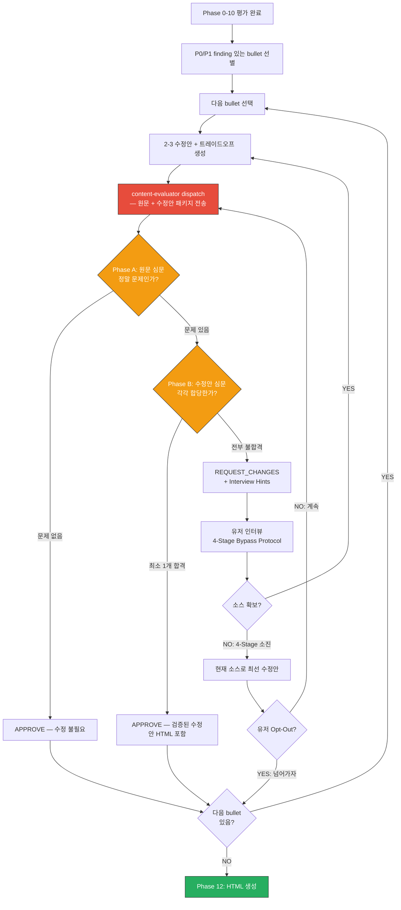

# Content Quality Gate Protocol

> Phase 0-10은 "무엇이 문제인가"를 진단한다. Quality Gate는 "문제가 해결되었는가"를 검증한다. 면접에서 CTO가 납득할 수준이 아니면 통과 불가.

---

## Table of Contents

1. [개요](#1-개요)
2. [평가 단위 (Evaluation Units)](#2-평가-단위-evaluation-units)
3. [수정안 제안 프로토콜 (Alternative Suggestions)](#3-수정안-제안-프로토콜-alternative-suggestions)
4. [인터뷰 루프 프로토콜 (Interview Loop)](#4-인터뷰-루프-프로토콜-interview-loop)
5. [Quality Gate 루프 전체 흐름](#5-quality-gate-루프-전체-흐름)
6. [유저 Opt-Out 처리](#6-유저-opt-out-처리)
7. [HTML 리포트 수정안 형식](#7-html-리포트-수정안-형식)
8. [Whole-Resume 피드백 루프](#8-whole-resume-피드백-루프)

---

## 1. 개요

### 목적

Per-Section Quality Gate는 HTML 리포트 생성(Phase 11) 직전, 각 이력서 섹션의 내용 품질을 보장하는 검증 루프다. Phase 0-10 평가가 "이 섹션에 무엇이 문제인가"를 진단하는 단계라면, Quality Gate는 "그 문제가 실제로 해결되었는가"를 content-evaluator agent가 독립적으로 검증하는 단계다.

### 핵심 원칙

**"면접에서 CTO가 납득할 수준이 아니면 통과 불가"**

이력서의 최종 독자는 채용 결정권자다. 각 수정안은 다음 질문을 통과해야 한다:
- "이 bullet을 면접에서 물어보면, 지원자가 답할 수 있는가?"
- "이 내용이 주장하는 바를 뒷받침할 소스가 실제로 있는가?"
- "면접관이 이 내용을 읽고 흥미를 느낄 이유가 있는가?"

하나라도 "아니오"가 나오면 해당 섹션은 Quality Gate를 통과하지 못한다.

### Phase 0-10 평가와의 차이

| 구분 | Phase 0-10 평가 | Quality Gate |
|------|----------------|-------------|
| 역할 | 진단 | 검증 |
| 질문 | "무엇이 문제인가?" | "문제가 해결되었는가?" |
| 주체 | review-resume 스킬 | content-evaluator agent (독립 심사) |
| 결과 | 갭 목록, 수정 방향 제시 | APPROVE / REQUEST_CHANGES 이진 판정 |
| 반복 | 1회 통과 | 루프 — APPROVE까지 무한 반복 |
| 탈출 | 없음 (평가 완료가 목표) | 유저 Opt-Out으로만 탈출 가능 |

---

## 2. 평가 단위 (Evaluation Units)

Quality Gate는 이력서를 **bullet 1개 / entry 1개** 단위로 분할하여 처리한다. content-evaluator가 기술적 심문을 수행하는 최소 단위는 개별 기술 클레임이다.

### 대상 선별

Phase 0-10에서 **P0 또는 P1 finding이 있는 bullet/entry만** Quality Gate 대상이다. 전체 기준 PASS인 bullet은 evaluator dispatch를 건너뛴다.

### 자기소개

| Type | Evaluator 대상 | 이유 |
|------|---------------|------|
| Type A (직업 정체성) | 조건부 | 기술적 클레임이 포함된 경우만 |
| Type B (일하는 철학) | 조건부 | 기술적 에피소드가 포함된 경우만 |
| Type C (회사 연결) | YES | 기술 역량 → 회사 도메인 연결이므로 기술적 실체 검증 필요 |
| Type D (현재 관심사) | 조건부 | 기술 탐구가 포함된 경우만 |

### 경력

**bullet별 1 unit**으로 처리한다. A사에 bullet 3개가 있으면 3개의 별도 evaluator 호출이다.

예시:
- "Kafka 비동기 파이프라인 구축으로 처리량 3배 향상" → 1 unit
- "결제-주문 불일치 0건 달성" → 1 unit

**처리 순서:** P0 finding bullet → P1 finding bullet 순. 동일 priority 내에서는 최신 직장 우선.

### 문제해결

**entry별 1 unit**으로 처리한다. entry는 하나의 기술적 서사(에피소드)이므로 통으로 evaluator에 보낸다.

예시:
- "결제 시스템 장애 격리" 에피소드 전체 → 1 unit
- "검색 응답 속도 최적화" 에피소드 전체 → 1 unit

**처리 순서:** signature depth → detailed depth → compressed depth 순. compressed는 content-evaluator 비대상 (문장이 너무 짧아 기술 심문 불가).

### 기술/스터디

**content-evaluator 비대상.** 기술 스택 나열은 기술적 심문의 대상이 아니다. Phase 0-10 평가로 충분하다.

---

## 3. 수정안 제안 프로토콜 (Alternative Suggestions)

### 핵심 원칙

**단일 수정안을 제시하지 않는다. 반드시 2-3개 대안을 트레이드오프 비교와 함께 제시한다.**

단일 수정안 제시는 두 가지 문제를 일으킨다:
1. 유저가 수정안의 전제(포지셔닝 방향, 리스크 수용 수준)를 공유하지 않은 채 채택을 강요받는다.
2. content-evaluator가 FAIL을 내릴 때 어느 방향으로 재수정해야 하는지 알 수 없다.

대안 제시는 유저가 방향을 선택하게 만들고, 선택된 방향에서 content-evaluator의 FAIL 축을 해소하는 후속 인터뷰를 설계할 수 있게 한다.

### 대안 형식

각 대안은 아래 구조를 따른다:

```
### 대안 {N}: {한줄 요약}

**수정안:**
{구체적 수정 텍스트 — 실제로 이력서에 들어갈 문장 그대로}

**장점:**
- {이 수정안의 강점 1}
- {이 수정안의 강점 2}

**단점:**
- {이 수정안의 약점/리스크 1}
- {이 수정안의 약점/리스크 2}

**트레이드오프 요약:**
{이 수정안이 어떤 가치를 우선하고 어떤 가치를 희생하는지 1문장}

**면접 시뮬레이션:**
{이 수정안으로 면접에 갔을 때 예상되는 후속 질문과 답변 가능성}
```

### 대안 생성 기준

**대안 1: 안전 방향**
- 기존 내용을 최소한으로 변경한다
- 확보된 소스로만 작성 가능한 범위 내에서 개선한다
- 면접에서 답변 불가능한 내용을 포함하지 않는다
- 차별화보다 정확성을 우선한다

**대안 2: 고임팩트 방향**
- 기존 내용을 대폭 변경하거나 완전히 재작성한다
- 더 강한 소스가 있다면 그것을 전면에 내세운다
- 차별화와 Hook Potential을 최대화한다
- 소스가 부족할 경우 인터뷰로 보완해야 할 축을 명시한다
- 리스크: 면접에서 심층 질문이 들어올 가능성이 높다

**대안 3 (선택적 적용): 절충안 또는 다른 각도**
- 대안 1, 2가 모두 방향성이 유사할 때 완전히 다른 각도를 제시한다
- 또는 대안 1과 2의 중간점을 명확히 잡아주는 절충안을 제시한다
- "이 섹션을 어떻게 포지셔닝할 것인가"에 대한 전략적 차이가 있을 때 3개 대안을 제시한다

### 비교 테이블 (유저 제시 형식)

대안 제시 후 반드시 아래 형식의 비교 테이블을 포함한다:

```markdown
| 기준 | 대안 1: {요약} | 대안 2: {요약} | 대안 3: {요약} |
|------|---------------|---------------|---------------|
| 면접 안전성 | ★★★ | ★☆☆ | ★★☆ |
| 차별화 | ★☆☆ | ★★★ | ★★☆ |
| 소스 필요량 | 낮음 | 높음 | 중간 |
| 수정 범위 | 1문장 | 전체 재작성 | 2-3문장 |
```

**★ 평가 기준:**
- 면접 안전성: 이 수정안으로 면접에서 추가 질문을 받았을 때 답변 가능한 정도
- 차별화: 유사 연차 지원자 대비 이 내용이 기억에 남을 가능성
- 소스 필요량: 수정안을 완성하기 위해 추가로 확보해야 할 소스의 양
- 수정 범위: 기존 내용 대비 변경 정도

### 추천 대안 표시

비교 테이블 아래에 추천 대안과 이유를 명시한다:

```
**추천:** 대안 {N}
**이유:** {추천 이유 1-2문장 — 유저의 타겟 포지션과 현재 소스 수준을 고려한 판단}
```

추천은 반드시 제시하되, 유저가 다른 대안을 선택할 경우 그 방향을 존중한다.

---

## 4. 인터뷰 루프 프로토콜 (Interview Loop)

### experience-mining.md와의 관계

Quality Gate 인터뷰는 experience-mining.md의 4-Stage Bypass Protocol을 **확장 적용**한다. 두 인터뷰는 목적이 다르다:

| 구분 | experience-mining 인터뷰 | Quality Gate 인터뷰 |
|------|--------------------------|-------------------|
| 목적 | 새 소스 발굴 | 이미 발견된 문제의 해결 소스 확보 |
| 트리거 | Phase 갭 감지 시 | content-evaluator REQUEST_CHANGES 수신 시 |
| 타겟 | 아직 발굴되지 않은 경험 | FAIL 판정된 평가 축(E1-E5) |
| 질문 기반 | Writing Guidance의 갭 목록 | content-evaluator의 Interview Hints |
| 소진 시 처리 | "진짜 없음"으로 마킹 후 다음 토픽 | "현재 소스로 최선 수정안" 생성 + 한계 명시 |

### 인터뷰 루프 구조

```
content-evaluator REQUEST_CHANGES 수신
    ↓
REQUEST_CHANGES에서 FAIL 축 목록 추출
    ↓
각 FAIL 축에 대해:
    1. content-evaluator의 Interview Hints 확인
    2. 해당 축을 PASS로 만들 수 있는 소스 타겟 설정
    3. experience-mining 4-Stage Bypass 적용:
       Stage 1: Direct Question (Hint 기반 구체적 질문)
       Stage 2: Bypass Question (동일 갭을 3가지 각도로 리프레이밍)
       Stage 3: Adjacent Experience (관련 인접 상황 탐색)
       Stage 4: Daily Work (루틴 업무 속 숨겨진 소스 탐색)
    4. 소스 확보 → 수정안 재생성 (Section 3 프로토콜 적용)
    5. 소스 미확보 → "현재 소스로 최선의 수정안" 생성 + 한계 명시
```

### Interview Hints 활용 방법

content-evaluator는 REQUEST_CHANGES 시 각 FAIL 축에 대해 Interview Hints를 제공한다. 이 Hints는 "어떤 정보가 있으면 이 축을 PASS로 바꿀 수 있는가"를 명시한다.

Hints를 질문으로 변환하는 원칙:

**BAD (너무 추상적):**
> "트레이드오프가 있었나요?"

**GOOD (구체적, 맥락 제공):**
> "Redis 도입 시 캐시 일관성과 응답 속도 사이에서 고민한 부분이 있었나요? 예를 들어 캐시 TTL을 정할 때 어떤 기준을 썼는지, 혹시 stale 데이터로 문제가 생긴 적이 있는지 궁금합니다."

좋은 질문의 요소:
1. **진단 맥락**: 왜 이 질문을 하는지 유저가 알 수 있도록 배경을 제시한다
2. **구체적 타겟**: 막연한 "경험"이 아닌, 특정 상황/결정/수치를 타겟팅한다
3. **예시 포함**: 유저가 비슷한 사례를 떠올릴 수 있도록 예시를 제공한다

### Source Quality Formula

소스 확보 판정 기준은 experience-mining.md의 Source Quality Formula를 동일하게 적용한다.

**소스 = Fact + Context + Verifiability**

| Element | Definition | When Absent |
|---------|------------|-------------|
| Fact | 무슨 일이 있었는가 | "경험 있어요" 수준 — 내용 불명 |
| Context | 왜/어디서/어떻게 | Fact만 있으면 이력서에 쓸 수 없음 |
| Verifiability | 수치, 전후 비교, 측정 가능한 결과 | 검증 불가능한 주장 |

세 요소 중 하나라도 없으면 소스 미확보로 판정하고 다음 Stage로 진입한다.

### 소스 미확보 시 처리

4-Stage를 모두 소진한 뒤에도 소스가 확보되지 않으면:

1. "현재 소스로 최선의 수정안"을 생성한다. 이 수정안은 소스가 뒷받침되는 범위 내에서 최대한 개선된 안이다.
2. 수정안에 한계를 명시한다: "E3(트레이드오프 진정성) 축은 현재 소스로 PASS가 어려울 수 있습니다. content-evaluator에서 다시 FAIL이 나올 경우, 이 항목은 유저 Opt-Out 처리를 검토하세요."
3. 이 수정안을 content-evaluator에 dispatch한다. content-evaluator가 APPROVE하면 진행, REQUEST_CHANGES면 유저에게 Opt-Out 여부를 확인한다.

**인터뷰 규칙 (experience-mining.md 동일 적용):**
- 메시지당 질문 하나. 복수 질문 금지.
- 모호한 답변은 명확화 질문으로 처리. 불충분한 답변을 소스로 수용하지 않는다.
- 유저가 "다음으로" / "넘어가자" → 현재 인터뷰 종료 → Opt-Out 처리로 이관.

---

## 5. Quality Gate 루프 전체 흐름



### 루프 진입 조건

Quality Gate 루프는 Phase 10 완료 후 자동으로 진입한다. 별도 트리거 없이, Phase 10의 마지막 평가 결과가 출력된 뒤 곧바로 Section Units 분할 단계로 이어진다.

### content-evaluator dispatch

content-evaluator는 **bullet 1개 / entry 1개** 단위로 dispatch된다.

Input Format은 SKILL.md Phase 11 "Evaluator Dispatch Protocol"에 정의된 템플릿을 사용한다. 이 템플릿은 `agents/content-evaluator.md`의 Input Format과 정확히 일치한다.

**핵심 규칙:**
- Technical Context의 "기술/접근법"은 메인 세션이 bullet 텍스트에서 직접 식별한다
- Phase 0-10 findings는 원문 그대로 전달한다 (요약 금지)
- 각 평가는 독립적이다. 이전 평가 결과를 재전송하지 않는다

### APPROVE 판정 후 처리

APPROVE를 받은 bullet의 수정안은 "확정 수정안"으로 기록된다. Phase 11 HTML 리포트는 이 확정 수정안을 기반으로 생성된다.

---

## 6. 유저 Opt-Out 처리

Quality Gate는 무한루프이지만, 유저가 명시적으로 탈출할 수 있다.

### Opt-Out 트리거 키워드

| 키워드 | 처리 |
|--------|------|
| "넘어가자" | 현재 섹션 루프 종료 → 다음 섹션으로 |
| "이 정도면 OK" | 현재 섹션 루프 종료 → 다음 섹션으로 |
| "skip" | 현재 섹션 루프 종료 → 다음 섹션으로 |
| "그냥 진행해" | 현재 섹션 루프 종료 → 다음 섹션으로 |

### Opt-Out 상태 마킹

Opt-Out된 섹션은 **"user-accepted (evaluator-not-approved)"** 상태로 기록된다. 이 상태는 HTML 리포트에 반영된다.

### 애매한 응답 처리

아래와 같은 애매한 응답은 Opt-Out으로 처리하지 않는다:
- "음...", "글쎄요", "대충 OK", "괜찮은 것 같은데"

이 경우: "이 섹션에서 아직 아쉬운 부분이 있나요? 있다면 계속 진행하고, 없다면 다음 섹션으로 넘어갑니다." 로 확인한다.

**규칙:** 명시적 Opt-Out만 루프를 탈출시킨다. 애매한 긍정은 루프를 유지한다.

### HTML 리포트에서의 Opt-Out 표시

Opt-Out 섹션은 HTML 리포트에서 다음과 같이 표시된다:
- 섹션 상단에 "미해소 피드백 있음" 배지 표시
- content-evaluator의 마지막 REQUEST_CHANGES 내용을 "미해소 피드백" 블록으로 포함
- 각 FAIL 축과 해당 축에 대한 Interview Hints를 접힌 상태(collapsible)로 제공

---

## 7. HTML 리포트 수정안 형식

Phase 11 HTML 리포트에서 각 finding의 수정안 표시 방식을 정의한다. 실제 적용은 SKILL.md HTML template 수정 태스크에서 처리한다.

### 변경 방향

**기존 (단일 수정안):**
```html
<div class="suggestion">수정안: ...</div>
```

**변경 (2-3 대안 + 트레이드오프 테이블):**
```html
<div class="alternatives">
  <h4>수정 대안</h4>
  <div class="alternative">
    <div class="alt-header">
      <span class="alt-badge alt-safe">대안 1: 안전</span>
      <span class="alt-recommendation">★ 추천</span>  <!-- 추천 대안에만 -->
    </div>
    <div class="alt-content">{수정안 텍스트}</div>
    <div class="alt-pros">장점: {장점}</div>
    <div class="alt-cons">단점: {단점}</div>
  </div>
  <div class="alternative">
    <div class="alt-header"><span class="alt-badge alt-impact">대안 2: 고임팩트</span></div>
    <div class="alt-content">{수정안 텍스트}</div>
    <div class="alt-pros">장점: {장점}</div>
    <div class="alt-cons">단점: {단점}</div>
  </div>
  <table class="tradeoff-table">
    <tr><th>기준</th><th>대안 1</th><th>대안 2</th></tr>
    <tr><td>면접 안전성</td><td>★★★</td><td>★☆☆</td></tr>
    <tr><td>차별화</td><td>★☆☆</td><td>★★★</td></tr>
  </table>
</div>
```

### Opt-Out 섹션 표시 형식

```html
<div class="section-opt-out">
  <div class="opt-out-badge">미해소 피드백 있음</div>
  <details class="unresolved-feedback">
    <summary>미해소 피드백 보기 ({N}개 축)</summary>
    <div class="fail-axis">
      <span class="axis-label">E3: 트레이드오프 진정성</span>
      <div class="axis-feedback">{content-evaluator의 피드백 텍스트}</div>
      <div class="axis-hint">Interview Hint: {힌트 텍스트}</div>
    </div>
  </details>
</div>
```

### CSS 클래스 정의

SKILL.md HTML template에 추가할 CSS (실제 적용은 SKILL.md 수정 태스크에서):

```css
.alternatives {
  background: #f8f9fa;
  border: 1px solid #dee2e6;
  border-radius: 8px;
  padding: 16px;
  margin: 8px 0;
}
.alternative {
  border-left: 3px solid #6c757d;
  padding: 8px 12px;
  margin: 8px 0;
  background: #fff;
}
.alt-badge {
  display: inline-block;
  padding: 2px 8px;
  border-radius: 4px;
  font-size: 0.8rem;
  font-weight: 700;
}
.alt-safe { background: #d4edda; color: #155724; }
.alt-impact { background: #cce5ff; color: #004085; }
.alt-balanced { background: #fff3cd; color: #856404; }
.alt-recommendation {
  color: #e67e22;
  font-weight: 700;
  font-size: 0.85rem;
  margin-left: 8px;
}
.alt-pros { color: #27ae60; font-size: 0.9rem; margin: 4px 0; }
.alt-cons { color: #c0392b; font-size: 0.9rem; margin: 4px 0; }
.tradeoff-table {
  margin-top: 12px;
  font-size: 0.9rem;
  width: 100%;
  border-collapse: collapse;
}
.tradeoff-table th {
  background: #e9ecef;
  padding: 6px 12px;
  text-align: left;
}
.tradeoff-table td {
  padding: 6px 12px;
  border-bottom: 1px solid #dee2e6;
}
.section-opt-out {
  background: #fff3cd;
  border: 1px solid #ffc107;
  border-radius: 6px;
  padding: 12px;
  margin: 8px 0;
}
.opt-out-badge {
  display: inline-block;
  background: #ffc107;
  color: #212529;
  padding: 2px 10px;
  border-radius: 4px;
  font-size: 0.8rem;
  font-weight: 700;
  margin-bottom: 8px;
}
.unresolved-feedback {
  margin-top: 8px;
}
.fail-axis {
  border-left: 3px solid #dc3545;
  padding: 6px 12px;
  margin: 6px 0;
  background: #fff;
}
.axis-label {
  font-weight: 700;
  color: #dc3545;
  font-size: 0.85rem;
}
.axis-feedback {
  margin: 4px 0;
  font-size: 0.9rem;
}
.axis-hint {
  color: #6c757d;
  font-size: 0.85rem;
  font-style: italic;
}
```

---

## 8. Whole-Resume 피드백 루프

### 목적

Phase 11에서 HTML 리포트를 생성한 뒤, 유저가 완성된 이력서 전체를 보고 추가 피드백을 줄 수 있는 루프를 제공한다. 섹션별 Quality Gate가 개별 수정의 품질을 보장한다면, Whole-Resume 피드백 루프는 이력서 전체의 일관성과 방향성을 최종 점검한다.

### 루프 구조

```
Phase 11 HTML 생성 + 브라우저 오픈
    ↓
유저 확인 → AskUserQuestion
"이력서 전체를 확인하셨나요? 수정하고 싶은 부분이 있으면 말씀해주세요."
    ↓
피드백 있음?
    → YES (특정 섹션 문제): 해당 섹션의 Quality Gate 재진입
    → YES (전체 구조/방향 문제): 관련 섹션들의 Quality Gate 재진입
    → NO (명시적 종료 신호만): Phase 12로 진행
```

### 피드백 분류 및 처리

| 피드백 유형 | 예시 | 처리 |
|------------|------|------|
| 특정 섹션 수정 요청 | "A사 경력 2번째 bullet이 약해 보여요" | 해당 섹션(A사 경력) Quality Gate 재진입 |
| 전체 방향성 이슈 | "전반적으로 리더십이 안 드러나는 것 같아요" | 자기소개 + 경력 섹션 Quality Gate 재진입 |
| 구조/레이아웃 이슈 | "기술 스택이 너무 뒤에 있어요" | section-evaluation.md 규칙 재확인 후 HTML 재생성 |
| 추가 내용 요청 | "이 경험도 넣고 싶어요" | experience-mining 프로토콜 적용 후 해당 섹션 재처리 |

### 종료 조건 (명시적 신호만)

아래 표현만 루프 종료 신호로 인정한다:
- "OK", "좋아", "완성", "됐어"
- "피드백 없어", "피드백 없음"
- "넘어가자", "Phase 12로 가자"
- "이 정도면 충분해"

### 애매한 응답 처리

| 애매한 응답 | 처리 |
|------------|------|
| "음...", "글쎄요" | "구체적으로 아쉬운 부분이 있나요?" 확인 |
| "괜찮은 것 같은데" | "혹시 더 보완하고 싶은 섹션이 있으신가요?" 확인 |
| "대충 OK" | "확인하셨으면, 피드백 없으면 다음 단계로 진행할게요. 피드백 있으시면 말씀해주세요." |

**핵심 규칙:** 명시적 종료 신호가 없으면 루프를 유지한다. 애매한 긍정을 종료로 해석하지 않는다.

### HTML 재생성 처리

Whole-Resume 피드백 루프에서 섹션이 수정될 경우:
1. 해당 섹션의 Quality Gate 루프 완료 (APPROVE 또는 Opt-Out)
2. HTML 리포트 전체를 재생성한다 (수정된 섹션만 교체하지 않고 전체 재생성)
3. 브라우저에서 재오픈한다
4. 유저 확인 → 다시 피드백 루프

이 전체 재생성 + 재확인 루프를 유저가 명시적 종료 신호를 보낼 때까지 반복한다.

### 강제 탈출 처리

"그냥 넘어가자" 등 강제 탈출 신호 시:
- 현재 미해소 피드백이 있는 섹션을 HTML 리포트에 "미해소 피드백 있음" 배지로 표시
- Phase 12로 진행
