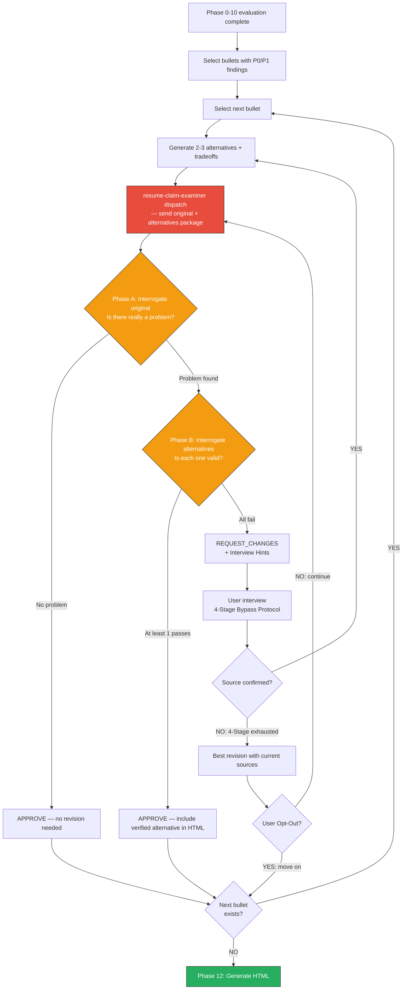

# Content Quality Gate Protocol

> Phases 0-10 diagnose "what is the problem." The Quality Gate verifies "has the problem been resolved." Anything below the level a CTO would find convincing in an interview does not pass.

---

## Table of Contents

1. [Overview](#1-overview)
2. [Evaluation Units](#2-evaluation-units)
3. [Alternative Suggestions Protocol](#3-alternative-suggestions-protocol)
4. [Interview Loop Protocol](#4-interview-loop-protocol)
5. [Quality Gate Loop — Full Flow](#5-quality-gate-loop--full-flow)
6. [User Opt-Out Handling](#6-user-opt-out-handling)
7. [HTML Report Alternatives Format](#7-html-report-alternatives-format)
8. [Whole-Resume Feedback Loop](#8-whole-resume-feedback-loop)

---

## 1. Overview

### Purpose

The Per-Bullet Quality Gate is a verification loop that ensures content quality for each resume bullet/entry immediately before HTML report generation (Phase 12). If Phases 0-10 diagnose "what is wrong with this section," the Quality Gate is the step where the resume-claim-examiner agent independently verifies "has that problem actually been resolved."

### Core Principle

**"Anything below the level a CTO would find convincing in an interview does not pass."**

The final reader of a resume is the hiring decision-maker. Each alternative must pass the following questions:
- "If asked about this bullet in an interview, can the candidate answer it?"
- "Is there an actual source backing up what this content claims?"
- "Does the interviewer have a reason to find this content interesting?"

If even one answer is "no," that section does not pass the Quality Gate.

### Difference from Phase 0-10 Evaluation

| Dimension | Phase 0-10 Evaluation | Quality Gate |
|-----------|----------------------|-------------|
| Role | Diagnosis | Verification |
| Question | "What is the problem?" | "Has the problem been resolved?" |
| Agent | review-resume skill | resume-claim-examiner agent (independent review) |
| Output | Gap list, revision direction | APPROVE / REQUEST_CHANGES binary verdict |
| Repetition | Single pass | Loop — repeats until APPROVE |
| Exit | None (completing evaluation is the goal) | User Opt-Out only |

---

## 2. Evaluation Units

The Quality Gate splits the resume into **1 bullet / 1 entry** units for processing. The minimum unit in which resume-claim-examiner conducts technical interrogation is the individual technical claim.

### Target Selection

Only **bullets/entries with P0 or P1 findings** from Phases 0-10 are subject to the Quality Gate. Bullets that pass all criteria skip evaluator dispatch entirely.

### Summary/Introduction

| Type | Evaluator Target | Reason |
|------|-----------------|--------|
| Type A (professional identity) | Conditional | Only if technical claims are included |
| Type B (work philosophy) | Conditional | Only if technical episodes are included |
| Type C (company connection) | YES | Technical capability → company domain mapping requires verification of technical substance |
| Type D (current interests) | Conditional | Only if technical exploration is included |

### Career / Work Experience

Processed as **1 unit per bullet**. If Company A has 3 bullets, that is 3 separate evaluator calls.

Examples:
- "Built Kafka async pipeline, tripling throughput" → 1 unit
- "Achieved zero payment-order inconsistencies" → 1 unit

**Processing order:** P0 finding bullets → P1 finding bullets. Within the same priority, most recent employer first.

### Problem-Solving

Processed as **1 unit per entry**. An entry is a single technical narrative (episode) and is sent to the evaluator as a whole.

Examples:
- Entire "payment system fault isolation" episode → 1 unit
- Entire "search response latency optimization" episode → 1 unit

**Processing order:** signature depth → detailed depth → compressed depth. Compressed is not a resume-claim-examiner target (sentences too short for technical interrogation).

### Skills / Study

**Not a resume-claim-examiner target.** A list of tech stacks is not subject to technical interrogation. Phase 0-10 evaluation is sufficient.

---

## 3. Alternative Suggestions Protocol

### Core Principle

**Do not present a single revision. Always present 2-3 alternatives with tradeoff comparisons.**

Presenting a single revision causes two problems:
1. The user is forced to adopt the revision without sharing the underlying assumptions (positioning direction, risk tolerance).
2. When the resume-claim-examiner issues a FAIL, there is no indication of which direction to revise toward.

Presenting alternatives lets the user choose a direction, and enables designing follow-up interviews to resolve the resume-claim-examiner's FAIL axes within the chosen direction.

### Alternative Format

Each alternative follows this structure:

```
### Alternative {N}: {one-line summary}

**Revision:**
{specific revision text — exactly as it would appear in the resume}

**Pros:**
- {strength of this alternative 1}
- {strength of this alternative 2}

**Cons:**
- {weakness/risk of this alternative 1}
- {weakness/risk of this alternative 2}

**Tradeoff Summary:**
{one sentence on what value this alternative prioritizes and what it sacrifices}

**Interview Simulation:**
{expected follow-up questions in an interview with this alternative, and likelihood of being able to answer them}
```

### Alternative Generation Criteria

**Alternative 1: Safe direction**
- Minimally modifies existing content
- Improves only within the range supportable by confirmed sources
- Does not include content that cannot be answered in an interview
- Prioritizes accuracy over differentiation

**Alternative 2: High-impact direction**
- Substantially modifies or completely rewrites existing content
- Brings stronger sources to the forefront if available
- Maximizes differentiation and hook potential
- Explicitly states axes that need supplementation through interview if sources are insufficient
- Risk: higher likelihood of in-depth questions in an interview

**Alternative 3 (optional): Compromise or different angle**
- Presents a completely different angle when alternatives 1 and 2 both trend in similar directions
- Or presents a clear midpoint between alternatives 1 and 2
- Present 3 alternatives when there is a meaningful strategic difference in "how to position this section"

### Comparison Table (User Presentation Format)

After presenting alternatives, always include a comparison table in the following format:

```markdown
| Criterion | Alt 1: {summary} | Alt 2: {summary} | Alt 3: {summary} |
|-----------|-----------------|-----------------|-----------------|
| Interview safety | ★★★ | ★☆☆ | ★★☆ |
| Differentiation | ★☆☆ | ★★★ | ★★☆ |
| Source requirement | Low | High | Medium |
| Revision scope | 1 sentence | Full rewrite | 2-3 sentences |
```

**★ Rating criteria:**
- Interview safety: degree to which the candidate can answer follow-up questions about this revision in an interview
- Differentiation: likelihood this content stands out compared to candidates at a similar experience level
- Source requirement: amount of additional sourcing needed to complete the revision
- Revision scope: degree of change relative to existing content

### Recommended Alternative Marking

Below the comparison table, state the recommended alternative and reasoning:

```
**Recommendation:** Alternative {N}
**Reason:** {1-2 sentences — judgment based on the user's target position and current source level}
```

Always provide a recommendation, but respect the user's choice if they select a different alternative.

---

## 4. Interview Loop Protocol

### Relationship with experience-mining.md

Quality Gate interviews **extend** the 4-Stage Bypass Protocol from experience-mining.md. The two interviews have different purposes:

| Dimension | experience-mining interview | Quality Gate interview |
|-----------|-----------------------------|----------------------|
| Purpose | Discover new sources | Secure sources to resolve already-identified problems |
| Trigger | Phase gap detected | resume-claim-examiner REQUEST_CHANGES received |
| Target | Undiscovered experiences | Evaluation axes (E1-E5) with FAIL verdict |
| Question basis | Gap list from Writing Guidance | Interview Hints from resume-claim-examiner |
| When exhausted | Mark as "genuinely none," move to next topic | Generate "best revision with current sources" + state limitations |

### Interview Loop Structure

```
resume-claim-examiner REQUEST_CHANGES received
    ↓
Extract FAIL axis list from REQUEST_CHANGES
    ↓
For each FAIL axis:
    1. Check Interview Hints from resume-claim-examiner
    2. Set source target that can move this axis to PASS
    3. Apply experience-mining 4-Stage Bypass:
       Stage 1: Direct Question (specific question based on Hints)
       Stage 2: Bypass Question (reframe the same gap from 3 angles)
       Stage 3: Adjacent Experience (explore related adjacent situations)
       Stage 4: Daily Work (explore hidden sources in routine work)
    4. Source confirmed → regenerate revision (apply Section 3 protocol)
    5. Source not confirmed → generate "best revision with current sources" + state limitations
```

### How to Use Interview Hints

The resume-claim-examiner provides Interview Hints for each FAIL axis with REQUEST_CHANGES. These Hints specify "what information would change this axis to PASS."

Principles for converting Hints into questions:

**BAD (too abstract):**
> "Were there any tradeoffs?"

**GOOD (specific, with context):**
> "When introducing Redis, was there anything you wrestled with between cache consistency and response speed? For example, what criteria did you use for cache TTL, and did stale data ever cause issues?"

Elements of a good question:
1. **Diagnostic context**: Provide background so the user understands why you're asking
2. **Specific target**: Target a specific situation/decision/number, not a vague "experience"
3. **Include examples**: Provide examples so the user can recall similar cases

### Source Quality Formula

The source confirmation criteria applies the same Source Quality Formula from experience-mining.md.

**Source = Fact + Context + Verifiability**

| Element | Definition | When Absent |
|---------|------------|-------------|
| Fact | What happened | "I have experience" — content unknown |
| Context | Why/where/how | Fact alone cannot be used in a resume |
| Verifiability | Numbers, before/after comparison, measurable outcome | Unverifiable claims |

If any of the three elements is missing, the source is judged unconfirmed and the next Stage is entered.

### Handling Unconfirmed Sources

If sources remain unconfirmed after all 4 Stages are exhausted:

1. Generate a "best revision with current sources." This revision is the most improved version within the range supported by available sources.
2. State the limitation explicitly in the revision: "The E3 (Tradeoff Specificity) axis may be difficult to PASS with current sources. If the resume-claim-examiner issues a FAIL again, consider User Opt-Out for this item."
3. Dispatch this revision to the resume-claim-examiner. If the resume-claim-examiner APPROVE, proceed; if REQUEST_CHANGES, confirm with the user whether to Opt-Out.

**Interview rules (same as experience-mining.md):**
- One question per message. Multiple questions are prohibited.
- Treat ambiguous answers with clarifying questions. Do not accept insufficient answers as sources.
- User says "move on" / "let's skip" → end current interview → hand off to Opt-Out handling.

---

## 5. Quality Gate Loop — Full Flow



### Loop Entry Condition

The Quality Gate loop is entered automatically after Phase 10 completes. Without a separate trigger, immediately after the final Phase 10 evaluation output, the flow proceeds directly to the Section Units split step.

### resume-claim-examiner dispatch

The resume-claim-examiner is dispatched **1 bullet / 1 entry** at a time.

The Input Format uses the template defined in SKILL.md Phase 11 "Evaluator Dispatch Protocol." This template exactly matches the Input Format in `agents/resume-claim-examiner.md`.

**Key rules:**
- The main session directly identifies "technologies/approaches" in Technical Context from the bullet text
- Phase 0-10 findings are passed verbatim (no summarization)
- Each evaluation is independent. Do not resend previous evaluation results.

### Post-APPROVE Handling

Revisions for bullets that receive APPROVE are recorded as "confirmed revisions." The Phase 12 HTML report is generated based on these confirmed revisions.

---

## 6. User Opt-Out Handling

The Quality Gate is an infinite loop, but the user can explicitly exit.

### Opt-Out Trigger Keywords

| Keyword | Handling |
|---------|---------|
| "move on" | End current section loop → proceed to next section |
| "this is OK" | End current section loop → proceed to next section |
| "skip" | End current section loop → proceed to next section |
| "just continue" | End current section loop → proceed to next section |

### Opt-Out Status Marking

Opted-out sections are recorded with **"user-accepted (evaluator-not-approved)"** status. This status is reflected in the HTML report.

### Handling Ambiguous Responses

The following ambiguous responses are not treated as Opt-Out:
- "hmm...", "not sure", "roughly OK", "seems fine"

In this case: confirm with "Is there anything still unsatisfying about this section? If yes, let's continue; if not, we'll move to the next section."

**Rule:** Only explicit Opt-Out exits the loop. Ambiguous affirmations keep the loop running.

### Opt-Out Display in HTML Report

Opted-out sections are displayed in the HTML report as follows:
- "Unresolved feedback" badge at the top of the section
- Last REQUEST_CHANGES from resume-claim-examiner included as an "Unresolved feedback" block
- Each FAIL axis and its Interview Hints provided in a collapsible state

---

## 7. HTML Report Alternatives Format

Defines how alternatives for each finding are displayed in the Phase 12 HTML report. Actual application is handled in the SKILL.md HTML template modification task.

### Direction of Change

**Before (single revision):**
```html
<div class="suggestion">Revision: ...</div>
```

**After (2-3 alternatives + tradeoff table):**
```html
<div class="alternatives">
  <h4>Revision Alternatives</h4>
  <div class="alternative">
    <div class="alt-header">
      <span class="alt-badge alt-safe">Alt 1: Safe</span>
      <span class="alt-recommendation">★ Recommended</span>  <!-- recommended alternative only -->
    </div>
    <div class="alt-content">{revision text}</div>
    <div class="alt-pros">Pros: {pros}</div>
    <div class="alt-cons">Cons: {cons}</div>
  </div>
  <div class="alternative">
    <div class="alt-header"><span class="alt-badge alt-impact">Alt 2: High-Impact</span></div>
    <div class="alt-content">{revision text}</div>
    <div class="alt-pros">Pros: {pros}</div>
    <div class="alt-cons">Cons: {cons}</div>
  </div>
  <table class="tradeoff-table">
    <tr><th>Criterion</th><th>Alt 1</th><th>Alt 2</th></tr>
    <tr><td>Interview safety</td><td>★★★</td><td>★☆☆</td></tr>
    <tr><td>Differentiation</td><td>★☆☆</td><td>★★★</td></tr>
  </table>
</div>
```

### Opt-Out Section Display Format

```html
<div class="section-opt-out">
  <div class="opt-out-badge">Unresolved feedback</div>
  <details class="unresolved-feedback">
    <summary>View unresolved feedback ({N} axes)</summary>
    <div class="fail-axis">
      <span class="axis-label">E3: Tradeoff authenticity</span>
      <div class="axis-feedback">{feedback text from resume-claim-examiner}</div>
      <div class="axis-hint">Interview Hint: {hint text}</div>
    </div>
  </details>
</div>
```

### CSS Class Definitions

CSS reference (canonical source: SKILL.md HTML template `<style>` block. This section is for documentation only — do not modify CSS here; update SKILL.md instead):

```css
.alternatives {
  background: #f8f9fa;
  border: 1px solid #dee2e6;
  border-radius: 8px;
  padding: 16px;
  margin: 8px 0;
}
.alternative {
  border-left: 3px solid #6c757d;
  padding: 8px 12px;
  margin: 8px 0;
  background: #fff;
  border-radius: 0 4px 4px 0;
}
.alt-badge {
  display: inline-block;
  padding: 2px 8px;
  border-radius: 4px;
  font-size: 0.8rem;
  font-weight: 700;
}
.alt-safe { background: #d4edda; color: #155724; }
.alt-impact { background: #cce5ff; color: #004085; }
.alt-balanced { background: #fff3cd; color: #856404; }
.alt-recommendation {
  color: #e67e22;
  font-weight: 700;
  font-size: 0.85rem;
  margin-left: 8px;
}
.alt-pros { color: #27ae60; font-size: 0.9rem; margin: 4px 0; }
.alt-cons { color: #c0392b; font-size: 0.9rem; margin: 4px 0; }
.tradeoff-table {
  margin-top: 12px;
  font-size: 0.9rem;
  width: 100%;
  border-collapse: collapse;
}
.tradeoff-table th {
  background: #e9ecef;
  padding: 6px 12px;
  text-align: left;
}
.tradeoff-table td {
  padding: 6px 12px;
  border-bottom: 1px solid #dee2e6;
}
.section-opt-out {
  background: #fff3cd;
  border: 1px solid #ffc107;
  border-radius: 6px;
  padding: 12px;
  margin: 8px 0;
}
.opt-out-badge {
  display: inline-block;
  background: #ffc107;
  color: #212529;
  padding: 2px 10px;
  border-radius: 4px;
  font-size: 0.8rem;
  font-weight: 700;
  margin-bottom: 8px;
}
.unresolved-feedback {
  margin-top: 8px;
}
.fail-axis {
  border-left: 3px solid #dc3545;
  padding: 6px 12px;
  margin: 6px 0;
  background: #fff;
}
.axis-label {
  font-weight: 700;
  color: #dc3545;
  font-size: 0.85rem;
}
.axis-feedback {
  margin: 4px 0;
  font-size: 0.9rem;
}
.axis-hint {
  color: #6c757d;
  font-size: 0.85rem;
  font-style: italic;
}
.unresolved-note {
  background: #fff3cd;
  border-left: 4px solid #ffc107;
  padding: 10px 14px;
  margin: 8px 0;
  border-radius: 0 4px 4px 0;
  font-style: italic;
}
```

---

## 8. Whole-Resume Feedback Loop

### Purpose

After generating the HTML report in Phase 12, provide a loop that allows the user to give additional feedback after reviewing the completed resume as a whole. If the per-section Quality Gate ensures the quality of individual revisions, the Whole-Resume Feedback Loop performs a final check on the consistency and direction of the resume as a whole.

### Loop Structure

```
Phase 12 HTML generated + browser opened
    ↓
User review → AskUserQuestion
"Have you reviewed the full resume? Let me know if there is anything you'd like to revise."
    ↓
Feedback present?
    → YES (specific section issue): Re-enter Quality Gate for that section
    → YES (overall structure/direction issue): Re-enter Quality Gate for relevant sections
    → NO (explicit termination signal only): Proceed to Phase 13
```

### Feedback Classification and Handling

| Feedback Type | Example | Handling |
|--------------|---------|---------|
| Specific section revision request | "The 2nd bullet for Company A looks weak" | Re-enter Quality Gate for that section (Company A career) |
| Overall direction issue | "Leadership doesn't come through overall" | Re-enter Quality Gate for intro + career sections |
| Structure/layout issue | "The tech stack section is too far back" | Re-confirm section-evaluation.md rules, then regenerate HTML |
| Additional content request | "I'd like to add this experience too" | Apply experience-mining protocol, then reprocess that section |

### Termination Conditions (Explicit Signals Only)

Only the following expressions are recognized as loop termination signals:
- "OK", "looks good", "done", "that's it"
- "no feedback", "nothing to add"
- "let's move on", "go to Phase 13"
- "this is enough"

### Handling Ambiguous Responses

| Ambiguous Response | Handling |
|-------------------|---------|
| "hmm...", "not sure" | Confirm: "Is there anything specific that feels unsatisfying?" |
| "seems fine" | Confirm: "Is there any section you'd like to improve further?" |
| "roughly OK" | "If you've reviewed it, we'll proceed to the next step unless you have feedback. Let me know if you do." |

**Core rule:** Maintain the loop until an explicit termination signal. Do not interpret ambiguous affirmations as termination.

### HTML Regeneration Handling

When a section is revised in the Whole-Resume Feedback Loop:
1. Complete the Quality Gate loop for that section (APPROVE or Opt-Out)
2. Regenerate the entire HTML report (do not replace only the modified section — regenerate the whole thing)
3. Reopen in the browser
4. User review → feedback loop again

Repeat this full regeneration + re-review loop until the user sends an explicit termination signal.

### Force-Exit Handling

On force-exit signals such as "just move on":
- Display an "Unresolved feedback" badge in the HTML report for any sections with unresolved feedback
- Proceed to Phase 13
