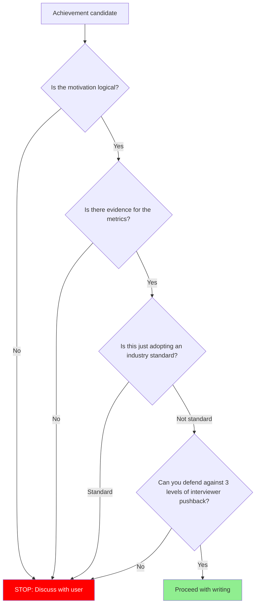

# Section-Specific Evaluation Reference

## Table of Contents

1. [Career vs Problem-Solving Distinction](#1-career-vs-problem-solving-distinction)
2. [Career Section Evaluation](#2-career-section-evaluation)
   - [Dimension Table](#dimension-table)
   - [PASS / FAIL Examples](#pass--fail-examples)
   - [Output Format](#career-evaluation-output-format)
3. [Problem-Solving Section Evaluation](#3-problem-solving-section-evaluation)
   - [Dimension Table](#dimension-table-1)
   - [PASS / FAIL Examples](#pass--fail-examples-1)
   - [Interview Depth Enhancement: Trade-off Richness Check](#interview-depth-enhancement-trade-off-richness-check)
   - [Output Format](#problem-solving-evaluation-output-format)
   - [Summary Count Format](#summary-count-format)
4. [Section Fitness Rules](#4-section-fitness-rules)
   - [Career vs Problem-Solving Distinction](#career-vs-problem-solving-distinction)
   - [Migration Rules](#migration-rules)
   - [Career-Level Volume Recommendations](#career-level-volume-recommendations)
   - [First-Page Primacy Rule](#first-page-primacy-rule)
   - [JD-Based Content Selection & Keyword Matching](#jd-based-content-selection--keyword-matching)
   - [Cross-Section Consistency Rule](#cross-section-consistency-rule)
5. [Writing Guidance Trigger: Achievement Lines](#5-writing-guidance-trigger-achievement-lines)
6. [Interview Simulation](#6-interview-simulation)

---

## Mandatory Evaluation Checklist

The following items must be checked during evaluation and included in the HTML Report output.

### Career Section
- [ ] PASS/FAIL verdict for each of the 6 criteria (Linear Causation, Metric Specificity, Role Clarity, Standard Transcendence, Hook Potential, Section Fitness)
- [ ] Identify bullets with high Hook Potential and bullets with low Hook Potential
- [ ] If Section Fitness is violated, recommend moving the line to the Problem-Solving section

### Problem-Solving Section
- [ ] PASS/FAIL verdict for each of the 6 criteria (Diagnostic Causation, Evidence Depth, Thought Visibility, Beyond-Standard Reasoning, Interview Depth, Section Fitness)
- [ ] Interview Depth: include results of the 3-level pushback simulation

### Technical Stack Placement
- [ ] Verify that the technical stack section is placed immediately below the self-introduction (JD tech stack matching must appear in the 7-second scan to benefit both ATS and recruiters)
- [ ] PASS: immediately after self-introduction / WARNING: 2nd section or later / FAIL: 3rd section or later, or at the bottom of the page

### Portfolio Theme Diversity
- [ ] Classify problem-solving entries by theme (Consistency, Performance, Resilience, Business Metrics, Data Pipeline, etc.)
- [ ] If 2 or more entries share the same theme, FLAG — recommend replacing one with a different theme

### Cross-Section Consistency
- [ ] Verify that episodes/keywords mentioned in the self-introduction are supported in the career or problem-solving section
- [ ] FLAG any hook that lacks supporting evidence

---

## 1. Career vs Problem-Solving Distinction

The career section and the problem-solving section answer fundamentally different questions and must be evaluated against separate criteria.

- **Career**: "What did this person achieve?" — direction and impact. Career bullets are **hooks** that invite interview questions.
- **Problem-Solving / Project Detail**: "How does this person approach problems?" — thought process and depth. Problem-solving entries are **proof** of engineering thinking.

The two sections are **independent**. Career bullets and problem-solving entries do not need a 1:1 correspondence. Every career section line is evaluated against the Career 6 criteria; every problem-solving section line is evaluated against the Problem-Solving 6 criteria.

---

## 2. Career Section Evaluation

### Dimension Table

| Dimension | Question | Fail Signal |
|-----------|----------|-------------|
| Linear Causation | Does goal→action→outcome connect in a single line as linear causation? | "improved", "enhanced", "introduced" without mechanism or outcome |
| Metric Specificity | Is the outcome supported by verifiable numbers (before→after, absolute value)? | Vague percentages, undefined baseline, unclear measurement method |
| Role Clarity | Is individual contribution distinguished from team output? | "participated", "contributed", "N-person project" without personal scope |
| Standard Transcendence | Is this a differentiated achievement beyond industry standard? | Webhook, CI/CD, Docker, REST API, etc. presented as a standalone achievement |
| Hook Potential | Does this single line spark the interviewer's curiosity and invite a question? | Tech name enumeration, generic description with no question-inducing power |
| Section Fitness | Is this an achievement statement or a problem narrative? | Problem diagnosis/resolution process placed in the career section |

### PASS / FAIL Examples

**Linear Causation — goal→action→outcome linear causation:**

| Verdict | Example | Reason |
|---------|---------|--------|
| PASS | "Built payment-order state sync scheduler, reducing weekly mismatches from 15 to 0" | Goal (eliminate mismatches)→action (build scheduler)→outcome (0 cases) clearly connected |
| PASS | "Applied Redis cache to product list/detail APIs, reducing peak-hour DB CPU from 90% to 50%" | Target→technical action→numeric outcome clearly connected |
| FAIL | "Improved payment system" | What and how? What was the outcome? — entire causation missing |
| FAIL | "Improved performance with async processing" | Applied where? By how much? — causation incomplete |

**Metric Specificity — verifiable numbers:**

| Verdict | Example | Reason |
|---------|---------|--------|
| PASS | "Weekly payment-order mismatches: 15 → 0" | before→after clear, verifiable |
| PASS | "Peak-hour DB CPU 90%→50%, average response time 1.2s→0.3s" | Multiple metrics, condition (peak hour) specified |
| FAIL | "50% performance improvement" | 50% of what? Under what conditions? Baseline undefined |
| FAIL | "Drastically reduced" | "Drastically" undefined, not verifiable |

**Role Clarity — identifying individual contribution:**

| Verdict | Example | Reason |
|---------|---------|--------|
| PASS | "Resolved payment mismatch with compensation transaction scheduler personally designed" | Personal action (personally designed) specified |
| PASS | "Led design and implementation of fault-isolation architecture for POS server integration" | Role (led design and implementation) clear |
| FAIL | "Team improved payment system" | What the individual did is unclear |
| FAIL | "Developed order system as a 3-person project" | Only headcount stated, individual scope of contribution absent |

**Standard Transcendence — achievement beyond industry standard:**

| Verdict | Example | Reason |
|---------|---------|--------|
| PASS | "Built compensation transaction + scheduler on top of webhook failures, achieving 0 payment mismatches" | Differentiated achievement built **on top of** the standard (Webhook) |
| PASS | "Reduced DB load by 80% via Redis cache + TTL strategy + cache invalidation logic" | Not just caching — strategic design + outcome |
| FAIL | "Introduced webhook-based async payment system" | Industry standard itself — not an achievement |
| FAIL | "Built CI/CD pipeline" | Infrastructure baseline |
| FAIL | "Configured Docker-based deployment environment" | Baseline of modern development |

**Hook Potential — inviting interview questions:**

| Verdict | Example | Reason |
|---------|---------|--------|
| PASS | "Resolved first-come coupon race condition with atomic update, achieving 0 over-issuances" | Interviewer: "What exactly is atomic update?" — question naturally invited |
| PASS | "Designed resilience architecture preventing external POS failures from propagating to orders" | Interviewer: "What pattern did you use?" — curiosity triggered |
| FAIL | "Developed coupon system" | Nothing to ask — interviewer's eyes do not linger |
| FAIL | "Stabilized order system" | Too abstract, no specific question comes to mind |

**Section Fitness — correct section placement:**

| Verdict | Example | Reason |
|---------|---------|--------|
| PASS | "Built compensation transaction scheduler, achieving 0 payment mismatches" | [System] + [Action] + [Outcome] pattern — achievement statement |
| PASS | "Built async message-queue-based order processing pipeline, tripling peak-hour throughput" | System built + numeric outcome — achievement statement |
| FAIL | "Discovered payment-order state mismatch and after analyzing the root cause..." | Problem narrative → needs to move to Problem-Solving section |
| FAIL | "The process of analyzing the root cause of intermittent POS server timeouts and introducing Circuit Breaker pattern..." | Root cause analysis + implementation process narrative → needs to move to Problem-Solving section |

### Career Evaluation Output Format (Internal)

This is the internal evaluation format used during Section-Specific Evaluation. The user-facing output format is defined in SKILL.md HTML Report phase.

```
[Career Line] "exact original text"
- Linear Causation: PASS / FAIL (reason)
- Metric Specificity: PASS / FAIL (reason)
- Role Clarity: PASS / FAIL / N/A (reason)
- Standard Transcendence: PASS / FAIL (reason)
- Hook Potential: PASS / FAIL (reason)
- Section Fitness: PASS / FAIL (reason)
```

---

## 3. Problem-Solving Section Evaluation

"Problem-Solving" and "Project Detail" are the same intent with different tab names. Both are deep narrative spaces for demonstrating problem detection and problem-solving ability.

### Dimension Table

| Dimension | Question | Fail Signal |
|-----------|----------|-------------|
| Diagnostic Causation | Does problem discovery→root cause diagnosis→attempt→failure reason→resolution connect as exploratory causation? | Jumps straight to solution, no root cause analysis of intermediate attempts |
| Evidence Depth | Is each attempt's failure/success supported by specific numbers and evidence? | "Didn't work", "inefficient", "slow" without data |
| Thought Visibility | Did problem diagnosis and technology selection come from the candidate's own thinking? | "On mentor's advice", "team decided", "referenced a blog" without personal reasoning |
| Beyond-Standard Reasoning | Is the technology choice supported by alternative comparison and trade-off analysis? | "Used [technology]", "applied [technology]" without why-this-not-that |
| Interview Depth | Is there enough narrative depth to survive 3-level pushback (implementation→judgment→alternatives)? | One-line resolution, no failure process, no trade-offs |
| Section Fitness | Is this a thought-process narrative or an outcome enumeration? | Only outcome bullets listed in the problem-solving section |

### PASS / FAIL Examples

**Diagnostic Causation — discovery→diagnosis→attempt→failure→resolution:**

| Verdict | Example | Reason |
|---------|---------|--------|
| PASS | "During QA, 100-unit coupon issued 152 times → reproduced via Thread.sleep → diagnosed READ COMMITTED + MVCC characteristics → 950/1000 failures after optimistic lock attempt → derived need for distributed lock" | Full arc from discovery→reproduction→diagnosis→attempt→failure cause→resolution direction |
| PASS | "Regex accuracy 40% → determined natural language understanding needed → single LLM hallucination rate 30% → derived need to separate observation/inference → 2-stage pipeline" | Each attempt: why it failed → learning arc connecting to the next attempt |
| FAIL | "Resolved concurrency issue with Redis distributed lock" | No explanation of why alternatives failed or how the issue was discovered — jumps straight to solution |
| FAIL | "Achieved 85% accuracy with LLM pipeline" | No explanation of why this structure, why previous attempts failed |

**Evidence Depth — specific failure/success data per attempt:**

| Verdict | Example | Reason |
|---------|---------|--------|
| PASS | "Optimistic lock: 950 failures out of 1000 concurrent requests, average response 1.2s even after applying Exponential Backoff" | Failure count + remaining problem even after mitigation, all in numbers |
| PASS | "Single LLM: accuracy 65%, hallucination 30% — generated allergy info not present in the photo" | Numbers + specific failure pattern (what went wrong) |
| FAIL | "Optimistic lock was inefficient" | Inefficient where and by how much? — no data |
| FAIL | "The first attempt had low accuracy" | How low? What was the problem? — absent |

**Thought Visibility — attribution to the candidate's own thinking:**

| Verdict | Example | Reason |
|---------|---------|--------|
| PASS | "Confirmed the LLM was 'inferring' and generating information not in the photo → concluded that observation and inference must be separated" | Observation→judgment→conclusion connected through the candidate's own thinking |
| PASS | "Started from mentor's question 'Can't you solve it without a lock?' → spent 3 days personally experimenting with CAS, isolation levels, and MVCC → independently confirmed need for distributed lock" | Trigger was external, but exploration and conclusion are the candidate's own |
| FAIL | "Decided on 2-stage pipeline in team meeting" | Only team decision described, no individual thinking process |
| FAIL | "Applied Redis distributed lock after referencing a blog that said it was appropriate" | No personal judgment on why it fits this specific situation |

**Beyond-Standard Reasoning — alternative comparison + trade-off analysis:**

| Verdict | Example | Reason |
|---------|---------|--------|
| PASS | "Pessimistic lock: Lock Escalation → Table Lock escalation risk / Advisory Lock: RDB shared memory consumption + scale-out constraints / → Distributed lock: Lua atomicity + TTL auto-release" | Per-alternative applicable scenario + exclusion reason before selection rationale |
| PASS | "Compared 5 model combinations on accuracy·cost·speed matrix, chose combination with 2% lower accuracy but 33% lower cost vs. 87%-accuracy combination" | Multi-dimensional comparison criteria + decision rationale |
| FAIL | "Used Redis distributed lock" | Why Redis? What were the alternatives? — selection rationale absent |
| FAIL | "Used GPT-4V" | Why this model? What other models? — no comparison |

**Target-Scale Perspective (for reference when evaluating):**

When evaluating Beyond-Standard Reasoning, additionally verify whether the alternative comparison and trade-off analysis remain valid at the target company's scale. This is not an independent criterion — it is a lens that reinforces the evaluation depth of Beyond-Standard Reasoning.

| Verdict | Example | Reason |
|---------|---------|--------|
| PASS | "Single DB lock → analyzed scale-out constraints in distributed environment → selected Redis distributed lock, scalable structure with TTL + Lua atomicity" | Technology choice accounts for scaling scenarios, not just current scale |
| FAIL | "Resolved concurrency issue with synchronized block" | Solution valid only on a single server — ineffective in the target company's distributed environment |

**Interview Depth — surviving 3-level pushback:**

| Verdict | Example | Reason |
|---------|---------|--------|
| PASS | 2-3 failed attempt arc + specific data and lessons from each failure + trade-off of final choice | L1("How?")→L2("Why?")→L3("Any alternatives?") all directly answerable from the narrative |
| PASS | "Regex (accuracy 40%) → single LLM (hallucination 30%) → observation/inference-separated pipeline (accuracy 85%) — narrative connecting each stage's failure cause to the motivation for the next attempt" | L1("How does the 2-stage pipeline work?")→L2("Why separate?")→L3("What about prompt tuning on the single LLM?") all answerable |
| FAIL | "Resolved concurrency issue with Redis distributed lock" | L1 — no implementation details / L2 — no selection rationale / L3 — no alternatives, all levels unanswerable |
| FAIL | "Resolved LLM hallucination issue with a 2-stage pipeline" | L1("How did you separate?") — no structural detail / L2("Why is separation the answer?") — no rationale / L3("What about prompt engineering?") — no alternative review |

**Section Fitness — correct section placement (problem-solving):**

| Verdict | Example | Reason |
|---------|---------|--------|
| PASS | Exploratory narrative with "[Problem] → [Resolution process] → [Verification] → [Retrospective]" structure | Narrative structure that reveals the thought process |
| PASS | Exploratory narrative in the form of "First-come coupon over-issuance bug → MVCC diagnosis → 3-stage lock experiment → Redis distributed lock selection → verification → retrospective" | Narrative revealing the problem→diagnosis→attempt→resolution→retrospective arc |
| FAIL | "Built menu metadata auto-extraction system, reduced headcount from 11 to 3" | Outcome bullet → needs to move to Career section |
| FAIL | "Resolved first-come coupon race condition, achieved 0 over-issuances, implemented Redis distributed lock" | Result summary bullet → needs to move to Career section |

### Interview Depth Enhancement: Trade-off Richness Check

For problem-solving entries, Interview Depth passes only when each alternative or attempt includes **rich trade-off reasoning** — not just "tried it, didn't work." Every excluded alternative must show why it was considered AND why it was ruled out in this specific context.

**Bad — alternatives listed without trade-off:**
```
Alternative 1 — Optimistic lock: excluded because it didn't fit
Alternative 2 — Redis distributed lock: excluded because no infrastructure
```

**Good — each alternative with applicable scenario + specific exclusion reason:**
```
Alternative 1 — Optimistic lock (version-based)
- In environments where conflicts are rare, most requests succeed
  without locking, making it efficient; however, in first-come
  scenarios where concurrent requests concentrate on the same row,
  retry explosions actually increase DB load

Alternative 2 — DB lock (Pessimistic lock / Advisory Lock)
- Pessimistic lock is the canonical approach for guaranteeing consistency
  in complex business logic requiring read-validate-update, but going
  through two phases for a simple operation like decrementing stock by 1
  is excessive
- Advisory Lock consumes RDB shared memory that is difficult to scale out,
  and introducing a DB-session-level lock for a single-row decrement was
  judged to have insufficient benefit relative to cost
```

**Scale Transfer Check:**

Following the interviewer's L3 pushback ("any other approaches?"), the question "what if the scale were 10x?" may arise. Check whether the answer to this question is implied within the narrative.

- If bottleneck prediction in a scaling scenario is visible: reinforcing element for Interview Depth
- If the narrative is optimized only for the current scale: potential weakness in Interview Depth — P1 finding candidate

### Problem-Solving Evaluation Output Format (Internal)

This is the internal evaluation format used during Section-Specific Evaluation. The user-facing output format is defined in SKILL.md HTML Report phase.

```
[Problem-Solving Line] "exact original text"
- Diagnostic Causation: PASS / FAIL (reason)
- Evidence Depth: PASS / FAIL (reason)
- Thought Visibility: PASS / FAIL / N/A (reason)
- Beyond-Standard Reasoning: PASS / FAIL (reason)
- Interview Depth: PASS / FAIL (reason)
- Section Fitness: PASS / FAIL (reason)
```

### Summary Count Format (Internal)

This is the internal evaluation format used during Section-Specific Evaluation. The user-facing output format is defined in SKILL.md HTML Report phase.

After all lines are evaluated, produce a split summary:

```
[Career Summary] Linear Causation: X/Y FAIL, Metric Specificity: X/Y FAIL, Role Clarity: X/Y FAIL, Standard Transcendence: X/Y FAIL, Hook Potential: X/Y FAIL, Section Fitness: X/Y FAIL
[Problem-Solving Summary] Diagnostic Causation: X/Y FAIL, Evidence Depth: X/Y FAIL, Thought Visibility: X/Y FAIL, Beyond-Standard Reasoning: X/Y FAIL, Interview Depth: X/Y FAIL, Section Fitness: X/Y FAIL
```

These counts drive the Writing Guidance Triggers.

---

## 4. Section Fitness Rules

### Career vs Problem-Solving Distinction

Career (6 criteria) evaluates direction and impact. Problem-Solving (6 criteria) evaluates thought process and depth. See Section 2 and Section 3 above for full criteria.

Never put problem descriptions like "Resolved payment-order state inconsistency" in the career section. That belongs in the problem-solving section.

### Migration Rules

State these as direct instructions, not suggestions:

- "Discovered and resolved a problem" → **Move this line to the Problem-Solving / Project Detail section**
- "Built a system and achieved outcomes" → **Move this line to the Career section**
- Same work appearing in both sections → flag as duplication, choose one
- When recommending migration, specify: "[original line] → move to [target section]"

### Career-Level Volume Recommendations

Career-level guidance for Problem-Solving / Project Detail entry count. Candidates with fewer years need more detailed problem-solving narratives to compensate for limited career breadth.

| Career Level | Recommended Entries per Position | Primary Strategy |
|---|---|---|
| New Grad | 2 entries per position | Prove CS depth and learning velocity. Signature project + detailed problem-solving entries. |
| Junior | 2 entries per position | Prove depth + technical foundations. Signature project + key problem-solving entries. |
| Mid | 1-2 entries per position | Balance depth and breadth. Signature project + major problem-solving entries. |
| Senior | Selective | Impact and leadership focus. Signature project less critical than career achievements and system thinking. |

### First-Page Primacy Rule

There is NO hard page limit. A 4-page resume is acceptable if every page earns its space. However, the opening section must function as a standalone executive summary:

**The opening section (approximately the first 500 words or 20-25 bullet lines) must contain:**
- Role identity + core competency (self-introduction)
- Top 2-3 quantified achievements
- Signature project summary (problem + outcome in 2-3 lines)
- Technical stack overview

**Why:** Recruiters spend ~7.4 seconds on initial screening (Ladders Eye-Tracking Study, 2018). Everything that determines "read further vs reject" must appear in the opening section. Remaining sections are for depth — they will only be read if the opening section earns the reader's attention.

**Evaluation:**
- PASS: Opening section contains identity, achievements, and signature summary
- WARNING: Key achievements or signature project buried past the opening section
- FAIL: Opening section is entirely career history or education with no impact signals

### Technical Stack Section Placement

**Why**: JD tech stack matching must appear in the 7-second scan to benefit both ATS and recruiters. If the tech section is buried after the career section, stack matching is confirmed too late.

Recommend placing the tech section immediately below the self-introduction.

**Evaluation**:
- PASS: Tech section is positioned immediately after the self-introduction
- WARNING: Tech section is positioned after the career section
- FAIL: Tech section is at the end of the resume or absent entirely

### JD-Based Content Selection & Keyword Matching

#### JD Keyword Matching (AI/ATS Screening)

When a JD (Job Description) text is provided, evaluate keyword alignment. Modern hiring pipelines use ATS (Applicant Tracking Systems) and AI-based screening that filter resumes by keyword match rate before human review.

**Evaluation criteria:**
- Extract key technical skills, tools, and domain terms from the target JD
- Check which JD keywords appear in the resume (exact match or close synonym)
- Calculate approximate match rate: matched keywords / total JD keywords

**Output format (when target JD is available):**
```
[JD Keyword Match]
- JD keywords identified: N
- Matched in resume: M (list top matches)
- Missing from resume: K (list missing keywords)
- Match rate: M/N (X%)
- Recommendation: [Add missing keywords where genuine experience exists / Match rate is sufficient]
```

**Guidelines:**
- Match rate > 70%: Strong alignment — PASS
- Match rate 40-70%: Partial alignment — recommend adding missing keywords where the candidate has genuine experience
- Match rate < 40%: Weak alignment — flag as potential ATS risk
- NEVER recommend adding keywords for skills the candidate does not actually possess (Absolute Rule 4)
- Keyword placement matters: technical stack section and achievement lines are highest-weight ATS zones
- Every JD keyword match must map to a specific project or achievement in the resume. A keyword that appears only in the technical stack section with no supporting achievement line is a **weak match** — flag it and recommend adding an evidence line.

**When no JD is provided:** Skip this check. Note: "JD keyword matching skipped — no target JD available."

#### JD-Based Content Selection

When a JD is provided, go beyond keyword matching to **optimize content selection itself against the JD**. If better candidates exist in the note pool, recommend a swap.

**Career bullet / Problem-Solving entry JD fit evaluation:**
- Evaluate each career bullet and problem-solving entry currently in the resume for JD keyword and domain relevance
- If the note pool contains a candidate that better fits the JD, recommend a specific swap:
  - "Consider replacing current [entry original text] with [note pool candidate title] (covers JD keyword [keyword name])"
- If no note pool candidate exists: suggest how to emphasize JD-relevant keywords in the current entry

**Self-introduction type recommendation:**
- Also recommend the self-introduction type (A/B/C/D) matched to the JD (see self-introduction.md for each type's positioning)
- Based on the competencies the JD emphasizes (e.g., system design, problem-solving depth, leadership, specific domain experience), determine which type creates the most effective hook
- Recommendation format: "JD analysis shows [competency] emphasis is advantageous → recommend self-introduction type [X] (reason)"

**When no JD is provided:** Skip this entire section. Note: "JD-based content selection skipped — no target JD available."

### Cross-Section Consistency Rule

Every project/episode/achievement hooked (mentioned) in the self-introduction must have a corresponding entry in the career or problem-solving section.

**Core Intuition:**
- Self-introduction = the hook that captures the interviewer's attention
- Problem-solving = the proof of that hook
- If you set a hook, evidence must exist. Evidence without a hook gets buried, and **a hook without evidence destroys credibility.**

**Why This Rule Matters:**
- Interviewers search the resume for projects that caught their interest in the self-introduction → if absent, credibility drops
- Projects/achievements briefly mentioned in the self-introduction must be elaborated in the problem-solving section
- What is in the self-introduction represents key JD-aligned hooks → these are the most attention-capturing projects, so they must be backed by evidence in the problem-solving tab

**Evaluation Method:**
1. Extract project/episode/achievement keywords mentioned in the self-introduction
2. For each keyword, verify whether a corresponding entry exists in the career or problem-solving section
3. Projects at hook level (ones an interviewer would ask about) must have **detailed elaboration** in the problem-solving section — a single career line alone is insufficient

**PASS / FAIL Examples:**

| Verdict | Self-Intro Reference | Career/Problem-Solving Match | Reason |
|---------|---------------------|------------------------------|--------|
| PASS | Self-intro mentions "Redefined payment-order state inconsistency as an inter-system sync problem" | Detailed elaboration of that project exists in problem-solving section | Hook → evidence connection complete |
| FAIL | Self-intro mentions "Atomically resolved first-come coupon race condition" | No corresponding project in problem-solving or career section | Hook exists but evidence is entirely absent → interviewer cannot find it in the resume |
| FAIL | Self-intro mentions "Saved KRW 15M/month with LLM-based automation" | Only a single line in career, no detailed elaboration in problem-solving | Hook-level project without sufficient evidence — resume provides no support when an interviewer follows up |

**Output format (self-introduction hook–evidence check):**
```
[Cross-Section Consistency Check]
Self-intro hook keywords: [list of extracted keywords]

- "[hook original text]" → problem-solving/career match: PASS / FAIL
  (If FAIL: "Add detailed elaboration to problem-solving section" or "Strengthen career entry")
```

### Portfolio Theme Overlap Detection

**Why**: Having 2 or more problem-solving entries on the same theme creates the impression "is this all this person can do?" Covering diverse themes reads as "someone who can solve multiple types of problems."

When evaluating the full resume, verify the technical theme diversity of problem-solving entries. Flag if 2 or more entries share the same theme.

| Technical Theme | Example Topics |
|----------------|---------------|
| Consistency | race condition, distributed lock, transaction sync |
| Performance | caching, query optimization, response time |
| Resilience | circuit breaker, retry, fallback, fault isolation |
| Business Metrics | cost reduction, headcount, conversion rate |
| Data Pipeline | ETL, streaming, batch processing |

**Evaluation**:
- PASS: Each signature/detailed entry covers a different theme
- FLAG: 2+ entries share the same theme → "Portfolio theme overlap — [entry1] and [entry2] are both [theme]. Consider replacing one with an entry of a different theme."

---

## 5. Writing Guidance Trigger: Achievement Lines

After completing the section-specific evaluation and summary counts, check if the writing guidance trigger condition is met. This is a mandatory check.

**Career trigger**: `Linear Causation FAIL count / career_lines > 0.5` OR `Metric Specificity FAIL count / career_lines > 0.5` (career_lines = number of bullet lines evaluated against the Career 6 criteria in the career section, excluding titles, blank lines, and section markers)

**Problem-solving trigger**: `Diagnostic Causation FAIL count / problem_lines > 0.5` OR `Evidence Depth FAIL count / problem_lines > 0.5` (problem_lines = number of lines evaluated against the Problem-Solving 6 criteria in the problem-solving section)

When triggered, deliver the full section-specific evaluation first, then deliver the corresponding message:

**Career trigger message:**
> "X out of N total career section lines fail Linear Causation/Metric Specificity. These career descriptions require content restructuring, not expression polishing. Please refer to the template and pre-writing validation flowchart in the Writing Guidance: Achievement Lines section above and rewrite."

When the career section trigger is met, refer to the Section-Specific Evaluation section in `Read references/experience-mining.md` and conduct an Experience Mining Interview. If the user opts out, replace with the Writing Guidance message above.

**Problem-solving trigger message:**
> "X out of N total problem-solving section lines fail Diagnostic Causation/Evidence Depth. These problem-solving descriptions require restructuring so that the thought process is visible. Please refer to the P.A.R.R. Writing Template and Before/After examples above and rewrite."

When the problem-solving section trigger is met, refer to the Section-Specific Evaluation section in `Read references/experience-mining.md` and conduct an Experience Mining Interview. If the user opts out, replace with the Writing Guidance message above.

Additional trigger conditions (any one also triggers):
- Section structure needs reorganization (Section Fitness failures pointing to section migration)
- Achievement lines need [Target] + [Action] + [Outcome] restructuring

### Achievement Line Structure

Use this guidance when Linear Causation or Metric Specificity failures indicate that career lines need content restructuring, not expression polishing.

```
[Target context] + [Technical action] + [Measurable outcome]
```

| Bad example | Problem | Good example |
|-------------|---------|--------------|
| Reduced DB CPU by introducing Redis cache | No context on what was cached | Applied Redis cache to product list/detail APIs, reducing peak-hour DB CPU from 90% to 50% |
| Improved payment system | No specifics on what or how | Built payment-order state sync scheduler, reducing weekly payment-order mismatches from 15 to 0 |
| Introduced webhook-based async payment system | This is already the standard | Built payment state sync scheduler to handle webhook delivery failures |

### Technical Keyword Selection

Choose specific keywords that invite rich follow-up questions.

| Abstract (avoid) | Specific (use) | Interview questions it invites |
|-------------------|----------------|-------------------------------|
| Auto-recovery system | Sync scheduler | Interval? Concurrent execution prevention? |
| Performance optimization | Redis cache | TTL strategy? Invalidation timing? |
| Message-based processing | Kafka | Partition design? At-least-once guarantee? |

### Pre-Writing Validation

Before writing or rewriting any achievement line, walk through these questions in order. If any answer is "No," stop writing and discuss with the user.



---

## 6. Interview Simulation

This section extends the 3-level pushback simulation (node H in the Evaluation Protocol flowchart) to the **writing guidance** context. When the agent is helping write or rewrite achievement lines (not just reviewing), apply the same 3-level simulation as a quality gate before finalizing each line. If the candidate cannot answer all 3 levels, that line will hurt more than help.

### 3-Level Pushback

| Level | Question Pattern | What It Tests |
|-------|-----------------|---------------|
| L1 | "How specifically did you implement it?" | Implementation knowledge |
| L2 | "Why did you choose that approach?" | Technical judgment |
| L3 | "Did you not consider any other alternatives?" | Trade-off awareness |

Apply all three levels to every line — including well-written ones. Well-written lines get harder L1-L3, not softer ones.

For well-written lines (e.g., "scheduler running every 5 minutes"), pushback goes deeper:
- L1: "Why 5 minutes? Why not 3 or 10?"
- L2: "How did you prevent concurrent execution?"
- L3: "What happens if the scheduler goes down?"

Apply the same simulation to existing lines when reviewing. "Just polish" does not override this check.

### L3 Trade-off Quality Standard

When evaluating L3 ("Did you not consider any other alternatives?"), each excluded alternative must include **both**:
1. The scenario where this alternative would have been the right choice
2. The specific reason it was ruled out in this situation

A bare "excluded" or "no infrastructure" is insufficient. The answer must show engineering judgment, not just a conclusion.

| Quality | Example |
|---------|---------|
| **Bad — no trade-off, just a verdict** | "Optimistic lock: excluded because it didn't fit / Redis distributed lock: excluded because no infrastructure" |
| **Good — scenario + this-situation reason** | "Optimistic lock (version-based): in environments where conflicts are rare, most requests succeed without locking, making it efficient; however, in first-come scenarios where concurrent requests concentrate on the same row, retry explosions actually increase DB load / DB lock (pessimistic lock / Advisory Lock): pessimistic lock is the canonical approach for guaranteeing consistency in complex business logic requiring read-validate-update, but going through two phases for a simple operation like decrementing stock by 1 is excessive. Advisory Lock consumes RDB shared memory that is difficult to scale out, and introducing a DB-session-level lock for a single-row decrement was judged to have insufficient benefit relative to cost" |

### Obvious Elimination vs Interview Backup

Alternatives that are obviously inapplicable (e.g., `synchronized` in a multi-instance environment) do not belong in the resume body — they waste space and signal shallow thinking. Prepare these as **interview backup answers** instead: know why they fail, but do not surface them in writing unless the context demands it.
