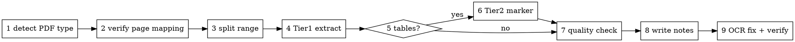

# Scan PDF to Notes

## Overview

A scanned book PDF (Producer is `ABBYY FineReader` or another OCR engine) is **page images + an OCR text layer**. The OCR layer's accuracy is the **quality ceiling** — no text extractor beats it for body text, and tables/figures/precise values (hashes, numbers, formulas) are the first things OCR mangles.

**Core principle:** one job yields **two artifacts and keeps both**:
- **Raw extraction (추출 원문)** — 1:1 with the book, OCR noise included. The *verifiable source*. Never delete it.
- **Study notes (정리)** — a re-narrated, condensed rewrite of the raw extraction. The *thing you read and study*.

Full flow = **Part A extract → quality check → Part B notes**. Doing only one half leaves the job half done.

## When to Use / NOT

**Use:** extracting a page range (chapter) of a scanned/OCR PDF book into text, markdown, or notes. When tables/code collapse into a single mangled line. When `pdftotext`/`get_text` alone loses structure and tables.

**NOT for:** native (text-based) PDFs — `pymupdf4llm`/`pdftotext` alone suffice (but confirm this in step 1 first). If only raw OCR text is needed and no notes, stop after Part A.

## Full Flow

---

# Part A — Extraction

### 1. Detect PDF type
`pdfinfo file.pdf | grep -iE 'producer|pages'`. If Producer is `ABBYY` or a scanner name, it is scanned+OCR → **OCR is the quality ceiling**. Pull one page with `pdftotext -f N -l N file.pdf -` to confirm a text layer exists.

### 2. Verify page mapping
Printed page ≠ PDF index (front-matter offset, blank divider pages between chapters). **Sample-extract the chapter boundary pages** to confirm start/end and any blank pages. Skipping this extracts the wrong pages (e.g. an empty p200 is the 6↔7 chapter divider). Also: pymupdf indices are **0-based**, while printed pages and `convert-range.sh` args are **1-based** — don't confuse the conversion. If the mapping is unclear, find the chapter-title page first via a `get_text()` keyword search.

### 3. Split the range
`convert-range.sh <SRC.pdf> <START> <END>` — pymupdf `insert_pdf` (the script handles the 0-indexed conversion) cuts out only the target pages. Name it `<book>_p<a>-<b>`.

### 4. Tier 1 (always)
`convert-range.sh` produces these in one pass:
- `pymupdf4llm.to_markdown(..., table_strategy="lines_strict")` → markdown with headers and structure. **Never use `fitz.get_text("text")` alone** (it loses structure and tables).
- `pdftotext -layout` → spatially-aligned text (cross-check for tables, columns, log output).

### 5–6. Tier 2 — recover tables/code blocks (conditionally required)
**If there are real grid tables, or code/logs where alignment matters,** run `marker-chunked.sh <SPLIT.pdf>`. marker re-OCRs + analyzes layout to restore **tables as real markdown tables (`|`)**. On Apple Silicon, the MPS bug forces **8-page chunking** (the script splits and recombines automatically).
- INFO output, key:value dumps, and diagrams "look like tables" but are not grids → marker is unnecessary; `pdftotext -layout` is enough.
- Cost: model is several GB and runs for minutes. The value often concentrates in 1–2 tables, so judge by ROI.

### 7. Quality check
`quality-check.sh <files...>` compares broken-char (`�`), header, and table-row counts per tool to pick a **per-region canonical source**. Body prose is usually pymupdf4llm; table/precise-value regions are pdftotext-layout or marker. **Never trust a single tool blindly.**

---

# Part B — Study Notes (정리)

The raw extraction is a "transcript" with OCR noise. The notes are the "study notebook" you write from it.

### 8. Writing the notes
- **Re-narrate and condense** — rewrite in your own words; do not copy book sentences verbatim (not a transcription).
- **Reorganize into numbered thematic sections.**
- **If a series exists, match its style, density, and file naming** — e.g. if `<book>_6장_정리.md` exists, write `<book>_7장_정리.md` at the same tone and section depth. (Series consistency is the core value of the notes.)
- **Prose comparisons → markdown tables.**
- **Reconstruct OCR-broken code/RESP/logs to spec** — don't paste broken tokens; fix them to the protocol format (`*N`/`$N`).
- **"Easy-to-confuse points" recap section** at the chapter's end. **The recap is conceptual, never autobiographical** — even if the series example is first-person ("I found this confusing"), keep the section but state the conceptual difficulty objectively (the no-fabrication rule wins).
- **Header note** at the top: state that it is a re-narrated summary + the source page range.

### 9. OCR fix + verification (while moving raw → notes)
- **Korean body text**: context-based correction is fine. Common patterns:

  | Pattern | OCR → fix |
  |---------|-----------|
  | mangled English abbreviation/parens | `AOFAppend 0nly` → `AOF(Append Only File)`, `RDBRedisDataBase` → `RDB(Redis DataBase)` |
  | digit↔letter confusion | `keyl`→`key1`, `co니nter`→`counter`, `slave©`→`slave0` (`l↔1`, `O↔0`) |
  | broken abbreviation glyphs | `QOM`→`OOM`, `[inf이`→`[info]`, `사wck`→`check` |
  | broken Korean | `人수용`→`사용`, `기준0.루`→`기준으로` |
  | superscript/footnote noise | `…`, `프로토콜*3P`, footnote digits — remove |

- **Precise values (hashes, offsets, ports, formulas, versions, identifiers): no context guessing.** Render the page to an image and **verify by eye**: `pymupdf.open(p)[idx].get_pixmap(matrix=pymupdf.Matrix(2.4,2.4)).save("v.png")` → read → delete the temp PNG. Use scale 2.2–2.6; **raise it for small fonts/logs/tables** (2.2 can be blurry).
- **Figures don't extract as text.** Fold their content into prose via caption + body description, or render to image if truly needed.

### No fabrication (strict)
- **Do not invent personal study context** — study week numbers, PR numbers, first-person reflections ("I was confused at first") are unknown to you, so **leave them blank for the user**. Even if the series example contains them, do not imitate and invent.
- **Environment-dependent values** (absolute maxmemory figures, etc.) → annotate as "reference values".
- **Do not fill gaps with inference** not present in the raw extraction.

## Tool Selection

| Tool | Output | Strength | Limit |
|---|---|---|---|
| `pymupdf4llm` | `.md` | header/structure markdown, fast | inherits OCR errors, misses scanned tables |
| `pdftotext -layout` | `.txt` | preserves spatial layout/logs, fast | no markdown structure, inherits OCR |
| `marker_single` | `.md` | re-OCR, **restores tables/code** | slow, multi-GB model, 8p chunks on MPS |
| `get_pixmap()` | `.png` | **eye-verify** precise values/figures | not text, manual check only |
| ❌ `fitz.get_text("text")` | `.txt` | — | loses all structure/tables — **do not use** |

## Common Mistakes

| Mistake | Fix |
|---|---|
| extracting plain text with `get_text("text")` | use pymupdf4llm to preserve structure |
| dropping tables when they break | recover real tables with marker Tier 2 |
| wasting marker on non-table INFO output | marker only for grid tables; pdftotext-layout for the rest |
| trusting one tool's output | compare with `quality-check.sh`, pick per-region canonical |
| context-guessing OCR precise values | eye-verify hashes/formulas/ports via image render |
| deleting the raw extraction (intermediate) | it is the verification source → keep, separate from notes |
| pasting broken code/RESP verbatim | reconstruct to protocol format |
| free-styling style/naming in a series | match the existing notes' tone, density, filename |
| fabricating personal study context | leave blank for the user |
| starting without checking it's scanned | run `pdfinfo` Producer first |

## Reference (scripts)

- `convert-range.sh <SRC.pdf> <START> <END> [STEM]` — split + Tier 1
- `marker-chunked.sh <SPLIT.pdf> [CHUNK=8]` — Tier 2, auto chunk + merge
- `quality-check.sh <files...>` — compare broken-char/structure metrics
