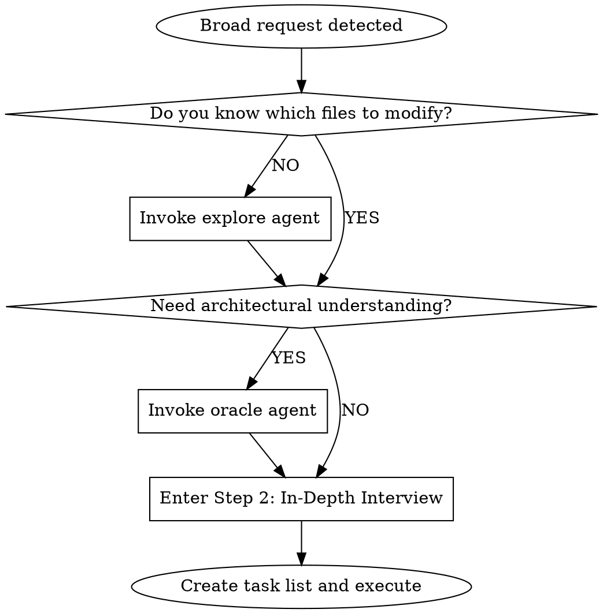

# Decision Gates

Request classification and interview workflow for the Sisyphus orchestrator.

## Decision Gate System (Phase 0)

### Step 1: Request Classification

| Type | Signal | Action |
|------|--------|--------|
| **Trivial** | Single file, known location, direct answer | Direct tools only |
| **Explicit** | Specific file/line, clear command | Execute directly |
| **Exploratory** | "How does X work?", "Find Y" | Fire explore (1-3) + tools in parallel |
| **Open-ended** | "Improve", "Refactor", "Add feature" | Assess codebase first -> Step 2 |
| **Ambiguous** | Unclear scope, multiple interpretations | -> Step 2 |

### Step 2: In-Depth Interview Mode

**When to Enter**: Open-ended or Ambiguous requests from Step 1.

**Conduct thorough interviews using `AskUserQuestion` about literally anything:**
- Technical implementation (architecture, patterns, error handling, state management)
- UI & UX (user flows, edge cases, loading states, error feedback)
- Concerns & risks (failure modes, security, performance, scalability)
- Tradeoffs (speed vs quality, scope boundaries, priorities)

**Interview Rules:**

1. **No Obvious Questions** - Don't ask what the codebase can answer. Use explore/oracle first.
2. **Rich Context in Questions** - Every question must explain the situation, why this matters, and what's at stake.
3. **Detailed Options** - Each option needs description explaining consequences, not just labels.
4. **Continue Until Complete** - Keep interviewing until YOU have no questions left. Not after 2-3 questions. Not when user seems tired.

**AskUserQuestion Quality Standard:**

```yaml
BAD:
  question: "Which approach?"
  options:
    - label: "A"
    - label: "B"

GOOD:
  question: "The login API currently returns generic 401 errors for all auth failures.
    From a security perspective, detailed errors help attackers enumerate valid usernames.
    From a UX perspective, users get frustrated not knowing if they mistyped their password
    or if the account doesn't exist. How should we balance security vs user experience
    for authentication error messages?"
  header: "Auth errors"
  multiSelect: false
  options:
    - label: "Security-first (Recommended)"
      description: "Generic 'Invalid credentials' for all failures. Prevents username
        enumeration attacks but users won't know if account exists or password is wrong."
    - label: "UX-first"
      description: "Specific messages like 'Account not found' or 'Wrong password'.
        Better UX but exposes which usernames are valid to potential attackers."
    - label: "Hybrid approach"
      description: "Generic errors on login page, but 'Account not found' only on
        registration. Balanced but adds implementation complexity."
```

**Question Structure:**
1. **Current situation** - What exists now, what's the context
2. **Tension/Problem** - Why this decision matters, conflicting concerns
3. **The actual question** - Clear ask with "How should we..." or "Which approach..."

**Exit Condition**: All ambiguities resolved AND you can clearly articulate:
- What will be built
- How success will be measured
- What is explicitly OUT of scope

### Step 3: Delegation Check

**Default Bias: DELEGATE. WORK YOURSELF ONLY WHEN IT IS SUPER SIMPLE.**

Ask in order:
1. Is there a specialized agent matching this request?
2. Does a delegate_task category best describe the task?
3. Can you accomplish it yourself FOR SURE? REALLY, REALLY?

## Broad Request Handling

### Broad Request Detection

A request is **BROAD** if ANY of:
- Uses scope-less verbs: "improve", "enhance", "fix", "refactor", "add", "implement" without specific targets
- No specific file or function mentioned
- Touches multiple unrelated areas (3+ components)
- Single sentence without clear deliverable
- You cannot immediately identify which files to modify

### When Broad Request Detected



1. **First**: Invoke `explore` to understand relevant codebase areas
2. **Optionally**: Invoke `oracle` for architectural guidance
3. **Then**: Enter **Step 2: In-Depth Interview Mode** (from Decision Gate System)
4. **Finally**: Create task list and delegate to sisyphus-junior

### Context Brokering Protocol (CRITICAL)

**NEVER burden the user with questions the codebase can answer.**

| Question Type | Ask User? | Action |
|---------------|-----------|--------|
| "Which project contains X?" | NO | Use explore first |
| "What patterns exist in the codebase?" | NO | Use explore first |
| "Where is X implemented?" | NO | Use explore first |
| "What's the current architecture?" | NO | Use oracle |
| "What's the tech stack?" | NO | Use explore first |
| "What's your timeline?" | YES | Ask user (via AskUserQuestion) |
| "Should we prioritize speed or quality?" | YES | Ask user (via AskUserQuestion) |
| "What's the scope boundary?" | YES | Ask user (via AskUserQuestion) |

**The ONLY questions for users are about PREFERENCES, not FACTS.**

### Handling Subagent User Interview Requests

When a subagent responds that it needs user input/interview:

1. Show the questions to the user (via AskUserQuestion or directly)
2. Collect user responses
3. Resume the subagent with the answers
