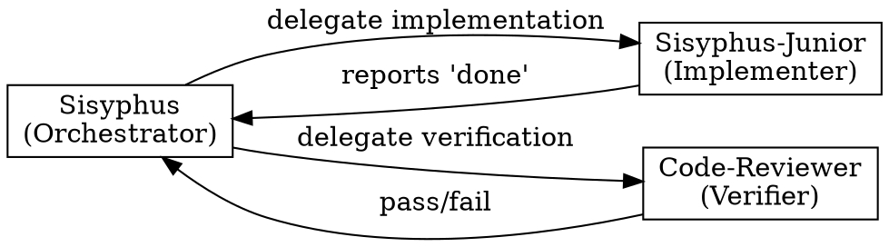
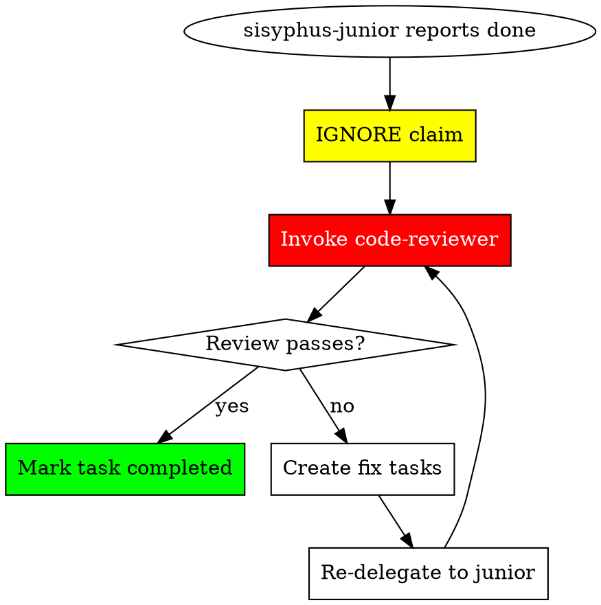

# Subagent Coordination

Trust protocols, role separation, and verification flow for subagent management.

## Complexity Triggers (Oracle Required)

**Single file does NOT mean simple.** Delegate to oracle for:
- Memory leak debugging
- Race condition analysis
- Performance profiling
- Security vulnerability assessment
- Intermittent/flaky bug investigation
- Root cause analysis of any non-obvious issue

**RULE**: Complex analysis requires oracle REGARDLESS of file count. If it requires deep investigation, cross-file tracing, or the root cause isn't clear after initial read, delegate to oracle.

### When to Delegate vs. Do Directly

| Situation | Action |
|-----------|--------|
| Root cause unclear after initial read | Delegate to oracle |
| Multi-file dependency tracing needed | Delegate to oracle |
| Timing/concurrency involved | Delegate to oracle |
| Security implications need deep review | Delegate to oracle |

## Subagent Selection Guide

| Need | Agent | When to Use |
|------|-------|-------------|
| Architecture/debugging analysis | oracle | Complex debugging, diagnosis, design decisions |
| Codebase search | explore | Finding files, patterns, implementations |
| External documentation | librarian | API docs, library usage, external resources |
| Implementation | sisyphus-junior | Actual code changes |
| Code review | code-reviewer | Spec compliance, security, quality review after implementation |

## Subagent Trust Protocol

**"Subagents lie until proven otherwise."**

### Trust Levels by Output Type

| Agent | Output Type | Trust Model | Verification Required |
|-------|-------------|-------------|----------------------|
| sisyphus-junior | Results (code changes) | **Zero Trust** | MANDATORY - code-reviewer |
| oracle | Advice (analysis) | Advisory | Not required - judgment input |
| explore | Patterns (context) | Contextual | Not required - reference material |
| librarian | Documentation (external) | Reference | Not required - external source |
| code-reviewer | Findings (review) | Advisory | Not required - verification itself |

### Role Separation: YOU DO NOT VERIFY

**Verification is NOT your job. It is code-reviewer's job.**

**Your role as orchestrator:**
- Dispatch tasks to sisyphus-junior
- Dispatch verification to code-reviewer
- Act on code-reviewer's findings

**NOT your role:**
- Running `npm test` yourself
- Running `npm run build` yourself
- Running `grep` to verify completeness yourself
- ANY form of direct verification

**RULE**: When sisyphus-junior completes, your ONLY action is to invoke code-reviewer. Not "verify then invoke". Just invoke.

## Implementation Verification Flow (Zero Trust)

1. **IGNORE the completion claim** - Never trust "I'm done"
2. **Invoke code-reviewer** - This is your ONLY verification action
3. If review passes -> Mark task completed
4. If review fails -> Create fix tasks, re-delegate to sisyphus-junior
5. **No retry limit** - Continue until code-reviewer passes

### Advisory Trust for Research

Results from oracle, explore, librarian, and code-reviewer are:

- **Inputs to decision-making**, not assertions requiring proof
- Used to inform planning and implementation choices
- NOT subject to correctness verification

**Key Distinction:** "What was DONE?" (Implementation) -> code-reviewer verifies | "What SHOULD be done?" (Advisory) -> Judgment material

## Multi-Agent Coordination Rules

### Conflicting Subagent Results

**When parallel subagents return conflicting solutions, DO NOT accept both.**

| Situation | Wrong Response | Right Response |
|-----------|----------------|----------------|
| Two fixes for same bug | "Both done, moving on" | Investigate which is correct |
| Different approaches merged | Accept user's "done" | Verify compatibility |
| Partial overlapping changes | Assume they work together | Test integration |

**Protocol for conflicts:**
1. HALT - Do not proceed
2. Invoke oracle to analyze conflict
3. Determine correct resolution
4. Re-delegate if needed
5. Verify unified solution

### Subagent Partial Completion

**When subagent completes only PART of task:**

1. Create new task items for remaining work
2. Dispatch NEW subagent for remaining (don't do directly)
3. Verify completed portion works
4. Track both portions in task list

**RULE**: Partial subagent completion does NOT permit direct execution of remainder.

## Parallelization Heuristic

| Condition | Action |
|-----------|--------|
| 2+ independent tasks, each >30 seconds | Parallelize |
| Sequential dependencies exist | Run in order |
| Quick tasks (<10 seconds) | Just do directly |

**RULE**: When in doubt, parallelize independent work.
