# Verification & QA Reference

Verification flow, Evidence Audit Gate, and QA REQUEST composition.

## Verification Flow

```dot
digraph verification_flow {
    rankdir=LR;
    "junior done" [shape=ellipse];
    "IGNORE" [shape=box];
    "argus" [shape=box, style=filled, fillcolor=red, fontcolor=white];
    "verdict?" [shape=diamond];
    "evidence audit" [shape=box, style=filled, fillcolor=orange, fontcolor=white];
    "evidence OK?" [shape=diamond];
    "re-invoke argus" [shape=box, style=filled, fillcolor=red, fontcolor=white];
    "new verdict?" [shape=diamond];
    "still gap?" [shape=diamond];
    "retries < 3?" [shape=diamond];
    "interview user" [shape=box, style=filled, fillcolor=purple, fontcolor=white];
    "mnemosyne" [shape=box, style=filled, fillcolor=blue, fontcolor=white];
    "complete" [shape=box, style=filled, fillcolor=green];
    "fix + retry" [shape=box];

    "junior done" -> "IGNORE" -> "argus" -> "verdict?";
    "verdict?" -> "fix + retry" [label="REQUEST_CHANGES"];
    "verdict?" -> "evidence audit" [label="APPROVE/COMMENT"];
    "evidence audit" -> "evidence OK?";
    "evidence OK?" -> "mnemosyne" [label="yes"];
    "evidence OK?" -> "re-invoke argus" [label="no (gap)"];
    "re-invoke argus" -> "new verdict?";
    "new verdict?" -> "fix + retry" [label="REQUEST_CHANGES"];
    "new verdict?" -> "still gap?" [label="APPROVE/COMMENT"];
    "still gap?" -> "mnemosyne" [label="no"];
    "still gap?" -> "retries < 3?" [label="yes"];
    "retries < 3?" -> "re-invoke argus" [label="yes"];
    "retries < 3?" -> "interview user" [label="no (exhausted)"];
    "mnemosyne" -> "complete";
    "fix + retry" -> "argus";
}
```



1. **IGNORE the completion claim** — Never trust "I'm done"
2. **Invoke argus** — This is your ONLY verification action
3. If APPROVE/COMMENT → **Run Evidence Audit Gate** before proceeding
4. If evidence gap → re-invoke argus (up to 3x; interview user if exhausted)
5. If evidence OK → **Invoke mnemosyne** to commit
6. If REQUEST_CHANGES → Create fix task, re-delegate to sisyphus-junior
7. **No retry limit on fix cycle** — Continue until argus passes

---

## Evidence Audit Gate

### Scope

Applies to **APPROVE** and **COMMENT** verdicts only. REQUEST_CHANGES bypasses the gate entirely.

### Expected Evidence Manifest

During QA REQUEST composition, sisyphus builds a list of evidence file paths from `## Required Verification`. When manifest is empty (judgment-only review), the audit gate passes trivially.

**Stage 1 automated checks (auto-include)**: When code changes are present, auto-include evidence paths for Stage 1 checks that exist in this project. Only include paths for commands actually discovered during project context gathering:

```
$OMT_DIR/evidence/adhoc-{task-slug}/build.txt
$OMT_DIR/evidence/adhoc-{task-slug}/test.txt
$OMT_DIR/evidence/adhoc-{task-slug}/lint.txt
```

Sisyphus auto-includes these paths in the manifest without explicit mention in the QA REQUEST.

### Audit Procedure

A path passes if the file **exists and is non-empty** (`test -f "$path" && test -s "$path"`).

| Check Type | Command | Purpose |
|------------|---------|---------|
| PERMITTED | `test -f "$path"` | File exists |
| PERMITTED | `test -s "$path"` | File non-empty |
| PERMITTED | `ls` on evidence directory | Directory listing (metadata only) |
| FORBIDDEN | `npm test`, `curl`, `grep` for code verification | Any verification command execution |

**RULE**: Evidence Audit is NOT verification — it's orchestration metadata inspection. The Iron Law is preserved. Sisyphus inspects whether argus produced artifacts; it does not re-run the verification commands argus ran.

### Evidence Gap Handling

| Retry | Condition | Action |
|-------|-----------|--------|
| Every retry | New verdict = REQUEST_CHANGES | Create fix task immediately (no evidence check needed) |
| 0 (initial) | APPROVE/COMMENT + evidence MISSING | Re-invoke argus with Evidence Gap Request listing missing paths |
| 1-2 | APPROVE/COMMENT + evidence STILL MISSING | Re-invoke argus again |
| 3 (exhausted) | APPROVE/COMMENT + evidence STILL MISSING | Interview user: explain situation + AskUserQuestion for strategy selection |

**Full protocol**:

1. If ALL manifest paths are PRESENT → proceed to Verdict Response Protocol
2. If ANY manifest paths are MISSING → Evidence Gap detected:
   - Re-invoke argus with an Evidence Gap Request listing the missing paths
   - After re-invocation, evaluate the **new verdict first**:
     - If REQUEST_CHANGES → treat as REQUEST_CHANGES (create fix task). Evidence gap is moot.
     - If APPROVE/COMMENT → check manifest again
   - If evidence STILL missing → retry (up to 3 total re-invocations)
   - After 3 retries with persistent gap → **Interview user**: summarize the situation and ask via AskUserQuestion what strategy to take
3. **Sisyphus NEVER executes the verification commands itself as a fallback.** The Iron Law stands unconditionally.

---

## Multi-Agent Coordination Rules

### Conflicting Subagent Results

**When parallel subagents return conflicting solutions, DO NOT accept both.**

Protocol:
1. HALT — Do not proceed
2. Invoke oracle to analyze conflict
3. Determine correct resolution
4. Re-delegate if needed
5. Verify unified solution

### Subagent Partial Completion

When subagent completes only PART of a task:
1. Create new task items for remaining work
2. Dispatch NEW subagent for remaining (don't do directly)
3. Verify completed portion via argus
4. Track both portions in task list

**RULE**: Partial subagent completion does NOT permit direct execution of remainder.

### Advisory Trust for Research

Results from oracle, explore, librarian, and argus are:
- **Inputs to decision-making**, not assertions requiring proof
- Used to inform planning and implementation choices
- NOT subject to correctness verification

**Key Distinction:** "What was DONE?" (Implementation) → argus verifies | "What SHOULD be done?" (Advisory) → Judgment material

---

## QA REQUEST Composition

### Format

```
# QA REQUEST

## Spec
[WHAT to verify — requirements, criteria, constraints — see recipes below]

## Required Verification
[HOW to verify — verification commands, QA scenarios, evidence to collect]

## Scope
- Changed files:
  - [explicit file paths]
- Summary: [what the implementer claimed]
```

### Evidence Path Fallback (Common Rule)

Applies to all Recipes. When the primary source does not provide an evidence path, generate an adhoc path:

```
$OMT_DIR/evidence/adhoc-{task-slug}/{check-slug}.{ext}
```

`{check-slug}`: URL-safe slug derived from the verification description.

### Composition Recipes

**Recipe 1: After task completion (no plan)**
- `## Spec` ← full 7-Section delegation prompt content (each section becomes `###` heading)
- `## Required Verification` ← EXPECTED OUTCOME verification + MUST DO assertions
- `## Scope` ← changed files + implementer's summary
- Evidence paths: Sisyphus generates adhoc evidence paths

**Recipe 2: After task completion (plan-based)**
- `## Spec` ← plan TODO의 spec content (What to do, Must NOT do, AC, QA Scenarios)
- `## Required Verification` ← TODO의 QA Scenarios + Acceptance Criteria
- `## Scope` ← changed files + implementer's summary
- Evidence paths: Plan TODO's Evidence field, fallback to common rule if absent

**Recipe 3: AC/QA Scenario verification with explicit methods**
- `## Spec` ← acceptance criteria + QA scenarios verbatim
- `## Required Verification` ← QA scenarios verbatim (they ARE the required verification)
- Evidence paths: QA scenarios' Evidence field, fallback to common rule if absent

After composing any recipe, retain evidence paths as **expected evidence manifest** for Evidence Audit Gate.

### Invocation Rules

| Rule | Requirement |
|------|-------------|
| **Prompt Fidelity** | Pass verification criteria **VERBATIM** — copy-paste only. No summarizing. |
| **Per-Task Invocation** | Invoke argus **once per task**. NEVER combine multiple tasks. |
| **File Path Specificity** | List changed files as **explicit paths**, NEVER abstract counts. |
| **No Pre-built Checklist** | Do NOT create a verification checklist for argus. Argus derives its own. |

### Fix Task from REQUEST_CHANGES

```markdown
Subject: Fix [issue type]: [brief description]
Description:
- Issue: [exact issue from reviewer]
- Location: [file:lines]
- Required fix: [specific action]
- Argus findings (verbatim):
  > [argus의 원문 피드백 전체 — 요약하지 말 것]
```
