# Verification & QA Reference

Verification flow, Evidence Audit Gate, and QA REQUEST composition.

## Verification Flow

```dot
digraph verification_flow {
    rankdir=LR;
    "verify task" [shape=ellipse];
    "argus" [shape=box, style=filled, fillcolor=red, fontcolor=white];
    "verdict?" [shape=diamond];
    "evidence audit" [shape=box, style=filled, fillcolor=orange, fontcolor=white];
    "evidence OK?" [shape=diamond];
    "re-invoke argus" [shape=box, style=filled, fillcolor=red, fontcolor=white];
    "new verdict?" [shape=diamond];
    "still gap?" [shape=diamond];
    "retries < 3?" [shape=diamond];
    "interview user" [shape=box, style=filled, fillcolor=purple, fontcolor=white];
    "Oracle diagnosis" [shape=box, style=filled, fillcolor=purple, fontcolor=white];
    "complete" [shape=box, style=filled, fillcolor=green];
    "fix + retry" [shape=box];

    "verify task" -> "argus" -> "verdict?";
    "verdict?" -> "Oracle diagnosis" [label="REQUEST_CHANGES"];
    "Oracle diagnosis" -> "fix + retry";
    "verdict?" -> "evidence audit" [label="APPROVE/COMMENT"];
    "evidence audit" -> "evidence OK?";
    "evidence OK?" -> "complete" [label="yes"];
    "evidence OK?" -> "re-invoke argus" [label="no (gap)"];
    "re-invoke argus" -> "new verdict?";
    "new verdict?" -> "Oracle diagnosis" [label="REQUEST_CHANGES"];
    "new verdict?" -> "still gap?" [label="APPROVE/COMMENT"];
    "still gap?" -> "complete" [label="no"];
    "still gap?" -> "retries < 3?" [label="yes"];
    "retries < 3?" -> "re-invoke argus" [label="yes"];
    "retries < 3?" -> "interview user" [label="no (exhausted)"];
    "fix + retry" -> "argus";
    "Mark aborted" [shape=box, style=filled, fillcolor=gray];

    "interview user" -> "fix + retry" [label="user: retry"];
    "interview user" -> "complete" [label="user: accept gaps"];
    "interview user" -> "Mark aborted" [label="user: abort"];
}
```



1. **Invoke argus** — on a verify task (deliverable = PASS/FAIL verdict; routed argus-direct, skip junior). Implement tasks do not reach this flow (see SKILL.md RULE 3); steps 2–6 below apply only to verify tasks.
2. If APPROVE/COMMENT → **Run Evidence Audit Gate** before proceeding
3. If evidence gap → re-invoke argus (up to 3x; interview user if exhausted)
4. If evidence OK → **mark the verify task complete** (verify tasks do not commit)
5. If REQUEST_CHANGES → oracle diagnosis → fix task including oracle findings → re-delegate to sisyphus-junior
6. **No retry limit on fix cycle** — Continue until argus passes

> **When argus runs (a verify task)**: the Evidence Audit Gate body below applies in full. Implement tasks skip this file entirely (see SKILL.md routing table).

---

## Evidence Audit Gate

### Scope

Applies to **APPROVE** and **COMMENT** verdicts only. REQUEST_CHANGES bypasses the gate entirely.

### Expected Evidence Manifest

Build the manifest after argus responds, from two sources:

1. **From QA REQUEST** — explicit evidence file paths included in `## Required Verification` (if any)
2. **From argus response** — all paths listed in the `## Evidence Files` section of the response

Manifest source depends on the mode in the table below. When manifest is empty (judgment-only review, no commands executed), the audit gate passes trivially.

**Two modes:**

| QA REQUEST has explicit paths? | Manifest source | Verification |
|-------------------------------|----------------|--------------|
| Yes | QA REQUEST paths (argus response as cross-check) | Verify argus saved to the specified locations |
| No | Argus response paths | Verify the files argus claims to have saved actually exist |

**Tier 1 automated checks**: When composing the QA REQUEST for code changes, sisyphus may include explicit Tier 1 evidence paths in `## Required Verification` for deterministic file locations. If omitted, argus determines paths autonomously using the 3-Tier Evidence Path Priority (defined in [qa/SKILL.md](../qa/SKILL.md)) and reports them in the response.

### Audit Procedure

A path passes when the file **exists and is non-empty** AND the evidence **actually demonstrates the requirement was satisfied** — not merely that a file is present. Beyond the existence check (`test -f "$path" && test -s "$path"`), read the evidence and confirm it proves what THIS task required (the right target/behavior, a real result), not something adjacent.

| Check Type | Command / Action | Purpose |
|------------|---------|---------|
| PERMITTED | `test -f "$path"` | File exists |
| PERMITTED | `test -s "$path"` | File non-empty |
| PERMITTED | `ls` on evidence directory | Directory listing (metadata only) |
| PERMITTED | **Read the evidence file to judge whether it proves the requirement** | Auditing whether argus's verdict holds up — reading, not verifying |
| FORBIDDEN | `npm test`, `curl`, `grep` for code verification | Re-executing / independently running a verification |
| FORBIDDEN | Rendering your own pass/fail, or failing the task yourself | The verdict is argus's; on doubt → re-invoke argus |

**RULE**: Evidence Audit confirms argus's verdict **holds up** — that the evidence is real and demonstrates the requirement, not just that a file exists. Reading the evidence to make that judgment is **auditing, NOT verifying**: you never re-run a command, and you never render your own verdict. The Iron Law is preserved — argus owns "does it pass?", you own "does argus's verdict hold up?". If the evidence is missing, or does not demonstrate the requirement, it is an Evidence Gap → re-invoke argus.

### Evidence Gap Handling

| Retry | Condition | Action |
|-------|-----------|--------|
| Every retry | New verdict = REQUEST_CHANGES | oracle diagnosis → fix task (no evidence check needed) |
| 0 (initial) | APPROVE/COMMENT + evidence MISSING or does not demonstrate the requirement | Re-invoke argus with Evidence Gap Request describing the gap |
| 1-2 | APPROVE/COMMENT + gap STILL present | Re-invoke argus again |
| 3 (exhausted) | APPROVE/COMMENT + gap STILL present | Interview user: explain situation + AskUserQuestion for strategy selection |

**Evidence Gap Request format:**

```
# EVIDENCE GAP REQUEST

## Original QA REQUEST
[Paste the original QA REQUEST verbatim]

## Missing Evidence
- [ ] $OMT_DIR/evidence/{work-slug}/{task-slug}/build.txt — file not found or empty
- [ ] [additional missing paths]

## Action Required
Re-run the verification commands that produce the missing evidence files.
Save outputs to the exact paths listed above.
```

**Full protocol**:

1. If ALL manifest paths are PRESENT and the evidence demonstrates the requirement → proceed to Verdict Response Protocol
2. If ANY manifest path is MISSING or fails to demonstrate the requirement → Evidence Gap detected:
   - Re-invoke argus with an Evidence Gap Request (format above) describing the gap
   - After re-invocation, evaluate the **new verdict first**:
     - If REQUEST_CHANGES → treat as REQUEST_CHANGES (oracle diagnosis → fix task). Evidence gap is moot.
     - If APPROVE/COMMENT → check manifest again
   - If evidence STILL missing → retry (up to 3 total re-invocations)
   - After 3 retries with persistent gap → **Interview user**: summarize the situation and ask via AskUserQuestion what strategy to take
3. **Sisyphus NEVER executes the verification commands itself as a fallback.** The Iron Law stands unconditionally.

### Post-Interview Continuation

After the user responds to the AskUserQuestion:

| User Choice | Sisyphus Action |
|-------------|-----------------|
| **Retry** | Re-invoke argus from scratch with the original QA REQUEST (retry counter resets) |
| **Accept gaps** | Accept current verdict despite missing evidence. Proceed to mark the verify task completed. |
| **Abort** | Skip this task. Mark as aborted, report situation to user, proceed to next task |

---

## Multi-Agent Coordination Rules

### Conflicting Subagent Results

**When parallel subagents return conflicting solutions, DO NOT accept both.**

Protocol:
1. HALT — Do not proceed
2. Invoke oracle to analyze conflict
3. Determine correct resolution
4. Re-delegate if needed
5. Verify unified solution

### Subagent Partial Completion

When subagent completes only PART of a task:
1. Create new task items for remaining work
2. Dispatch NEW subagent for remaining (don't do directly)
3. For an implement task: commit the completed portion via mnemosyne, then create new junior tasks for the remaining work (no argus). For a verify task: verify the completed portion via argus.
4. Track both portions in task list

**RULE**: Partial subagent completion does NOT permit direct execution of remainder.

### Advisory Trust for Research

Results from oracle, explore, and librarian are:
- **Inputs to decision-making**, not assertions requiring proof
- Used to inform planning and implementation choices
- NOT subject to correctness verification

**Key Distinction:** "What was DONE?" (Implementation) → completion is junior's report + mnemosyne commit; argus verifies verify-type tasks only | "What SHOULD be done?" (Advisory) → Judgment material, not correctness-verified

---

## QA REQUEST Composition

### Format

```
# QA REQUEST

## Spec
[WHAT to verify — requirements, criteria, constraints — see recipes below]

## Required Verification
[HOW to verify — verification commands, QA scenarios, evidence to collect]

## Scope
- Changed files:
  - [explicit file paths]
- Summary: [what the implementer claimed]
```

### When to Request Completeness Verification

Include a "Completeness check" directive in the QA REQUEST's `## Required Verification` section when:

| Condition | Reason |
|-----------|--------|
| Spec contains 3 or more prose requirements (items not encapsulated as ACs) | Prose-only spec items are not automatically verified by AC checks — explicit completeness verification is required |
| Task originated from a broad request (decision-gates.md §Broad Requests) | Broad requests carry higher risk of missing deliverables |
| User explicitly requests *coverage* (e.g., "everything covered" or "전체 반영") | User intent is completeness assurance |

> **Note on Korean keyword above**: `"전체 반영"` is a user-input trigger phrase preserved intentionally — sisyphus matches this exact Korean string when users request full coverage in Korean. Do not translate it.

#### QA REQUEST Example (with Completeness)

```
# QA REQUEST

## Spec
- 1. Add input validation to /api/login endpoint
- 2. Write unit tests for the validation logic
- 3. Document the new validation rules in API.md
- 4. Write migration notes if validation changes an existing data shape

## Required Verification
- AC-1: `npm test` exits 0
- AC-2: `eslint .` exits 0
- Completeness check: Verify all 4 Spec items are reflected in the deliverable

## Scope
- Changed files: ...
```

### Evidence Path Fallback (Common Rule)

Applies to all Recipes. When composing a QA REQUEST, sisyphus generates evidence paths using the work-unit slug:

```
$OMT_DIR/evidence/{work-slug}/{task-slug}/{check-slug}.{ext}
```

- `{work-slug}`: URL-safe slug generated by sisyphus when creating the task list (see SKILL.md Task Planning)
- `{task-slug}`: short URL-safe slug derived from the TaskCreate subject (e.g., "Add chaining template" → `chaining-template`). Declared once per task at TaskCreate time and reused for the task's lifetime. Argus saves to the path declared in Tier 1 verbatim — never renumbers or re-derives the slug.
- `{check-slug}`: URL-safe slug derived from the verification description
- `{ext}`: `.txt` for CLI/test output, `.json` for API responses, `.png` for screenshots

Include these paths in `## Required Verification` of the QA REQUEST as explicit Tier 1 paths. This ensures argus saves evidence to predictable locations.

Ensure the target directory exists (`mkdir -p`) before saving evidence files.

### Composition Recipes

All recipes below apply ONLY to verify-type tasks (the argus path). Implement tasks compose no QA REQUEST — they complete junior → mnemosyne (see the boundary note at the top of this file).

**Recipe 1: Verify task (no plan)**
- `## Spec` ← the verify task's stated acceptance criteria + what must be verified (the task's PASS/FAIL closure criteria)
- `## Required Verification` ← EXPECTED OUTCOME verification + MUST DO assertions
- `## Scope` ← changed files + implementer's summary
- Evidence paths: Include `$OMT_DIR/evidence/{work-slug}/{task-slug}/{check-slug}.{ext}` paths in `## Required Verification` (Tier 1)

**Recipe 2: After task completion (plan-based)**
- `## Spec` ← plan TODO's spec content (What to do, Must NOT do, AC, QA Scenarios)
- `## Required Verification` ← TODO's QA Scenarios + Acceptance Criteria
- `## Scope` ← changed files + implementer's summary
- Evidence paths: Plan TODO's Evidence field. If absent, use `$OMT_DIR/evidence/{work-slug}/{task-slug}/{check-slug}.{ext}` (Tier 1)

**Recipe 3: AC/QA Scenario verification with explicit methods**
- `## Spec` ← acceptance criteria + QA scenarios verbatim
- `## Required Verification` ← QA scenarios verbatim (they ARE the required verification)
- Evidence paths: QA scenarios' Evidence field. If absent, use `$OMT_DIR/evidence/{work-slug}/{task-slug}/{check-slug}.{ext}` (Tier 1)

After composing any recipe, the evidence paths included in `## Required Verification` become the expected manifest for Evidence Audit Gate (manifest source depends on the mode defined in the Evidence Audit Gate section above).

### Invocation Rules

| Rule | Requirement |
|------|-------------|
| **Prompt Fidelity** | Pass verification criteria **VERBATIM** — copy-paste only. No summarizing. |
| **Per-Task Invocation** | Invoke argus **once per task**. NEVER combine multiple tasks. |
| **File Path Specificity** | List changed files as **explicit paths**, NEVER abstract counts. |
| **No Pre-built Checklist** | Do NOT create a verification checklist for argus. Argus derives its own. |

### Fix Task from REQUEST_CHANGES

When argus returns REQUEST_CHANGES, sisyphus MUST route through oracle before creating a fix task:

1. **Invoke oracle** — forward argus's REQUEST_CHANGES verdict + changed files as a diagnosis request.
2. **Receive oracle findings** — root cause, recommended fix direction, file:line citations.
3. **Create fix task** — include oracle findings verbatim in the delegation prompt.

```markdown
Subject: Fix [issue type]: [brief description]
Description:
- Issue: [exact issue from reviewer]
- Location: [file:lines]
- Required fix: [specific action]
- Argus findings (verbatim):
  > [Full argus feedback verbatim — do not summarize]
- Oracle diagnosis (verbatim):
  > [Full oracle diagnosis and recommendations — do not summarize]
```
