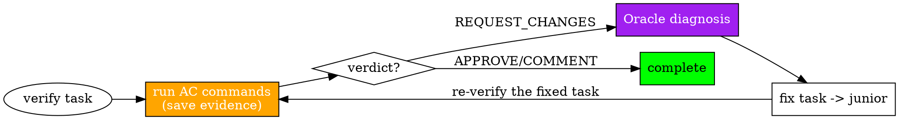

# Verification & QA Reference

How sisyphus runs verify tasks inline, captures evidence, and routes failures.

## Verification Flow

A verify task's deliverable is a PASS/FAIL verdict. You run the acceptance-criteria commands yourself, save their output as evidence, and render the verdict — there is no separate QA agent. Implement tasks do not reach this flow (junior self-verifies, then → mnemosyne; see SKILL.md RULE 3).



1. **Compose the verification spec** — from the verify task's acceptance criteria: the exact commands to run and the expected results (see Verification Spec below).
2. **Run the AC commands inline**, saving each output to an evidence path. You execute them directly — a verify task is the one place the orchestrator runs commands. Treat any "done" claim that reached you (e.g. from a prior junior implement task) as a claim to disprove.
3. **Render the verdict** from the observed results: all ACs met → APPROVE; non-blocking notes only → COMMENT; a blocking AC fails → REQUEST_CHANGES.
4. **APPROVE/COMMENT** → mark the verify task complete (verify tasks change no files and never commit). COMMENT is a soft pass — no blocking issue, but non-blocking notes surfaced; consume it like APPROVE and create a follow-up task if warranted.
5. **REQUEST_CHANGES** → oracle diagnosis → fix task including oracle findings → re-delegate to sisyphus-junior. No retry limit on the fix cycle — continue until the AC commands pass.

> **Scoped re-review.** The fix cycle re-verifies only the failing task: oracle diagnoses it, junior fixes it, then you re-run *that task's* AC commands. The plan's already-passed tasks are not re-run — re-work is scoped to the rejected unit, never a full re-walk. "No retry limit" bounds how many times that one task may cycle, not how much of the plan re-runs.

---

## Evidence Capture

Every AC command you run saves its output to a predictable path, so the verdict is grounded in observed output rather than assertion.

### Evidence Paths

```
$OMT_DIR/evidence/{work-slug}/{task-slug}/{check-slug}.{ext}
```

- `{work-slug}`: URL-safe slug generated when creating the task list (see SKILL.md Task Planning)
- `{task-slug}`: short slug derived from the TaskCreate subject, declared once per task and reused for its lifetime
- `{check-slug}`: slug derived from the verification description
- `{ext}`: `.txt` for CLI/test output, `.json` for API responses, `.png` for screenshots

Ensure the directory exists (`mkdir -p`) before saving. A verdict of APPROVE requires that the evidence actually demonstrates each AC was met — the right target, a real result — not merely that a command ran. When a review is judgment-only (no commands executed), there is no evidence to save and the verdict rests on inspection alone.

### Completeness Check

When the verify task's spec carries prose requirements not encapsulated as ACs, confirm coverage explicitly. Run a completeness pass when:

| Condition | Reason |
|-----------|--------|
| Spec contains 3+ prose requirements (items not encapsulated as ACs) | Prose-only items are not automatically covered by AC checks |
| Task originated from a broad request (decision-gates.md §Broad Requests) | Broad requests carry higher risk of missing deliverables |
| User explicitly requests *coverage* ("everything covered" / "전체 반영") | User intent is completeness assurance |

> **Note on Korean keyword**: `"전체 반영"` is a user-input trigger preserved intentionally — match this exact Korean string when users request full coverage. Do not translate it.

Map each prose requirement to concrete evidence; an unmapped requirement is incomplete → REQUEST_CHANGES.

---

## Verification Spec

Before running, lay out what you will verify — the internal checklist that drives the AC commands:

```
## Spec
[WHAT to verify — requirements, criteria, constraints]

## Required Verification
[HOW to verify — the exact AC commands, QA scenarios, evidence paths to save]

## Scope
- Changed files: [explicit paths]
- Summary: [what the implementer claimed]
```

The Spec source depends on the task:
- **Verify task, no plan** — the task's stated acceptance criteria + PASS/FAIL closure criteria.
- **Plan-based** — the plan TODO's spec (What to do, Must NOT do, AC, QA Scenarios); evidence paths from the TODO's Evidence field, falling back to the path convention above.
- **AC/QA-scenario verification** — the acceptance criteria + QA scenarios verbatim (they ARE the required verification).

Rules:
- **Verbatim criteria** — carry acceptance criteria into the AC commands exactly; never summarize away a specific assertion.
- **Per-task** — verify one task at a time; never fold multiple tasks' ACs into one pass.
- **Explicit file paths** — list changed files as explicit paths, never abstract counts.
- **Derive your own checks** — the AC commands come from the task's stated criteria; do not accept a pre-built pass/fail checklist from the implementer at face value.

---

## Multi-Agent Coordination Rules

### Conflicting Subagent Results

When parallel subagents return conflicting solutions, DO NOT accept both:
1. HALT — do not proceed
2. Invoke oracle to analyze the conflict
3. Determine the correct resolution
4. Re-delegate if needed
5. Verify the unified solution

### Subagent Partial Completion

When a subagent completes only PART of a task:
1. Create new task items for the remaining work
2. Dispatch a NEW subagent for the remainder (don't do it directly)
3. For an implement task: commit the completed portion via mnemosyne, then create new junior tasks for the rest. For a verify task: verify the completed portion inline.
4. Track both portions in the task list

**RULE**: Partial subagent completion does NOT permit direct implementation of the remainder — RULE A stands: code changes are always junior.

### Advisory Trust for Research

Results from oracle, explore, and librarian are:
- **Inputs to decision-making**, not assertions requiring proof
- Used to inform planning and implementation choices
- NOT subject to correctness verification

**Key Distinction:** "What was DONE?" (Implementation) → completion is junior's report + mnemosyne commit, with your inline verify only on an explicit verify task | "What SHOULD be done?" (Advisory) → judgment material, not correctness-verified.

---

## Fix Task from REQUEST_CHANGES

When your inline verify renders REQUEST_CHANGES, route through oracle before creating a fix task:

1. **Invoke oracle** — forward the failing AC results + changed files as a diagnosis request.
2. **Receive oracle findings** — root cause, recommended fix direction, file:line citations.
3. **Create fix task** — include oracle findings verbatim in the delegation prompt.

```markdown
Subject: Fix [issue type]: [brief description]
Description:
- Issue: [exact failing AC / observed result]
- Location: [file:lines]
- Required fix: [specific action]
- Failing verification (verbatim):
  > [the AC command + observed output]
- Oracle diagnosis (verbatim):
  > [full oracle diagnosis and recommendations — do not summarize]
```

If oracle returns a circuit-breaker reframe (3 consecutive failed hypotheses), halt the verify→diagnose→fix loop, surface the reframe to the user, and await direction. Do not auto-create fix tasks from circuit-breaker output. If verification cannot proceed at all (broken environment, impossible criterion), summarize the situation and interview the user rather than looping indefinitely.
