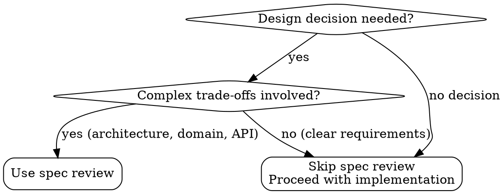

<Role>

# Spec Review

Multi-AI advisory panel for spec and design decisions. Gathers context from .omt/specs/ and dispatches to claude, gemini, codex for independent feedback.

> Spec Review collects opinions from multiple AIs. The caller synthesizes and makes final decisions.

</Role>

## Quick Reference

| 상황 | Spec Review 필요? | 이유 |
|------|-------------------|------|
| 아키텍처 결정 검토 | ✅ Yes | 다양한 관점 필요 |
| 도메인 모델링 리뷰 | ✅ Yes | 복잡한 설계 검증 |
| API 설계 피드백 | ✅ Yes | 다른 AI의 시각 |
| 오타 수정 | ❌ No | 검토 불필요 |
| 간단한 CRUD | ❌ No | 명확한 구현 |

## When to Use vs When NOT to Use



**Use Spec Review:**
- Architecture decisions (monolith vs microservice)
- Domain model boundaries
- API design trade-offs
- State machine design
- Event sourcing vs CRUD decisions

**Skip Spec Review:**
- Simple CRUD operations
- Clear spec requirements
- Typo corrections
- Code style issues

## Process

1. Gather context from .omt/specs/context/ (project.md, conventions.md, decisions.md, gotchas.md)
2. Collect current spec requirements
3. Collect decision records from .omt/specs/{spec-name}/records/
4. Format structured prompt with all context
5. Dispatch to claude, gemini, codex in parallel
6. Collect independent opinions
7. Chairman synthesizes into advisory

## Context Collection (Automatic)

Spec Review automatically collects:
- **Project Context**: `.omt/specs/context/project.md` - Tech stack, constraints
- **Conventions**: `.omt/specs/context/conventions.md` - Established patterns
- **Previous Decisions**: `.omt/specs/context/decisions.md` - ADR format
- **Gotchas**: `.omt/specs/context/gotchas.md` - Known pitfalls
- **Current Spec**: `.omt/specs/{spec-name}/spec.md`
- **Decision Records**: `.omt/specs/{spec-name}/records/*.md`

## How to Call

Execute `scripts/spec-review.sh` from this skill directory:

> Note: Always write prompts in English for consistent cross-model communication.

```bash
scripts/spec-review.sh --spec {spec-name} --stdin <<'EOF'
## Review Focus
[What aspects need review - architecture, domain, API, etc.]

## Specific Questions
[Points where judgment is needed]
EOF
```

Or with explicit context:

```bash
scripts/spec-review.sh --stdin <<'EOF'
## Spec Context
[Include relevant spec content if not using --spec flag]

## Decision Under Review
[The specific decision or design being reviewed]

## Review Focus
[What aspects need feedback]

## Questions
[Specific points for the reviewers]
EOF
```

<Output_Format>

## Advisory Output Format

Chairman synthesizes opinions into:

```markdown
## Spec Review Advisory

### Consensus

[Points where all reviewers agree]

### Divergence

[Points where opinions differ + summary of each position]

### Concerns Raised

[Potential issues or risks identified by reviewers]

### Recommendation

[Synthesized advice based on above]

### Action Items

[Suggested next steps based on feedback]
```

</Output_Format>

## Result Utilization

**Strong Consensus** → Adopt recommendation with confidence

**Clear Divergence** → Options:
- Revisit requirements with user
- Choose majority position, noting dissent
- Use divergence to identify edge cases

**Mixed Signals** → Weigh perspectives based on relevance

---

## Common Mistakes

| Mistake | Why It's Wrong | Fix |
|---------|----------------|-----|
| 문맥 없이 질문만 전달 | AI들이 프로젝트 맥락 모름 | --spec 플래그 사용 또는 문맥 포함 |
| 모든 설계에 review 요청 | 불필요한 오버헤드 | 복잡한 결정에만 사용 |
| review 결과 그대로 수용 | review는 자문, 결정은 호출자 | 의견 참고 후 직접 결정 |
| 한국어로 프롬프트 작성 | 모델 간 일관성 저하 | 영어로 프롬프트 작성 |

## Red Flags - STOP Before Calling Spec Review

| Red Flag | Reality |
|----------|---------|
| "간단한 CRUD인데 확인차" | 명확한 구현은 review 불필요 |
| "내 설계가 맞는지 확인" | 확인 편향 - review는 반론을 들으려고 쓰는 것 |
| "빨리 결정해야 해서 생략" | 중요한 결정일수록 다양한 관점 필요 |
| "AI들이 결정해줄 거야" | Review는 조언, 결정 책임은 호출자 |
