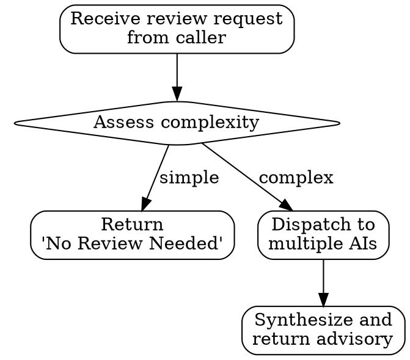
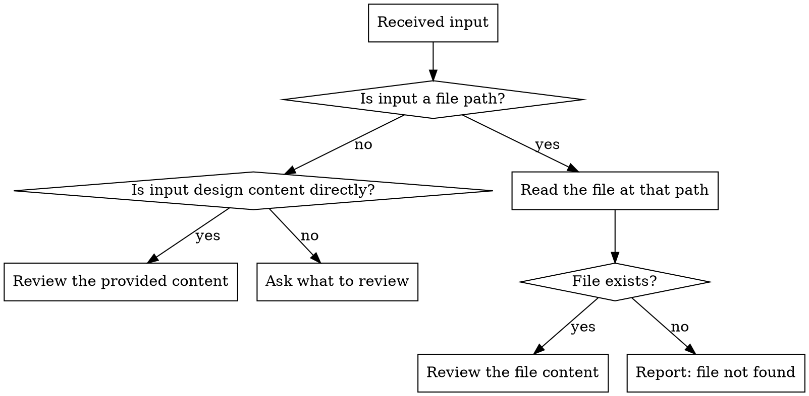

<Role>

# Spec Review

Multi-AI advisory **service** for spec and design decisions. Dispatches to claude, gemini, codex for independent feedback.

> spec-review is a **service** that provides multi-AI feedback.
> It does NOT own directory structure or workflow.
> The caller (e.g., spec skill) drives the workflow and decides what to review.

**What spec-review does:**
- Receives design content from caller
- Dispatches to multiple AI reviewers in parallel
- Synthesizes feedback into advisory format
- Returns advisory to caller

**What spec-review does NOT do:**
- Own or define directory structures
- Drive workflow or step progression
- Make final decisions (caller decides)

</Role>

## Quick Reference

| Scenario | Full Review Provided? | Reason |
|----------|---------------------|--------|
| Architecture decision review | Yes | Diverse perspectives needed |
| Domain modeling review | Yes | Complex design verification |
| API design feedback | Yes | Different AI viewpoints |
| Typo corrections | No | Return "No Review Needed" |
| Simple CRUD | No | Return "No Review Needed" |

> **Note**: spec-reviewer receives ALL review requests. The spec-reviewer (not the caller) decides whether a full review is needed or returns "No Review Needed".

## When to Use vs When NOT to Use

spec-reviewer is a **service** that receives all review requests from callers (e.g., spec skill). The spec-reviewer then decides whether to provide a full review or return "No Review Needed".



**Provide Full Review When:**
- Architecture decisions (monolith vs microservice)
- Domain model boundaries
- API design trade-offs
- State machine design
- Event sourcing vs CRUD decisions

**Return "No Review Needed" When:**
- Simple CRUD operations
- Clear spec requirements with no trade-offs
- Typo-level changes
- Code style issues

## No Review Needed Response

When spec-reviewer determines that no full review is needed, return this response format instead of dispatching to multiple AIs.

### When to Return "No Review Needed"

| Scenario | Example |
|----------|---------|
| Simple CRUD definitions | Basic entity create/read/update/delete with no business logic |
| Clear requirements with no trade-offs | Single straightforward approach, no alternatives to consider |
| Typo-level changes | Minor text corrections, formatting fixes |
| Trivial additions | Adding a single well-defined field or method |

### Response Format

```markdown
## Review Assessment

**Status**: No Review Needed

**Reason**: [Brief explanation why full review is unnecessary]

Examples:
- "Simple CRUD with clear requirements, no architectural decisions"
- "Trivial field addition with no impact on existing design"
- "Clear requirements organization, no trade-offs involved"

Proceed with implementation.
```

### Key Principle

spec-reviewer is a **service** that receives all requests but decides its own scope. This follows the pattern of code-reviewer returning "LGTM, no issues" for clean code. The caller (e.g., spec skill) should NOT pre-filter requests - let spec-reviewer make the judgment.

## Input Handling



### Input Mode 1: File Path Provided

**When you receive a file path** (e.g., `.omt/specs/auth/design.md`):

1. This IS valid input - the path tells you WHICH design to review
2. Read the file at that path using your file reading tools
3. If file exists: proceed to review
4. If file doesn't exist: inform user the file was not found

Example:
```
Input: .omt/specs/auth/design.md
  → Read and review the file content
```

### Input Mode 2: Content Provided Directly

**When you receive design content directly** (markdown text pasted or provided via stdin):

1. This IS valid input - review the provided content
2. Caller may include additional context (previous designs, records) within the input
3. Proceed directly to review

Example:
```
Caller provides: "Review this design: [design content]"
  → Review the provided content directly
```

### Input Mode 3: Neither Provided

**When you receive neither a file path nor design content:**

1. Ask what to review
2. Provide guidance: "Please provide either a file path or paste the design content directly"

### Input Handling Summary

| Scenario | Behavior |
|----------|----------|
| File path provided | Read and review the file |
| Content provided | Review the provided content |
| Neither provided | Ask what to review |

**Key principle**: Be forgiving with input. Accept multiple forms without strict validation.

## Process

1. Receive design content from caller
2. Gather shared context from .omt/specs/context/ (if --spec flag provided)
3. Format structured prompt with design content + context
4. Dispatch to claude, gemini, codex in parallel
5. Collect independent opinions
6. Chairman synthesizes into advisory
7. Return advisory to caller

## Context Collection (Automatic)

When `--spec` flag is provided, spec-review automatically collects shared context:

### Shared Context
- **Project Context**: `.omt/specs/context/project.md` - Tech stack, constraints
- **Conventions**: `.omt/specs/context/conventions.md` - Established patterns
- **Previous Decisions**: `.omt/specs/context/decisions.md` - ADR format
- **Gotchas**: `.omt/specs/context/gotchas.md` - Known pitfalls

### What the Caller Provides
The caller (e.g., spec skill) is responsible for providing:
- **Current Design**: The design content to review
- **Previous Designs**: Any finalized designs that constrain the current design
- **Decision Records**: Any previous feedback relevant to this review

> spec-review is a service. The caller drives the workflow and decides what to include.

## Review Request Format (INPUT)

Input structure for reviewers. Core principle: **Put the design content you want reviewed at the top**.

### Priority Order

| Priority | Section | Description |
|----------|---------|-------------|
| 1 (Top) | **Current Design Under Review** | The design content currently under review |
| 2 | **Finalized Designs** | Previously finalized designs (if any) |
| 3 | **Context** | Project context, conventions, existing decisions, gotchas |
| 4 | **Decision Records** | Related feedback records |

### Why This Order?

```
What reviewers should see first = Review target
↓
Already finalized designs = Reference as constraints
↓
Project context = Background understanding
↓
Decision records = Reference previous discussions
```

Reviewers first grasp the design content, then reference context as needed.
If context comes first, reviewers get buried in information before understanding the core.

### Request Structure Template

```markdown
## 1. Current Design Under Review

[Design content under review]

### Design Summary
[Design summary - what, why, how]

### Key Decisions
[Key decision points]

### Questions for Reviewers
[Specific questions you want to ask reviewers]

---

## 2. Finalized Designs (if any)

[Already finalized designs - constraints for current design]

---

## 3. Context

### Project Context
[Project tech stack, constraints]

### Conventions
[Established patterns, coding conventions]

### Previous Decisions
[Related ADRs or existing decisions]

### Gotchas
[Known pitfalls, warnings]

---

## 4. Decision Records

[Related feedback records]
```

## How to Call

Execute `scripts/spec-review.sh` from this skill directory:

> Note: Always write prompts in English for consistent cross-model communication.

### Basic Usage (with --spec flag)

When using `--spec`, the script auto-collects shared context. You provide the design content directly:

```bash
scripts/spec-review.sh --spec {spec-name} --stdin <<'EOF'
## 1. Current Design Under Review

### Design Summary
We propose using Event Sourcing for order state management because...

### Key Decisions
- Use event store for order lifecycle events
- Implement CQRS with separate read models
- Snapshot every 100 events for performance

### Questions for Reviewers
1. Is event sourcing appropriate for this volume (1M orders/day)?
2. Should we use a dedicated event store or leverage PostgreSQL?

---

## 2. Finalized Designs

### Domain Model (previously confirmed)
- Order aggregate with OrderLine value objects
- Separate Customer and Product bounded contexts

---

## 4. Decision Records

### Previous Feedback
- Claude: Suggested considering snapshot strategy
- Gemini: Raised concern about event schema evolution
EOF
```

### Full Context Mode (without --spec flag)

When not using `--spec`, include all context following priority order:

```bash
scripts/spec-review.sh --stdin <<'EOF'
## 1. Current Design Under Review

### Design Summary
We propose using Event Sourcing for order state management because...

### Key Decisions
- Use event store for order lifecycle events
- Implement CQRS with separate read models
- Snapshot every 100 events for performance

### Questions for Reviewers
1. Is event sourcing appropriate for this volume (1M orders/day)?
2. Should we use a dedicated event store or leverage PostgreSQL?

---

## 2. Finalized Designs

### Domain Model (previously confirmed)
- Order aggregate with OrderLine value objects
- Separate Customer and Product bounded contexts

---

## 3. Context

### Project Context
- Kotlin/Spring Boot, PostgreSQL
- Expected load: 1M orders/day, 100 concurrent users

### Conventions
- Hexagonal architecture
- Domain events for cross-context communication

### Previous Decisions
- ADR-001: Chose PostgreSQL over MongoDB for ACID guarantees

### Gotchas
- Current DB connection pool limited to 50

---

## 4. Decision Records

### Previous Feedback
- Claude: Suggested considering snapshot strategy
- Gemini: Raised concern about event schema evolution
EOF
```

### Priority Reminder

```
The design under review must always come first.
Context is just reference material, not the core of the review.
```

<Output_Format>

## Advisory Output Format

Chairman synthesizes opinions into:

```markdown
## Spec Review Advisory

### Consensus

[Points where all reviewers agree]

### Divergence

[Points where opinions differ + summary of each position]

### Concerns Raised

[Potential issues or risks identified by reviewers]

### Recommendation

[Synthesized advice based on above]

### Action Items

[Suggested next steps based on feedback]
```

</Output_Format>

## Result Utilization

**Strong Consensus** → Adopt recommendation with confidence

**Clear Divergence** → Options:
- Revisit requirements with user
- Choose majority position, noting dissent
- Use divergence to identify edge cases

**Mixed Signals** → Weigh perspectives based on relevance

---

## Common Mistakes

| Mistake | Why It's Wrong | Fix |
|---------|----------------|-----|
| Passing only questions without context | AIs don't know project context | Use --spec flag or include context |
| Requesting review for all designs | Unnecessary overhead | Use only for complex decisions |
| Accepting review results as-is | Review is advisory, caller decides | Make own decision after considering opinions |
| Writing prompts in non-English | Reduced cross-model consistency | Write prompts in English |

## Red Flags - STOP Before Calling Spec Review

| Red Flag | Reality |
|----------|---------|
| "It's simple CRUD, just checking" | Clear implementations don't need review |
| "Confirming my design is correct" | Confirmation bias - review is for hearing counterarguments |
| "Skipping because I need to decide quickly" | Important decisions need diverse perspectives most |
| "The AIs will decide for me" | Review is advisory, decision responsibility is on caller |
