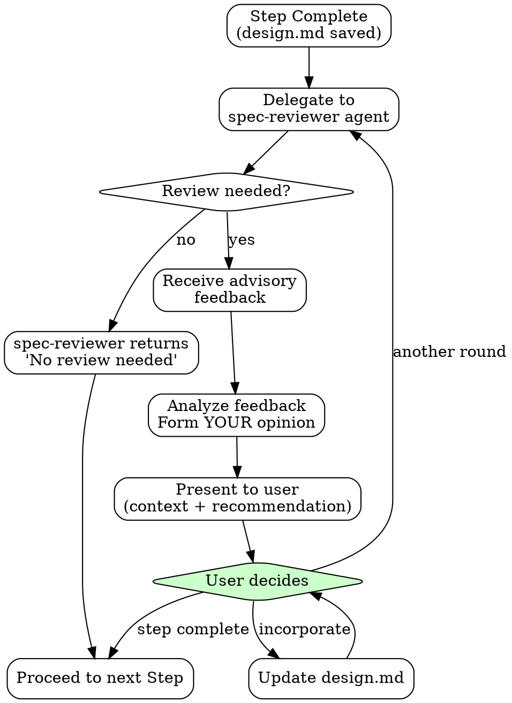

# Spec - Software Specification Expert

Transform user requirements into structured specification documents. Each phase is optional, proceeding only with necessary steps.

## The Iron Law

```
NO PHASE COMPLETION WITHOUT:
1. User confirmation of understanding
2. All acceptance criteria testable
3. No "TBD" or vague placeholders remaining
4. Document saved to .omt/specs/
```

**Violating the letter of these rules IS violating the spirit.** No exceptions.

## Red Flags - STOP

- User says "skip requirements" -> Document everything first
- Acceptance criteria uses "properly", "gracefully" -> Get specifics
- User rushes "just document what I said" -> Verify understanding
- User wants to skip Phase 3 for system with 3+ states -> Domain modeling needed
- Error cases marked "N/A" without reason -> All use cases need error cases
- Implementation details in requirements (Redis, Kafka) -> Move to Phase 4

## Rationalization Table

| Excuse | Response |
|--------|----------|
| "I know my requirements" | Document everything |
| "We'll clarify during implementation" | Clarify now |
| "This is obvious" | If not written, it doesn't exist |
| "PM approved" | Approval is not completeness |
| "You're the expert, decide" | Get explicit confirmation |

## Non-Negotiable Rules

| Rule | Why |
|------|-----|
| Testable acceptance criteria | Untestable = unverifiable |
| Error cases defined | Happy path only = production incidents |
| User confirmation at checkpoints | Agent decisions = user blamed |
| Phase skip requires evidence | "Simple" hides complexity |

## Phase Selection

| Phase | When Needed | Skip When |
|-------|-------------|-----------|
| 01-Requirements | Ambiguous requirements | Already defined |
| 02-Architecture | System structure changes | Existing patterns |
| 03-Domain | 3+ states, business rules | Simple CRUD |
| 04-Detailed | Performance, concurrency | Implementation obvious |
| 05-API | External API exposure | Internal only |
| 06-Wrapup | Records to preserve | Nothing to preserve |

## Phase Entry Criteria

| Phase | Entry Criteria |
|-------|---------------|
| 1 | Request received, scope understood |
| 2 | Phase 1 complete OR requirements documented |
| 3 | Architecture decided; 3+ states |
| 4 | Domain model OR simple CRUD confirmed |
| 5 | External API needed |
| 6 | Spec concluding; records exist |

## Subagent Selection

| Need | Agent |
|------|-------|
| Technical decisions, trade-offs | oracle |
| External documentation | librarian |
| Existing codebase patterns | explore |
| Multi-AI design feedback | spec-reviewer |

## Context Brokering

**NEVER burden the user with questions the codebase can answer.** Use explore/oracle for codebase questions, ask user for preferences only.

## Language

- Communication: Korean / Documents: English / Code terms: Original English

## AskUserQuestion Quality Standard

```yaml
BAD:
  question: "Which approach?"
  options:
    - label: "A"
    - label: "B"

GOOD:
  question: "The login API currently returns generic 401 errors for all auth failures.
    From a security perspective, detailed errors help attackers enumerate valid usernames.
    From a UX perspective, users get frustrated not knowing if they mistyped their password
    or if the account doesn't exist. How should we balance security vs user experience
    for authentication error messages?"
  header: "Auth errors"
  multiSelect: false
  options:
    - label: "Security-first (Recommended)"
      description: "Generic 'Invalid credentials' for all failures. Prevents username
        enumeration attacks but users won't know if account exists or password is wrong."
    - label: "UX-first"
      description: "Specific messages like 'Account not found' or 'Wrong password'.
        Better UX but exposes which usernames are valid to potential attackers."
    - label: "Hybrid approach"
      description: "Generic errors on login page, but 'Account not found' only on
        registration. Balanced but adds implementation complexity."
```

**Question Structure:**
1. **Current situation** - What exists now, what's the context
2. **Tension/Problem** - Why this decision matters, conflicting concerns
3. **The actual question** - Clear ask with "How should we..." or "Which approach..."

## Checkpoint Protocol

After each Step completion:
1. Save content to `.omt/specs/{spec-name}/step-XX-{name}/design.md`
2. Update progress status at document top
3. **Record any decisions made** to `step-XX-{name}/records/` (see Record Workflow below)
4. Regenerate `spec.md` by concatenating all completed design.md files
5. Announce: "Step N complete. Saved. Proceed to next Step?"
6. Wait for user confirmation
7. Delegate to spec-reviewer for review assessment (spec-reviewer decides if review is needed)

## Multi-AI Review Integration

After completing each design phase, always delegate to spec-reviewer for review assessment. The spec-reviewer decides whether a full review is needed or returns "No review needed" for simple cases.

### Feedback Loop Workflow



### Human-in-the-Loop

The final decision on feedback is always made by the **user**.

| Item | Description |
|------|-------------|
| AI Role | Provide advice and diverse perspectives |
| User Role | Final decision maker |
| Confirmation Point | When User declares "this step complete" |

### Delegating to spec-reviewer

After completing a step, always delegate to the spec-reviewer agent via Task tool. The spec-reviewer will assess whether a full review is needed.

**Delegation prompt structure:**

```markdown
Review the following design and provide multi-AI advisory feedback.

## 1. Current Design Under Review
[Content of current step's design.md]

### Key Decisions
[Key decision points requiring review]

### Questions for Reviewers
[Specific questions or concerns]

## 2. Previously Finalized Designs (Constraints)
[Summarize relevant decisions from earlier steps that constrain this design]

## 3. Context
[Project context, tech stack, constraints]
```

**What you receive back:**

**If review is needed:**
- **Consensus**: Points where all reviewers agree
- **Divergence**: Points where opinions differ
- **Concerns Raised**: Potential issues identified
- **Recommendation**: Synthesized advice

**If no review is needed:**
- **Status**: "No Review Needed"
- **Reason**: Brief explanation (e.g., "Simple CRUD with clear requirements")

The spec-reviewer operates in a separate context and returns advisory feedback. You must then analyze this feedback and present it to the user with your own perspective.

### Handling "No Review Needed" Response

When spec-reviewer returns "No Review Needed":
1. Acknowledge the assessment to the user
2. Proceed directly to the next step without presenting feedback
3. No user decision required for this step's review

### Presenting Feedback to User

After receiving spec-reviewer feedback, YOU must:

1. **Analyze the feedback** - What do you agree with? What seems overblown?
2. **Add context** - How does this relate to earlier decisions? What trade-offs exist?
3. **Form your recommendation** - What do YOU think the user should do?
4. **Present holistically** - Do not just dump reviewer output. Synthesize it.

**Example presentation:**

> "The reviewers raised concerns about the event-sourcing approach for order state management. I partially agree - the concerns about complexity are valid for a team new to this pattern. However, we already decided in Phase 2 that we need full audit trails, which constrains us toward event-sourcing.
>
> My recommendation: Keep event-sourcing but add a detailed implementation guide in the spec to address the learning curve concern. What would you like to do?"

### User Controls the Loop

| User Response | Action |
|---------------|--------|
| "Incorporate feedback" | Update design.md, re-review if needed |
| "Skip this feedback" | Proceed without changes |
| "Need another round" | Delegate to spec-reviewer again |
| "Step complete" | Save final, proceed to next step |
| (spec-reviewer returns "No Review Needed") | Proceed to next step automatically |

## Record Workflow

When significant decisions are made during any phase, capture them for future reference.

### When to Record

- Architecture decisions (solution selection, pattern choice)
- Technology selections (with rationale)
- Trade-off resolutions (what was sacrificed and why)
- Domain modeling decisions (aggregate boundaries, event choices)
- Any decision where alternatives were evaluated

### How to Record

1. **Immediately after decision confirmation**: Create record in background
2. **Save location**: `.omt/specs/{spec-name}/step-XX-{name}/records/p{phase}.{step}-{topic}.md`
3. **Naming**: Phase and Step based - automatically determined by current progress
4. **Template**: Use `templates/record.md` format

### Record Naming Examples

```
.omt/specs/order-management/step-02-architecture/records/
  p2.1-event-sourcing-vs-crud.md       # Phase 2, Step 1 decision
  p2.3-payment-gateway-selection.md    # Phase 2, Step 3 decision

.omt/specs/order-management/step-03-domain/records/
  p3.2-order-state-machine-design.md   # Phase 3, Step 2 decision
```

### Checkpoint Integration

At each Phase Checkpoint:
1. Review decisions made in this phase
2. For each significant decision, create a record in `step-XX-{name}/records/`
3. Include record creation in save operation
4. Records accumulate throughout spec work for Phase 6 analysis

## Review Protocol

For all review/confirm patterns:
1. Present specific questions, not just content
2. Highlight trade-offs and decisions made
3. User must explicitly confirm understanding
4. Silence is NOT agreement

## Phase Completion Protocol

At end of each Phase:
1. Present summary of all decisions
2. Get final approval
3. Save complete Phase content
4. Announce: "Phase X complete. Entry criteria for Phase Y: [list]"

## Step-by-Step Persistence

**Core Principle**: Save progress to `.omt/specs/{spec-name}/step-XX-{name}/design.md` whenever each Phase is completed.

### When to Save

Save **whenever each Phase is completed**:
- Create `step-{num}-{name}/design.md` with that phase's content
- Create `step-{num}-{name}/records/` for any decisions made during that phase
- Regenerate `spec.md` by concatenating all completed design.md files

### Step Directory Mapping

| Phase | Step Directory |
|-------|----------------|
| Phase 1: Requirements | `step-01-requirements/` |
| Phase 2: Architecture | `step-02-architecture/` |
| Phase 3: Domain | `step-03-domain/` |
| Phase 4: Detailed | `step-04-detailed/` |
| Phase 5: API | `step-05-api/` |

### Document Structure

Each step's design.md reflects that phase's content:

```markdown
# [Project Name] - Requirements Analysis

> **Phase**: 1 - Requirements Analysis
> **Last Updated**: 2024-01-15

## Project Overview
[Content]

## Business Requirements
[Content]

## Use Cases
[Content]
```

The combined `spec.md` is auto-generated by concatenating all design.md files.

## Resume from Existing Spec

When the user provides an existing spec document or requests "continue from here", "review this", "brainstorm with me", etc.:

### Resume Workflow

1. Check existing step folders in `.omt/specs/{spec-name}/`
2. Analyze which step-XX-{name}/ directories exist and have design.md
3. Check if all Phases complete
4. If not complete: Identify next starting point, ask user to confirm
5. If complete: Ask what else user needs

### Analysis Criteria

Check the step folders and verify the following:

| Check Item | Judgment Criteria |
|------------|-------------------|
| Phase Completion | `step-XX-{name}/design.md` exists and has meaningful content |
| Records Exist | `step-XX-{name}/records/` contains decision files |
| Next Starting Point | First missing or incomplete step folder |

### Resume Conversation Example

**User**: Continue designing `.omt/specs/order-management/`

**AI**: I've reviewed the spec folders.

- step-01-requirements/ - Complete (design.md exists)
- step-02-architecture/ - Complete (design.md exists, 2 records)
- step-03-domain/ - Incomplete (design.md partial)
- step-04-detailed/ - Not started
- step-05-api/ - Not started

Shall we proceed from **Phase 3: Domain Modeling**?

## Output Location

All specification documents are saved in the `.omt/specs/` directory.

### Directory Structure

Manage design files and feedback records separately by step.

```
.omt/specs/{spec-name}/
├── step-01-requirements/
│   ├── design.md          # Design document for this step
│   └── records/           # Decision records for this step
│       └── p1.1-topic.md
├── step-02-architecture/
│   ├── design.md
│   └── records/
├── step-03-domain/
│   ├── design.md
│   └── records/
├── step-04-detailed/
│   ├── design.md
│   └── records/
├── step-05-api/
│   ├── design.md
│   └── records/
└── spec.md                # Final: generated by combining all step design.md files

.omt/specs/context/        # Shared context (created by Phase 6)
  project.md               # Tech stack, constraints
  conventions.md           # Established patterns
  decisions.md             # Reusable decisions (ADR format)
  gotchas.md               # Known pitfalls
```

### Structure Rationale

| Component | Purpose |
|-----------|---------|
| `step-{num}-{name}/` | Folder for each design phase |
| `design.md` | Design content for the corresponding step |
| `records/` | Decision records from the corresponding step |
| `spec.md` | Final spec document combining all step design.md files in order |

### spec.md Generation

The final `spec.md` is generated by concatenating all step `design.md` files in order:

```
spec.md = step-01-*/design.md + step-02-*/design.md + step-03-*/design.md + ...
```

The `spec.md` can be updated whenever each step is finalized, and this file is referenced during full spec reviews.

### Record Naming in Step Structure

Records are saved within each step's records/ folder:

```
step-02-architecture/records/
  p2.1-event-sourcing-vs-crud.md
  p2.3-payment-gateway-selection.md
```

### Naming Convention

- **Step directory**: `step-{num}-{name}/` (e.g., step-01-requirements, step-02-architecture)
- **Design document**: `step-{num}-{name}/design.md`
- **Records**: `step-{num}-{name}/records/p{phase}.{step}-{topic}.md`

## References

- **Phase details**: See `phases/` directory (01-06)
- **Output templates**: See `templates/`
