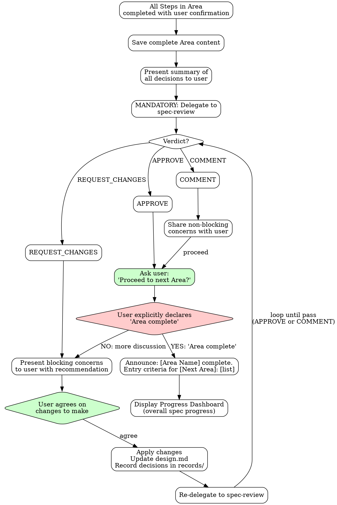

# Area Completion Protocol (MANDATORY - No Area Skipping)

**Every Area MUST go through this full sequence. No shortcuts.**



### Area Completion Sequence

1. **Verify all Steps completed**: Every Step in the Area must have passed its Checkpoint Protocol
2. **Save complete Area content**: Write to `{area-directory}/design.md`
3. **Present Area summary**: Show all decisions made in this Area to user
4. **MANDATORY spec-review**: Delegate Area results to spec-review

   > See `references/multi-ai-review.md` for the full spec-review delegation and feedback handling protocol.

5. **Verdict handling**:
   - **APPROVE** → Proceed to step 5.5
   - **REQUEST_CHANGES** → Present blocking concerns to user with recommendation → User agrees on changes → Apply changes, update design.md, record decisions in `records/` → Re-delegate to spec-review → Return to step 5
   - **COMMENT** → Share non-blocking concerns with user, create follow-up if needed → Proceed to step 5.5
5.5. **Update state.json**: Record `review_verdict`, update `updated_at`
6. **User final gate**: User MUST explicitly declare "Area complete"
   - Silence is NOT agreement
   - AI CANNOT self-declare Area completion
   - **Area completion cannot be declared without spec-review pass (APPROVE or COMMENT)** — Area cannot be completed while REQUEST_CHANGES is in effect
6.5. **Update state.json**: Set area `status` to `completed`, update `current_area` to next area (or null if last), update `updated_at`
7. **Announce next Area**: "[Area Name] complete. Entry criteria for [Next Area]: [list]"
8. **Progress Dashboard**: Display the overall spec progress to the user (see below)

### Progress Dashboard (Step 8)

Display the overall spec progress:

| Area | Status | Key Decisions |
|------|--------|---------------|
| {Area Name} | {status} | {summary or "-"} |

One row per selected Area in processing order.

Status values: `Complete` | `In Progress` | `Pending` | `Skipped`

This dashboard provides transparency into the overall spec progress, helping the user understand where they are in the process and what remains.

> **Template Flexibility**: Output templates in each reference file are recommended structures. Adapt sections, ordering, and detail level to your project's needs. The structural intent (what information to capture) matters more than exact formatting.

**Two gates must BOTH be passed for Area completion:**
1. **spec-review pass** — APPROVE or COMMENT (quality gate). REQUEST_CHANGES is a blocker.
2. **User "Area complete" declaration** (authority gate)

**Without BOTH gates passed, the Area is NOT complete and next Area CANNOT begin.**

### Phase Transition Gate (Requirements → Solution Design)

**Precondition:** This gate runs only when both Requirements Analysis and Solution Design are selected. If Solution Design is not selected, skip this gate — Area transition proceeds via the standard spec-review + user gate.

After Requirements Analysis completes (spec-review pass + user "Area complete"), automatically run this readiness check before entering Solution Design.

| # | Check | Source |
|---|-------|--------|
| 1 | Core objective clearly defined? | Requirements |
| 2 | Scope boundaries explicit (IN/OUT)? | Requirements |
| 3 | Key business rules documented with rationale? | Requirements |
| 4 | Non-functional requirements quantified? | Requirements |
| 5 | Success criteria testable? | Requirements |
| 6 | Ambiguity ≤ 0.2 (Ambiguity Threshold)? | Clarity Scoring |

**All YES** → Proceed to Solution Design.
**Any NO** → Return to Requirements Analysis via Prior Area Amendment, then:
1. Re-run spec-review on the amended Requirements (pass required)
2. User re-declares "Area complete" for Requirements
3. Re-run this Phase Transition Gate

This gate runs internally after Requirements Area completion. Display results to the user:

```
Phase Transition Gate: Requirements → Solution Design

| # | Check                                 | Result |
|---|---------------------------------------|--------|
| 1 | Core objective clearly defined?       | {YES/NO: gap} |
| 2 | Scope boundaries explicit (IN/OUT)?   | {YES/NO: gap} |
| 3 | Key business rules documented with rationale? | {YES/NO: gap} |
| 4 | NFRs quantified?                      | {YES/NO: gap} |
| 5 | Success criteria testable?            | {YES/NO: gap} |
| 6 | Ambiguity ≤ 0.2 (Ambiguity Threshold)? | {YES/NO: current score} |

Result: {PASS — proceed to Solution Design | FAIL — return to Requirements}
```

**Scope:** This gate applies ONLY to the Requirements → Solution Design transition. Other Area transitions rely on the spec-review gate and user "Area complete" declaration.
