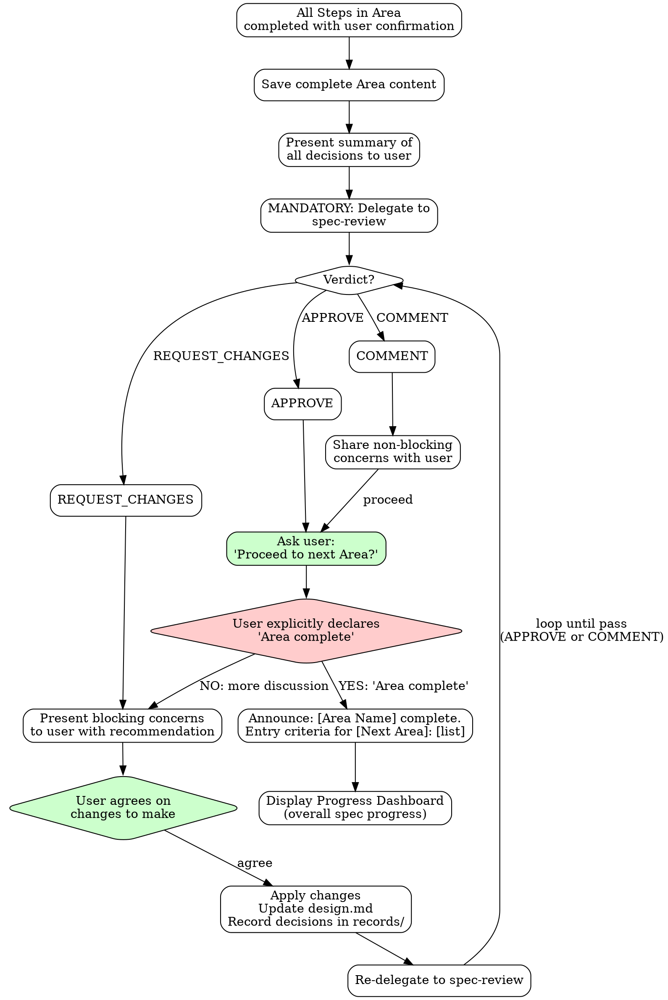
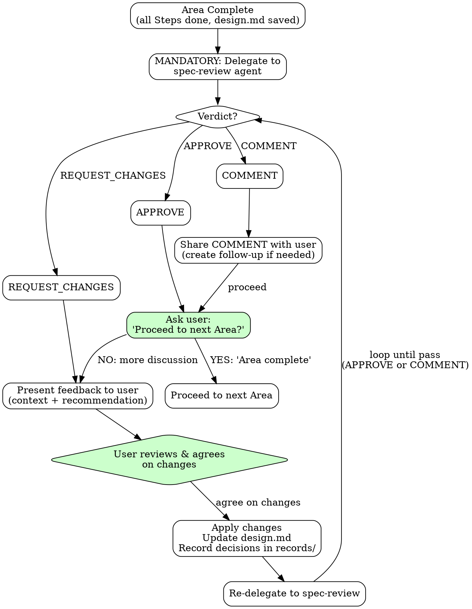

# Core Protocols Reference

## Contents

- **Checkpoint Protocol** — The mandatory per-step completion sequence that every design step must follow.
  Covers the 8-step completion sequence (present, confirm, save, record), the Decision Interview Gate
  that blocks progress until all decisions pass user interviews, Clarity Scoring for Requirements
  and Solution Design, and the Final Step Checkpoint before spec completion.

- **Record Workflow** — How to capture and preserve significant design decisions as records.
  Includes the 9-signal Decision Recognition Checklist, Decision Interview Protocol,
  immediate record creation rules (no batching/deferring), checkpoint integration
  for verification, and deferred concern record format.

- **Area Completion** — The mandatory full-sequence protocol when finishing any Design Area.
  Covers the Area Completion Sequence (verify steps, save, present summary, delegate to spec-review,
  handle verdict, user gate), Progress Dashboard display, and the Phase Transition Gate
  that enforces readiness between Requirements and Solution Design.

- **Multi-AI Review Integration** — The spec-review delegation and feedback handling protocol.
  Details the feedback loop workflow, delegation prompt structure with Deliberate Divergence
  handling for re-submissions, the Feedback Consensus Protocol (iron rule: zero edits before
  user consensus), presenting feedback to users, and verdict-based flow control.

- **Question Quality Standard** — Quality rules for AskUserQuestion options.
  Defines the Consequence Statement Rule requiring concrete consequence descriptions
  in every option, with annotated good/bad examples.

- **Subagent Guide** — When and how to dispatch Explore, Oracle, and Librarian subagents.
  Covers trigger conditions and exclusion criteria for each subagent type, and the
  structured prompt guide (Context, Goal, Downstream, Request) with examples.

---

## Checkpoint Protocol (Per Step - MANDATORY)

**EVERY Step MUST complete this protocol. No exceptions. No skipping.**

Even if AI already has sufficient information for a Step, it MUST:
- Present what it knows as a **proposal/draft** to the user
- Get explicit user confirmation before marking the Step complete

### Step Completion Sequence

1. **Present results**: Show the Step's output/proposal to user (even if based on prior knowledge). Include potential risks of the proposed design (e.g., transaction scope expansion, coupling increase, blast radius of policy changes). Present risks as trade-offs with alternatives, not as blocking problems.
2. **User confirmation**: Wait for explicit user approval of the Step content
3. Save content to `$OMT_DIR/specs/{spec-name}/{area-directory}/design.md`
4. Update progress status at document top
4.5. **Update state.json**: Increment `steps_completed` for current area, update `updated_at`

### Decision Interview Gate (BLOCKING)

**For every recordable decision identified in this Step**, the agent MUST have conducted a user interview BEFORE recording.

The interview follows the **Rich Context Pattern** (defined inline in the main SKILL.md):
- **Current State** — What exists now (1-2 sentences)
- **Tension/Problem** — Why this decision matters, conflicting concerns
- **Existing Project Patterns** — Relevant code, prior decisions, historical context
- **Option Analysis** — For each option: behavior, tradeoffs (security/UX/maintainability/performance/complexity), code impact
- **Recommendation** — Your suggested option with rationale
- **AskUserQuestion** — Single question with 2-3 options

**ALL 9 Decision Recognition signals trigger this gate:**

1. Technology/tool selection
2. Strategy/approach choice
3. Priority/classification
4. Scope inclusion/exclusion
5. Feature deferral
6. Architecture pattern
7. Boundary definition
8. Elimination conclusion
9. Feedback incorporation

(Full Decision Recognition Checklist with examples is in the **Record Workflow** section below.)

**If a decision was made without interview** (e.g., emerged organically from a design discussion), it MUST be retroactively discussed with the user — present the Rich Context structure for that decision and obtain explicit user acknowledgment — before proceeding to record creation.

**This gate is BLOCKING.** Cannot proceed to step 5 (record creation) without passing.

5. **MANDATORY: Record decisions** to `{area-directory}/records/` (see Record Workflow below)
   - If decisions were made: Create record NOW. This is a BLOCKING gate — do NOT proceed to step 6 until record is saved. Then append the record filename to `areas[current_area].records` in state.json.
   - If no decisions were made: Explicitly state "No recordable decisions in this Step" before proceeding.
5.5. **Emergent Concern Check**: "Are there any design or clarification needs uncovered in this Step that are not addressed by the selected Design Areas?" If found, apply Emergent Concern Protocol.
6. Regenerate `spec.md` by concatenating all completed design.md files
7. Announce: "Step N complete. Saved. Proceed to next Step?" (For Requirements Analysis and Solution Design: Clarity Scoring display format replaces this announcement — see Clarity Scoring below)
8. Wait for user confirmation to proceed

### Information Sufficiency Rule

```
AI has enough info for a Step?
├── YES → Present as PROPOSAL to user → Get confirmation → Step complete
└── NO  → Dialogue with user → Build content → Present → Get confirmation → Step complete
```

**"I already know this" is NEVER a reason to skip presenting to the user.**
If you have sufficient information, use it to draft a high-quality proposal and present it for user review. The user may have corrections, additions, or different priorities that only surface when they see your proposal.

### Clarity Scoring

**Applies to Requirements Analysis and Solution Design only. Other Areas skip this scoring.**

**Ambiguity Threshold**: 0.2 — used at Phase Transition Gate and area completion warnings below.

After each Step completion within Requirements Analysis or Solution Design, compute clarity dimensions and display the score table to the user. The score from the final Step of an Area is the authoritative value used at the Phase Transition Gate.

**Formula:** `Ambiguity = 1 − Σ(clarity_i × weight_i)`

Each clarity dimension is rated 0.0 (fully ambiguous) to 1.0 (fully clear).

**Calibration anchors:**

| Score | Goal | Constraints | Success Criteria | Context (Brownfield) |
|-------|------|-------------|------------------|----------------------|
| 0.0 | No objective stated | No constraints identified | No criteria defined | No codebase understanding |
| 0.5 | Objective stated but scope unclear | Some constraints named, no priorities | Criteria exist but not measurable | Key modules identified, dependencies unknown |
| 1.0 | Single unambiguous objective with scope boundary | All constraints ranked with rationale | Every criterion has metric + threshold | Full dependency map with change-impact assessed |

| Variant | Dimensions | Weights |
|---------|-----------|---------|
| **Greenfield** | Goal, Constraints, Success Criteria | Goal 0.4, Constraints 0.3, Success Criteria 0.3 |
| **Brownfield** | Goal, Constraints, Success Criteria, Context | Goal 0.35, Constraints 0.25, Success Criteria 0.25, Context 0.15 |

**Variant selection:** Use Greenfield when no existing codebase is being modified; use Brownfield when the spec targets changes to an existing system.

**Worked example (Greenfield):**

| Dimension | Clarity | Weight | Weighted |
|-----------|---------|--------|----------|
| Goal | 0.8 | 0.4 | 0.32 |
| Constraints | 0.6 | 0.3 | 0.18 |
| Success Criteria | 0.5 | 0.3 | 0.15 |
| **Sum** | | | **0.65** |

`Ambiguity = 1 − 0.65 = 0.35` → exceeds 0.2 (Ambiguity Threshold); next Step targets Success Criteria (weakest at 0.5).

**Display format** (replaces Step Completion Sequence item 7 announcement for scored Areas):

```
Step {n} complete.

| Dimension             | Score | Gap              |
|-----------------------|-------|------------------|
| Goal                  | {s}   | {gap or "Clear"} |
| Constraints           | {s}   | {gap or "Clear"} |
| Success Criteria      | {s}   | {gap or "Clear"} |
| Context (brownfield only)  | {s}   | {gap or "Clear"} |

Ambiguity: {score} → Next Step targets: {weakest dimension}
Proceed to next Step?
```

For Greenfield projects, omit the Context row entirely.

**Area completion warning:** When completing Requirements Analysis or Solution Design with Ambiguity > 0.2 (the Ambiguity Threshold), display:

> "Ambiguity is {score}. Consider addressing gaps before proceeding to {Next Area}. Note: the Phase Transition Gate enforces ≤ 0.2 (Ambiguity Threshold) at the Requirements → Solution Design boundary."

The Phase Transition Gate enforces Ambiguity ≤ 0.2 (Ambiguity Threshold) at the Requirements → Solution Design boundary. For Solution Design → Design Areas, this warning is advisory only.

**Non-scoring Areas:** For all other Design Areas, Clarity Scoring is skipped. Area quality is ensured by the spec-review gate.

### Final Step Checkpoint (After Last Design Area)

**BEFORE announcing "All Design Areas finished":**

1. **Check records existence**: Do ANY `{area-directory}/records/` folders contain files?
2. **If YES (records exist)**:
   - Announce: "Records exist from this spec session. **Wrapup is MANDATORY.**"
   - "Proceeding to Wrapup."
   - Do NOT allow spec completion until Wrapup done
3. **If NO (no records)**:
   - Announce: "No records to preserve. Wrapup is optional."
   - May proceed directly to completion if user agrees

**This checkpoint is NON-NEGOTIABLE. Records existence = Wrapup required.**

---

## Record Workflow

When significant decisions are made during any area, capture them for future reference.

### When to Record

- Architecture decisions (solution selection, pattern choice)
- Technology selections (with rationale)
- Trade-off resolutions (what was sacrificed and why)
- Domain modeling decisions (aggregate boundaries, event choices)
- Any decision where alternatives were evaluated

## Decision Interview Protocol

**IRON RULE: No record without prior user interview.** Every recordable decision MUST be discussed with the user BEFORE creating a record.

### Protocol Flow

1. **Detect**: When any of the 9 Decision Recognition signals are identified, STOP current design work
2. **Present**: Present the tradeoff situation to the user using the Rich Context Pattern (Context → Tension → Options → Recommendation → AskUserQuestion) — see the Rich Context Pattern section in SKILL.md
3. **Consensus**: Wait for explicit user agreement on the chosen option
4. **Record**: THEN create the record using `templates/record.md` format, capturing the full interview context (options considered, tradeoffs, user's rationale)

The record is a **COMMITMENT DEVICE** — it captures not just WHAT was decided, but WHY, and confirms the user was part of the decision.

> **Cross-reference:** This protocol must pass the Decision Interview Gate defined in the **Checkpoint Protocol** section above — the gate BLOCKS step completion until all decisions pass this interview.

### Decision Recognition Checklist

A statement is a **recordable decision** if ANY of these apply:

| Signal | Example | Why Recordable |
|--------|---------|----------------|
| Technology/tool selection | "Let's use Redis", "Go with Kafka Streams" | Technology choice with alternatives |
| Strategy/approach choice | "Idempotency via UUID" | Approach selected over alternatives |
| Priority/classification | "Split into P0/P1" | Affects scope and ordering |
| Scope inclusion/exclusion | "Drop the admin dashboard" | Scope boundary decision |
| Feature deferral | "Do that in the next release" | Timeline and scope impact |
| Architecture pattern | "Go with the hybrid approach" | Structural decision |
| Boundary definition | "Group under the same Aggregate" | Domain modeling decision |
| Elimination conclusion | Two options rejected → third selected | Implicit selection by elimination |
| Feedback incorporation | Reviewer concern accepted → design changed | Design modification through external review |

**Decisions often hide behind casual language:**
- "I think we can just do X" → This IS a decision, not a suggestion
- "Obviously it's X" → "Obviously" framing does NOT make it non-recordable
- "Just for reference, X" → Informational framing CAN contain decisions
- "Eh, we'll just do X" → Throwaway tone does NOT reduce significance
- "Let's drop/defer X" → Exclusions and deferrals ARE decisions

### How to Record

1. **Create record NOW — not later, not at Area completion, not in batches**: Record MUST be created at the Step where the decision was confirmed. Do NOT defer to next Step, do NOT batch with other decisions, do NOT wait for Area Checkpoint.
2. **Save location**: `$OMT_DIR/specs/{spec-name}/{area-directory}/records/{naming-pattern}.md`
3. **Naming**: Area and Step based - automatically determined by current progress
4. **Template**: Use `templates/record.md` format

### Record Naming Examples

See `templates/record.md` for record naming convention and file structure examples.

### Checkpoint Integration (Verification Only)

Records should ALREADY exist at Area Checkpoint — they were created at each Step's decision point.

At each Area Checkpoint:
1. **Verify** all decisions made in this area have corresponding records in `records/`
2. If any record is MISSING: Create it now as catch-up (this is a failure — records should have been created at decision time)
3. Log any catch-up records as process violations for improvement
4. Records accumulate throughout spec work for Wrapup analysis

**Normal flow**: All records already exist at checkpoint. Checkpoint is verification, not creation.

### Deferred Concern Record

When a concern is deferred via Emergent Concern Protocol Option (C):

**Record format:**
- **Concern name**: Name of the identified concern
- **Discovery point**: Which Area and Step it was discovered in
- **Defer reason**: Why it is not addressed in the current spec
- **Follow-up needed**: Whether follow-up is required and recommended timing
- **Impact on current spec**: Impact on the current spec, if any

**Save location**: `$OMT_DIR/specs/{spec-name}/{current-area}/records/{step}-deferred-{concern-name}.md`

**Wrapup integration**: Deferred concern records are listed in Wrapup as a separate "Deferred Concerns" section.

---

## Area Completion Protocol (MANDATORY - No Area Skipping)

**Every Area MUST go through this full sequence. No shortcuts.**



### Area Completion Sequence

1. **Verify all Steps completed**: Every Step in the Area must have passed its Checkpoint Protocol
2. **Save complete Area content**: Write to `{area-directory}/design.md`
3. **Present Area summary**: Show all decisions made in this Area to user
4. **MANDATORY spec-review**: Delegate Area results to spec-review

   > See the **Multi-AI Review Integration** section below for the full spec-review delegation and feedback handling protocol.

5. **Verdict handling**:
   - **APPROVE** → Proceed to step 5.5
   - **REQUEST_CHANGES** → Present blocking concerns to user with recommendation → User agrees on changes → Apply changes, update design.md, record decisions in `records/` → Re-delegate to spec-review → Return to step 5
   - **COMMENT** → Share non-blocking concerns with user, create follow-up if needed → Proceed to step 5.5
5.5. **Update state.json**: Record `review_verdict`, update `updated_at`
6. **User final gate**: User MUST explicitly declare "Area complete"
   - Silence is NOT agreement
   - AI CANNOT self-declare Area completion
   - **Area completion cannot be declared without spec-review pass (APPROVE or COMMENT)** — Area cannot be completed while REQUEST_CHANGES is in effect
6.5. **Update state.json**: Set area `status` to `completed`, update `current_area` to next area (or null if last), update `updated_at`
7. **Announce next Area**: "[Area Name] complete. Entry criteria for [Next Area]: [list]"
8. **Progress Dashboard**: Display the overall spec progress to the user (see below)

### Progress Dashboard (Step 8)

Display the overall spec progress:

| Area | Status | Key Decisions |
|------|--------|---------------|
| {Area Name} | {status} | {summary or "-"} |

One row per selected Area in processing order.

Status values: `Complete` | `In Progress` | `Pending` | `Skipped`

This dashboard provides transparency into the overall spec progress, helping the user understand where they are in the process and what remains.

> **Template Flexibility**: Output templates in each reference file are recommended structures. Adapt sections, ordering, and detail level to your project's needs. The structural intent (what information to capture) matters more than exact formatting.

**Two gates must BOTH be passed for Area completion:**
1. **spec-review pass** — APPROVE or COMMENT (quality gate). REQUEST_CHANGES is a blocker.
2. **User "Area complete" declaration** (authority gate)

**Without BOTH gates passed, the Area is NOT complete and next Area CANNOT begin.**

### Phase Transition Gate (Requirements → Solution Design)

**Precondition:** This gate runs only when both Requirements Analysis and Solution Design are selected. If Solution Design is not selected, skip this gate — Area transition proceeds via the standard spec-review + user gate.

After Requirements Analysis completes (spec-review pass + user "Area complete"), automatically run this readiness check before entering Solution Design.

| # | Check | Source |
|---|-------|--------|
| 1 | Core objective clearly defined? | Requirements |
| 2 | Scope boundaries explicit (IN/OUT)? | Requirements |
| 3 | Key business rules documented with rationale? | Requirements |
| 4 | Non-functional requirements quantified? | Requirements |
| 5 | Success criteria testable? | Requirements |
| 6 | Ambiguity ≤ 0.2 (Ambiguity Threshold)? | Clarity Scoring |

**All YES** → Proceed to Solution Design.
**Any NO** → Return to Requirements Analysis via Prior Area Amendment, then:
1. Re-run spec-review on the amended Requirements (pass required)
2. User re-declares "Area complete" for Requirements
3. Re-run this Phase Transition Gate

This gate runs internally after Requirements Area completion. Display results to the user:

```
Phase Transition Gate: Requirements → Solution Design

| # | Check                                 | Result |
|---|---------------------------------------|--------|
| 1 | Core objective clearly defined?       | {YES/NO: gap} |
| 2 | Scope boundaries explicit (IN/OUT)?   | {YES/NO: gap} |
| 3 | Key business rules documented with rationale? | {YES/NO: gap} |
| 4 | NFRs quantified?                      | {YES/NO: gap} |
| 5 | Success criteria testable?            | {YES/NO: gap} |
| 6 | Ambiguity ≤ 0.2 (Ambiguity Threshold)? | {YES/NO: current score} |

Result: {PASS — proceed to Solution Design | FAIL — return to Requirements}
```

**Scope:** This gate applies ONLY to the Requirements → Solution Design transition. Other Area transitions rely on the spec-review gate and user "Area complete" declaration.

---

## Multi-AI Review Integration

**MANDATORY at Area completion.** After completing all Steps in an Area, ALWAYS delegate to spec-review. This is part of the Area Completion Protocol and cannot be skipped.

The spec-review decides whether a full review is needed or returns "No review needed" (with APPROVE verdict) for simple cases. Either way, the verdict MUST be handled according to the Verdict-Based Flow Control.

### Feedback Loop Workflow



### Human-in-the-Loop

The final decision on feedback is always made by the **user**, but spec-review pass (APPROVE or COMMENT) is a prerequisite for Area completion.

| Item | Description |
|------|-------------|
| spec-review Role | Quality gate — pass (APPROVE or COMMENT) required before Area can complete |
| AI (spec) Role | Present feedback, form recommendation, facilitate consensus |
| User Role | Review feedback, agree on changes, declare "Area complete" after pass |
| Gate Order | spec-review pass first → then user "Area complete" declaration |

### Delegating to spec-review

After completing all Steps in an Area, always delegate to the spec-review agent via Task tool. The spec-review will assess whether a full review is needed and return a verdict.

**Delegation prompt structure:**

```markdown
Review the following design and provide multi-AI advisory feedback.

## 0. Review Perspective
[Current Area's Review Perspective from reference file — verbatim]

## 1. Current Design Under Review
[Content of current step's design.md]

### Key Decisions
[Key decision points requiring review]

### Questions for Reviewers
[Specific questions or concerns]

## 2. Previously Finalized Designs (Constraints)
[Summarize relevant decisions from earlier steps that constrain this design]

## 3. Deliberate Divergence (re-submission only)
[If re-submitting: list concerns from previous review that were discussed
 with the user and intentionally not adopted, with rationale.
 Omit this section on initial delegation.]

## 4. Context
[Project context, tech stack, constraints]
```

#### Deliberate Divergence (Re-submission)

The `## 3. Deliberate Divergence` section is included ONLY on re-submission, never on the initial delegation. For each concern that was raised in a previous review and discussed with the user but intentionally not adopted, document:

- **Concern summary**: What the reviewer flagged
- **User's rationale for rejection**: Why the user chose not to adopt it
- **Classification**: Whether it was deemed out-of-scope per the current Area's Review Perspective, or a deliberate trade-off within scope

Purpose: stateless reviewers have no memory of prior rounds. Without this section, they will re-raise the same concerns on every re-submission, creating an infinite loop. Listing rejected concerns with rationale signals to reviewers that these points have been considered and decided.

**What you receive back:**

**If review is needed:**
- **Consensus**: Points where all reviewers agree
- **Divergence**: Points where opinions differ
- **Concerns Raised**: Potential issues identified
- **Recommendation**: Synthesized advice
- **Review Verdict**: APPROVE / REQUEST_CHANGES / COMMENT (with blocking concerns list and rationale)

**If no review is needed:**
- **Status**: "No Review Needed"
- **Verdict**: APPROVE
- **Reason**: Brief explanation (e.g., "Simple CRUD with clear requirements")

The spec-review operates in a separate context and returns advisory feedback with a verdict. You must then handle the verdict accordingly and present it to the user.

### Presenting Feedback to User

After receiving spec-review feedback, YOU must:

1. **State the verdict** - APPROVE, REQUEST_CHANGES, or COMMENT — make it explicit
2. **Analyze the feedback** - What do you agree with? What seems overblown?
3. **Add context** - How does this relate to earlier decisions? What trade-offs exist?
4. **Form your recommendation** - What do YOU think the user should do? Frame recommendations as options with trade-offs, not as the single right answer.
5. **Present holistically** - Do not just dump reviewer output. Synthesize it.
6. **All sections mandatory** - Present every section spec-review returns (Consensus, Divergence, Concerns, Recommendation, Verdict). No section omission.

**Verdict-specific presentation:**

| Verdict | Presentation |
|---------|-------------|
| **APPROVE** | "spec-review APPROVE. [Brief summary]. Proceed to next Area?" |
| **REQUEST_CHANGES** | "spec-review REQUEST_CHANGES. [Summary of blocking concerns + recommendations]. How about making the following changes? [Specific change proposals]" |
| **COMMENT** | "spec-review COMMENT. [Summary of non-blocking improvement recommendations]. I'll proceed with these in mind. [Follow-up created if needed]" |

**Example (REQUEST_CHANGES):**

> "spec-review **REQUEST_CHANGES**. Reviewers raised a blocking concern about the event-sourcing approach for order state management. The main points were the team's limited ES experience and concerns about complexity. However, since the need for a full audit trail was confirmed in Solution Design, I propose keeping event-sourcing while adding a detailed implementation guide to the spec. Do you agree with this direction?"

### Feedback Consensus Protocol

**IRON RULE: When spec-review returns REQUEST_CHANGES: ZERO EDITS to any design document before user consensus. Present → Discuss → Agree → THEN edit. Violating this rule — editing design.md, requirements, or any spec artifact based on reviewer feedback without user agreement — is forbidden.**

For each blocking concern, present it using this per-concern format:

- **Situation**: What the reviewer found
- **Reason**: Why the reviewer considers it a problem
- **Scope assessment**: Is this concern within the current Area's Review Perspective? If it matches an Overstepping Signal, state this explicitly.
- **Recommendation**: Incorporate / modify and incorporate / defer to implementation / reject
- **User decision**: Wait for explicit agreement before proceeding

After all concerns have been discussed with the user:

1. Apply ONLY the changes the user explicitly agreed to
2. Record decisions (including rationale for rejections) in `records/`
3. Record rejected concerns as Deliberate Divergence entries for the re-submission delegation prompt (`## 3. Deliberate Divergence`)

### Verdict-Based Flow Control

| Verdict | User Interaction | Next Action |
|---------|-----------------|-------------|
| **APPROVE** | Ask "Proceed to next Area?" | User declares "Area complete" → Next Area |
| **REQUEST_CHANGES** | Present blocking concerns + change proposals | User agrees → Apply changes → Re-call spec-review |
| **COMMENT** | Share non-blocking improvement recommendations | User confirms → Follow-up may be created → Ask "Proceed to next Area?" |

**REQUEST_CHANGES Loop:**
1. Present blocking concerns and recommended changes to user
2. User reviews and agrees on specific changes (user may modify recommendations)
3. Apply agreed changes to design.md, record decisions in `records/`
4. Re-delegate to spec-review
5. Repeat until pass received

> **Note:** Deliberate trade-offs against previous review findings are now documented in the `## 3. Deliberate Divergence` section of the re-delegation prompt (see above). This mechanism is mandatory on re-submission — not optional.

**CRITICAL: Area completion cannot be declared unless spec-review passes (APPROVE or COMMENT).** Even if the user declares "Area complete" while a REQUEST_CHANGES verdict is in effect, the Area cannot be completed until a pass is received.

---

## Question Quality Standard

**Consequence Statement Rule:** Every AskUserQuestion option MUST include a `description` field with at least one concrete consequence statement.

- Anti-pattern: `description: "Simple approach"` — RED (no consequence, just a label)
- Good: `description: "Simple approach — single transaction, but rollback affects all operations if any step fails"` — GREEN (states what happens as a result)

```yaml
BAD:
  question: "Which approach?"
  options:
    - label: "A"
    - label: "B"

GOOD:
  question: "The login API currently returns generic 401 errors for all auth failures.
    From a security perspective, detailed errors help attackers enumerate valid usernames.
    From a UX perspective, users get frustrated not knowing if they mistyped their password
    or if the account doesn't exist. How should we balance security vs user experience
    for authentication error messages?"
  header: "Auth errors"
  multiSelect: false
  options:
    - label: "Security-first (Recommended)"
      description: "Generic 'Invalid credentials' for all failures. Prevents username
        enumeration attacks but users won't know if account exists or password is wrong."
    - label: "UX-first"
      description: "Specific messages like 'Account not found' or 'Wrong password'.
        Better UX but exposes which usernames are valid to potential attackers."
    - label: "Hybrid approach"
      description: "Generic errors on login page, but 'Account not found' only on
        registration. Balanced but adds implementation complexity."
```

---

## Subagent Guide

### Explore -- Codebase Pattern Discovery

When asking the user about codebase facts during spec design:
- Design built on incorrect premises based on user's inaccurate memory (false premise)
- Unnecessarily introducing new patterns while ignoring existing proven ones (inconsistency)
- Incomplete design due to missing integration points/dependencies (missing constraints)

→ Always dispatch explore for any codebase question during design. NEVER ask the user.

### Oracle -- Design Decision Analysis

Core principle: **Dispatch when explore results and user requirements alone cannot determine the optimal design.**

Explore reveals "what exists in the codebase" and user interviews reveal "what they want," but neither answers "which design is technically optimal." Oracle analyzes the entire codebase to answer 4 types of design questions:

| Type | Question | Example |
|------|----------|---------|
| Design alternative analysis | "Which design option fits the existing architecture?" | event-sourcing vs state-based, sync vs async, embedded vs separate service |
| Feasibility validation | "Is this design achievable in the current system?" | Existing schema compatibility, infrastructure constraints, performance limits |
| Impact assessment | "What impact does this design have on existing systems?" | Breaking changes for existing API consumers, data migration necessity |
| Constraint discovery | "Are there hidden constraints that must be considered in design?" | Existing transaction boundaries, layer rules, shared resource contention |

**When NOT to dispatch oracle:**
- Simple pattern checks answerable by explore -- "does a similar implementation exist" level
- User already decided the design with clear technical rationale
- Standard designs with obvious choices -- simple CRUD, field additions, etc.
- Codebase not yet explored -- run explore first
- Design improvements sufficiently resolvable through spec-reviewer feedback

**Oracle trigger conditions:**
- 2+ architecture alternatives competing with clear trade-offs each → (design alternative analysis)
- New component/service/layer introduction affects existing system structure → (impact assessment, feasibility validation)
- Domain model boundary decisions affect transaction scope → (constraint discovery)
- Interface changes affect external consumers → (impact assessment)
- Non-functional requirements (performance, scalability, security) constrain design choices → (feasibility validation, constraint discovery)

Briefly announce "Consulting Oracle for [reason]" before invocation.

### Librarian -- External Documentation Research

Core principle: **Dispatch when the design requires external documentation that the codebase cannot provide.**

When the spec includes technology choices, information outside the codebase may be needed:
- Is the recommended usage pattern being followed for the current version?
- Are there known pitfalls, deprecated APIs, or security advisories?
- What does official documentation recommend as best practices?

**When NOT to dispatch librarian:**
- General usage patterns of technology already proven in the project -- explore can verify existing usage
- Internal design decisions (domain model, component separation, etc.) -- oracle territory
- User provided technology choice with external documentation references

**Librarian trigger conditions:**
- New library/framework/infrastructure introduction included in the design
- Design patterns of a specific technology need comparative evaluation (e.g., cache invalidation strategy, event schema design)
- Official recommendations needed for security/authentication-related design
- Major version upgrade of existing dependency included in the design

### Explore/Librarian Prompt Guide

Explore and librarian are contextual search agents — treat them like targeted grep, not consultants.
Always parallel when independent.

**Prompt structure** (each field should be substantive, not a single sentence):
- **[CONTEXT]**: What task you're working on, which files/modules are involved, and what approach you're taking
- **[GOAL]**: The specific outcome you need — what decision or action the results will unblock
- **[DOWNSTREAM]**: How you will use the results — what you'll build/decide based on what's found
- **[REQUEST]**: Concrete search instructions — what to find, what format to return, and what to SKIP

**Examples:**

```
// Spec research (internal)
Task(subagent_type="explore", prompt="I'm designing a spec for a new caching layer and need to understand existing data access patterns. I'll use this to decide where caching fits in the architecture. Find: repository/DAO patterns, data access layers, existing caching (if any), query hot spots. Focus on src/ — skip tests. Return file paths with usage frequency indicators.")

// Spec research (external)
Task(subagent_type="librarian", prompt="I'm specifying a Redis caching strategy and need authoritative guidance on cache invalidation patterns. I'll use this to recommend the right approach in the spec. Find: cache-aside vs write-through patterns, TTL strategies, invalidation approaches, Redis best practices for [framework]. Skip introductory content — architecture-level guidance only.")
```
