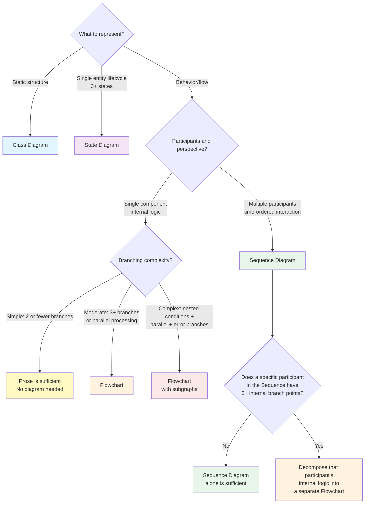
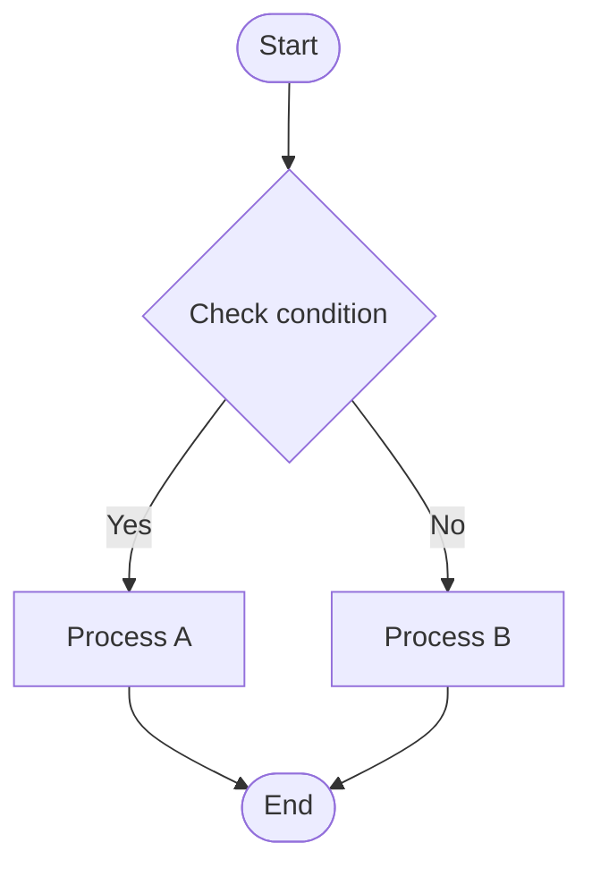
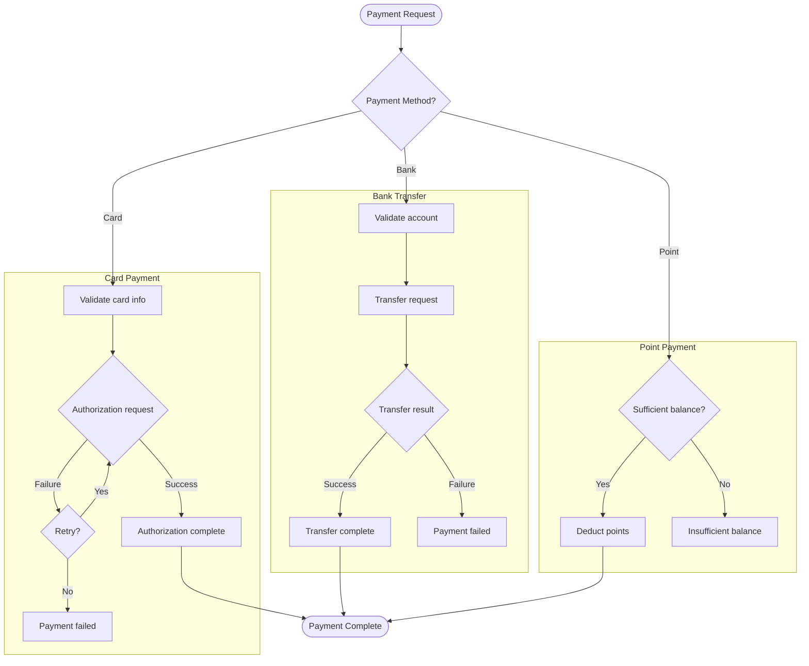

# Diagram Selection Guide

A cross-cutting reference guide providing selection criteria and authoring guidelines for the 4 diagram types used in the spec skill.

## 1. Diagram Types

| Diagram | Purpose | Mermaid Syntax | Primary Usage |
|---------|---------|----------------|---------------|
| Sequence Diagram | Time-ordered interaction between multiple participants | `sequenceDiagram` | Solution Design (Step 4.4), Integration Pattern (Step 3.1) |
| Class Diagram | Static structure (domain objects, relationships) | `classDiagram` | Domain Model (Step 2) |
| State Diagram | Single entity lifecycle (3+ states) | `stateDiagram-v2` | Domain Model (Step 4) |
| Flowchart | Internal branching logic within a single component | `flowchart TD` | Complex conditionals, parallel processing, error handling |

## 2. Selection Decision Tree



## 3. Scenario Mapping

| Scenario | Diagram | Rationale |
|----------|---------|-----------|
| API request → Service A → Service B → DB | Sequence | Time-ordered flow between multiple participants |
| Order status: CREATED → PAID → SHIPPED → DELIVERED | State | Single entity lifecycle |
| Relationships and responsibilities between domain objects | Class | Static structure |
| Payment processing: card/bank/point branching + retry on failure + partial payment | Flowchart | Single component internal, 3+ branches |
| Discount calculation: coupon → grade discount → minimum amount validation → error branch | Flowchart with subgraphs | Nested conditions + error branches |
| Simple condition that ends with a single if-else | Prose | 2 or fewer branches, diagram is overkill |
| Message flow from Service A to Service B | Sequence | System-to-system flow (Flowchart prohibited) |
| Full order processing flow (inter-service) + Payment internal branching (5+ branch points) | Sequence + Decomposition Flowchart | Sequence = inter-service flow, Flowchart = single participant's internal branching detail. Different abstraction levels, so not duplication |
| Same inter-service flow represented as both Sequence and Flowchart at the same level | Prohibited | Same-level duplication. Choose one only |

## 4. Guardrails

### 4a. Necessity Test

> "Does this diagram reveal structure/relationships that prose alone cannot efficiently convey?"
> NO → No diagram needed. Write in prose.

### 4b. Constraints

| Rule | Rationale |
|------|-----------|
| No diagram duplication of the same flow at the same abstraction level | Prevent redundant representation |
| Decomposition allowed: internal branching (3+ branch points) of a single participant within a Sequence may be detailed as a separate Flowchart | Complementary multi-level representation |
| If prose is sufficient, no diagram needed | Prevent excessive visualization |
| Flowchart only when 3+ branch points exist | Prevent diagram overkill for simple logic |
| Flowchart prohibited for system-to-system flows | Use Sequence Diagram |
| Maximum ~15 nodes per diagram | Maintain readability |

### 4c. Anti-Patterns

| Anti-Pattern | Correct Approach |
|--------------|-----------------|
| Representing system-to-system API calls as Flowchart | Use Sequence Diagram |
| Using Flowchart for 2 branches | Prose is sufficient |
| Representing the same flow as both Sequence + Flowchart at the same abstraction level | Choose one only. System-to-system → Sequence, single component → Flowchart |
| Forcing participant internal branching into Sequence alt/note blocks only | If 3+ branch points, decompose that participant's internal logic into a separate Flowchart (Decomposition) |
| Giant Flowchart with 15+ nodes | Split into subgraphs or reduce scope |
| Using State Diagram for branching logic | State = lifecycle, Flowchart = branching logic |

### 4d. Decomposition Pattern

| Pattern | Condition | Example |
|---------|-----------|---------|
| Sequence + Decomposition Flowchart | When a specific participant in a Sequence has 3+ internal branch points | Detailing PaymentService's internal payment method branching as a Flowchart within an order flow Sequence |

**Decomposition Criteria:**
1. A Sequence Diagram must already represent the system-to-system flow
2. The decomposition target must be a **single participant** of the Sequence
3. That participant must have **3+ internal branch points** (R3 threshold applies)
4. The Flowchart must represent **only that participant's internal logic** (no cross-participant interactions)
5. The Sequence Diagram must reference the decomposition target via `Note over` or similar

## 5. Flowchart Quick Reference

### 5a. Basic Syntax



### 5b. Node Shapes

| Syntax | Shape | Usage |
|--------|-------|-------|
| `A[text]` | Rectangle | Process/action |
| `A{text}` | Diamond | Conditional branch |
| `A([text])` | Rounded rectangle | Start/end |
| `A[[text]]` | Double rectangle | Subroutine call |
| `A[(text)]` | Cylinder | Data store |

### 5c. Subgraph Example

Separate complex branching logic into logical groups.



### 5d. Edge Labels

```
A --> B                %% No label
A -->|label text| B    %% With label
A -.->|dashed| B       %% Dashed arrow
A ==>|bold| B          %% Bold arrow
```

### 5e. Style Tips

- **Direction**: Generally use `TD` (top-down). Use `LR` (left-to-right) when horizontal flow is more natural.
- **Node IDs**: Use short, meaningful IDs (e.g., `validate`, `retry`, `err`). Simple alphabets (A, B, C) reduce readability.
- **Error path distinction**: Visually distinguish error paths from normal flow using dashed lines (-.->) or styling.
- **Node count limit**: If a single diagram exceeds ~15 nodes, split into subgraphs or reduce scope.
- **Label brevity**: Keep edge labels short and clear. If longer explanation is needed, supplement with prose.
