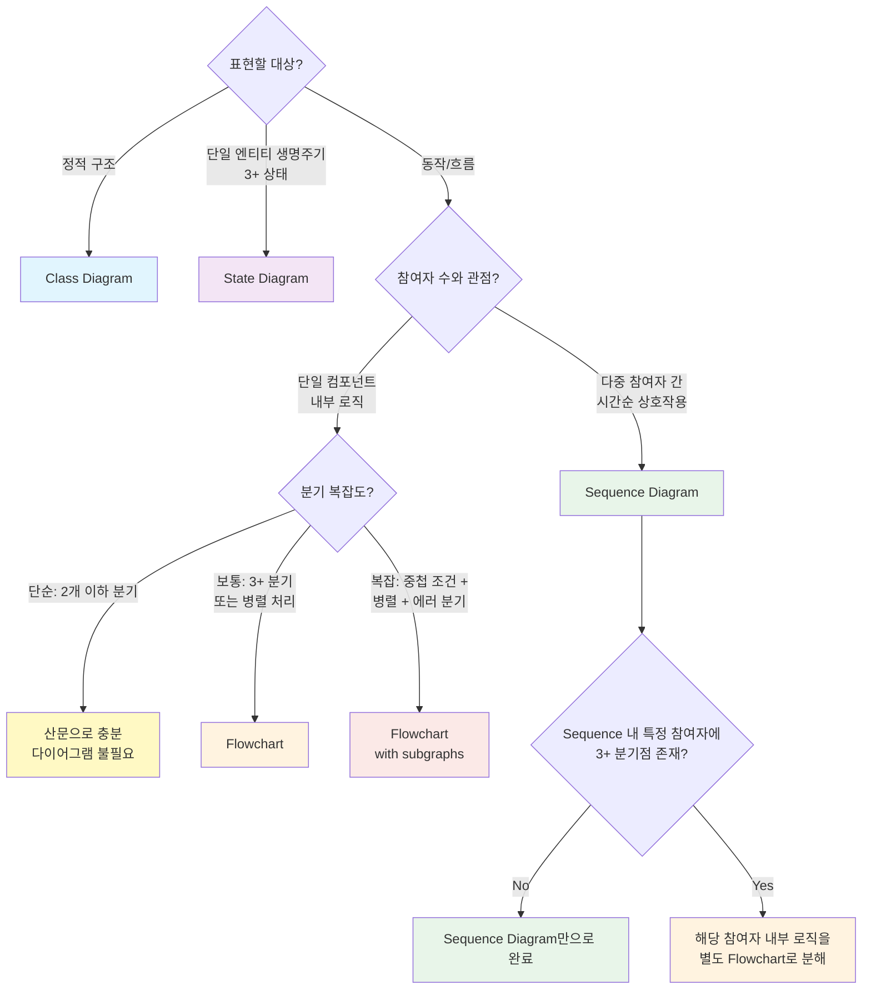
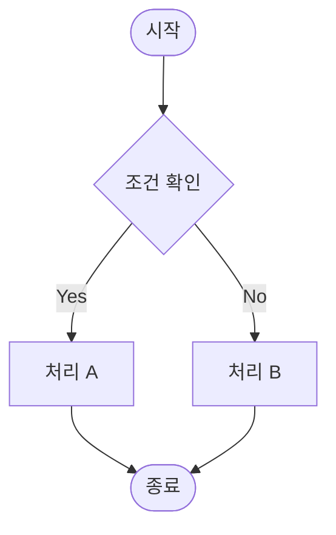
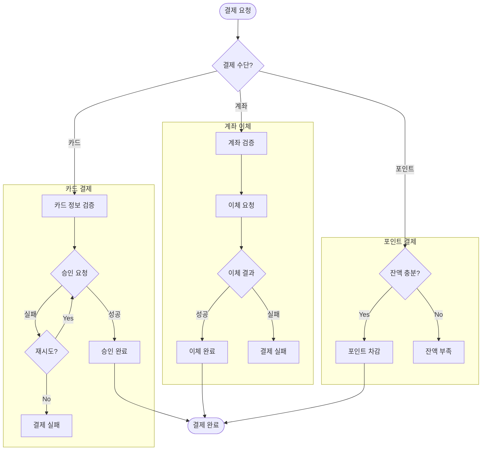

# Diagram Selection Guide

spec 스킬에서 사용하는 4종 다이어그램의 선택 기준과 작성 가이드라인을 제공하는 cross-cutting 참조 가이드이다.

## 1. Diagram Types

| Diagram | Purpose | Mermaid Syntax | Primary Usage |
|---------|---------|----------------|---------------|
| Sequence Diagram | 다중 참여자 간 시간순 상호작용 | `sequenceDiagram` | Solution Design (Step 4.4), Integration Pattern (Step 3.1) |
| Class Diagram | 정적 구조 (도메인 객체, 관계) | `classDiagram` | Domain Model (Step 2) |
| State Diagram | 단일 엔티티 생명주기 (3+ 상태) | `stateDiagram-v2` | Domain Model (Step 4) |
| Flowchart | 단일 컴포넌트 내부 분기 로직 | `flowchart TD` | 복잡한 조건 분기, 병렬 처리, 에러 핸들링 |

## 2. Selection Decision Tree



## 3. Scenario Mapping

| Scenario | Diagram | Rationale |
|----------|---------|-----------|
| API 요청 → 서비스 A → 서비스 B → DB | Sequence | 다중 참여자 간 시간순 흐름 |
| 주문 상태: CREATED → PAID → SHIPPED → DELIVERED | State | 단일 엔티티 생명주기 |
| 도메인 객체 간 관계와 책임 | Class | 정적 구조 |
| 결제 처리: 카드/계좌/포인트 분기 + 실패 재시도 + 부분 결제 | Flowchart | 단일 컴포넌트 내부, 3+ 분기 |
| 할인 계산: 쿠폰 → 등급 할인 → 최소 금액 검증 → 에러 분기 | Flowchart with subgraphs | 중첩 조건 + 에러 분기 |
| if-else 하나로 끝나는 단순 조건 | 산문 | 2개 이하 분기, 다이어그램 과잉 |
| 서비스 A에서 서비스 B로 메시지 전달 흐름 | Sequence | 시스템 간 흐름 (Flowchart 금지) |
| 주문 처리 전체 흐름(서비스 간) + Payment 내부 분기(5+ 분기점) | Sequence + Decomposition Flowchart | Sequence = 시스템 간 흐름, Flowchart = 단일 참여자 내부 상세 분기. 추상화 수준이 다르므로 중복 아님 |
| 동일 서비스 간 흐름을 Sequence와 Flowchart로 동일 수준에서 표현 | 금지 | 동일 추상화 수준 중복. 하나만 선택 |

## 4. Guardrails

### 4a. Necessity Test

> "이 다이어그램이 산문만으로는 효율적으로 전달 못하는 구조/관계를 드러내는가?"
> NO → 다이어그램 불필요. 산문으로 작성.

### 4b. Constraints

| Rule | Rationale |
|------|-----------|
| 동일 추상화 수준에서 동일 흐름의 다이어그램 중복 금지 | 중복 표현 방지 |
| Decomposition 허용: Sequence 내 단일 참여자의 내부 분기(3+ 분기점)는 별도 Flowchart로 상세화 가능 | 보완적 다층 표현 |
| 산문으로 충분하면 다이어그램 불필요 | 과도한 시각화 방지 |
| Flowchart는 3+ 분기점일 때만 | 단순 로직에 다이어그램 과잉 방지 |
| 시스템 간 흐름에 Flowchart 금지 | Sequence Diagram 사용 |
| 다이어그램당 최대 ~15 노드 | 가독성 유지 |

### 4c. Anti-Patterns

| Anti-Pattern | Correct Approach |
|--------------|-----------------|
| 시스템 간 API 호출을 Flowchart로 표현 | Sequence Diagram 사용 |
| 2개 분기를 Flowchart로 표현 | 산문으로 충분 |
| 동일 추상화 수준에서 같은 흐름을 Sequence + Flowchart로 표현 | 하나만 선택. 시스템 간이면 Sequence, 단일 컴포넌트면 Flowchart |
| Sequence 내 참여자 내부 분기를 alt/note로만 억지 표현 | 3+ 분기점이면 해당 참여자 내부 로직을 별도 Flowchart로 분해(Decomposition) |
| 15+ 노드의 거대한 Flowchart | subgraph로 분리하거나 범위 축소 |
| State Diagram으로 분기 로직 표현 | State = 생명주기, Flowchart = 분기 로직 |

### 4d. Decomposition Pattern

| Pattern | 조건 | 예시 |
|---------|------|------|
| Sequence + Decomposition Flowchart | Sequence 내 특정 참여자가 3+ 내부 분기점을 가질 때 | 주문 흐름 Sequence에서 PaymentService 내부 결제수단 분기를 Flowchart로 상세화 |

**Decomposition 적용 기준:**
1. Sequence Diagram이 이미 시스템 간 흐름을 표현하고 있을 것
2. Decomposition 대상은 Sequence의 **단일 참여자**일 것
3. 해당 참여자 내부에 **3+ 분기점**이 존재할 것 (R3 기준 적용)
4. Flowchart는 해당 참여자의 **내부 로직만** 표현할 것 (다른 참여자와의 상호작용 포함 금지)
5. Sequence Diagram에서 Decomposition 대상을 `Note over` 등으로 Flowchart 참조 명시

## 5. Flowchart Quick Reference

### 5a. Basic Syntax



### 5b. Node Shapes

| Syntax | Shape | 용도 |
|--------|-------|------|
| `A[text]` | 사각형 | 처리/액션 |
| `A{text}` | 다이아몬드 | 조건 분기 |
| `A([text])` | 둥근 사각형 | 시작/종료 |
| `A[[text]]` | 이중 사각형 | 서브루틴 호출 |
| `A[(text)]` | 실린더 | 데이터 저장소 |

### 5c. Subgraph 예시

복잡한 분기 로직을 논리적 그룹으로 분리한다.



### 5d. Edge Labels

```
A --> B                %% 라벨 없음
A -->|라벨 텍스트| B    %% 라벨 포함
A -.->|점선| B         %% 점선 화살표
A ==>|굵은선| B        %% 굵은 화살표
```

### 5e. Style Tips

- **방향**: 일반적으로 `TD` (위에서 아래)를 사용한다. 수평 흐름이 자연스러운 경우 `LR` (왼쪽에서 오른쪽)을 사용한다.
- **노드명**: 의미 있는 짧은 ID를 사용한다 (예: `validate`, `retry`, `err` 등). 단순 알파벳(A, B, C)은 가독성을 떨어뜨린다.
- **에러 경로 구분**: 에러 경로는 점선(-.->)이나 스타일링으로 정상 흐름과 시각적으로 구분한다.
- **노드 수 제한**: 단일 다이어그램에 ~15 노드를 초과하면 subgraph로 분리하거나 범위를 축소한다.
- **라벨 간결성**: Edge label은 짧고 명확하게 작성한다. 긴 설명이 필요하면 산문으로 보충한다.
