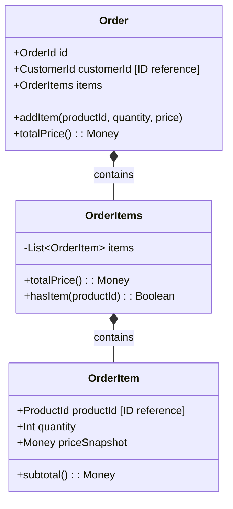

# Design Area: Domain Model

## Role

As a Domain-Driven Design (DDD) expert, systematically design the project's domain model and organize it into a single unified document.

**Output Format**: See `templates/phase-outputs.md`

## Design Philosophy

### Rich Domain Model

Business rules belong inside domain objects, not services. Domain models collaborate to express business logic, and the service layer should read as simple procedural flow - orchestration only, no business decisions.

Domain logic that doesn't naturally belong to an Entity or Value Object is extracted as a **Doer** (performs action) or **Policy** (encapsulates rules). Use Policy when logic applies to multiple entities, has multiple variations, or requires external context.

**When to use Policy:** When multiple calculation strategies exist (e.g., discount types) and you want to add new variations without modifying existing code (OCP).

**Domain Collaboration:** Design domain models to collaborate with each other through unidirectional dependencies. The service layer should only orchestrate - fetch, delegate, persist - while domain objects handle the actual business logic.

```
// Service: orchestration only
payResult = paymentClient.pay(orderId, totalAmount)
payment.complete(payResult)
order.markPaid()

// NOT this: business logic in service
if (payResult.isSuccess()) {
    payment.status = COMPLETED
    order.status = PAID
    // business rules scattered in service...
}
```

### Design by Contract

Invariants are validated in the constructor - invalid objects should never exist. Public domain methods should have clear preconditions and postconditions, documented so the team can understand the contract.

```
Invariant: Money.amount >= 0
```

### Aggregate Design

Objects with the same lifecycle belong in the same Aggregate. References between different Aggregates must be by ID only - use ID reference when the referenced object can change independently or has a different owner. Repository exists only for Aggregate Root. When boundaries are unclear, prefer smaller Aggregates.



### Value Object Promotion

Create a first-class collection when a collection has business logic beyond simple iteration (validation, calculation, lookup). Promote a primitive to VO when a value has multiple modification cases, formatting rules, or validation logic.

```
PhoneNumber
  - Invariant: valid format
  - Operations: format(), countryCode()
```

### Event Design Principles

Events decouple publishers and consumers. Design events to maintain this decoupling.

**Events describe what happened, not what should be done.** Event names should be past tense describing a fact (OrderCreated, PaymentCompleted), not commands for consumers (SendNotification, UpdateInventory). Publishers don't know and don't care what consumers will do.

**Design for unknown consumers.** Don't tailor event payloads to specific consumer needs. Include only the minimal information describing what happened. If consumers need more data, they should query using IDs from the payload.

**Publishers and consumers have separate lifecycles.** They can be developed, tested, and deployed independently. The event payload is the contract connecting them - once published, payload structure changes should consider versioning.

**Good example** - describes what happened with minimal payload:
```
OrderCreatedEvent
  - orderId: Long
  - customerId: Long
  - totalAmount: Long
  - occurredAt: Instant
```

**Bad example** - designed for specific consumer with unnecessary data (customerEmail, customerName, notificationTemplate leaked from consumer's concerns).

## Principles

- Ensure each piece of information appears in exactly one place
- Focus on pure domain logic: document business rules and invariants, exclude implementation details
- Keep documents concise and easy for team members to review
- Keep diagrams clean with concise notes focused only on business rules
- Use class diagrams as the single source of truth for structure and responsibilities

### Repository/Port Interfaces are WHAT, not HOW

Define operations in business terms (e.g., "atomically accumulate count", "retrieve top N by score"). Exclude implementation details (e.g., "INSERT ... ON CONFLICT", "ZREVRANGE"). Implementation is covered in detailed design.

### Document Scope

- **Include**: Domain objects, aggregates, business rules, invariants, state transitions, domain events, repository/port interfaces (business meaning only)
- **Exclude**: SQL statements, cache commands, framework annotations, batch strategies, and other technology-specific implementations (covered in detailed design)

## STOP: Domain Model Red Flags

- 3+ entity states but user wants to skip → Domain modeling required
- Cross-entity business rules but no aggregate design → Cannot skip
- Repository defined with implementation details → Keep business terms only
- "나중에 이벤트 추가" without YAGNI analysis → Evaluate now

## Process

### Step 1: Context Review

#### 1.1 Review Input Documents
- Review: Analyze requirements and architecture documents provided by user
- Summarize: Present key points relevant to domain modeling

#### 1.2 Identify Modeling Scope
- Identify: Define domain modeling scope based on input documents
- Confirm: Get user agreement on scope

#### Checkpoint: Step 1 Complete
Apply **Checkpoint Protocol** (see SKILL.md Standard Protocols)

### Step 2: Class Diagram Design

#### 2.1 Identify Domain Objects
- Identify: Core domain entities, value objects, enums
- Classify: Categorize each object type (refer to design philosophy criteria)
- **For each Value Object**: Identify invariants that must always hold (become constructor validations)
- Review: Discuss with user

#### 2.2 Define Aggregate Boundaries
- Analyze: Define aggregate boundaries and aggregate roots (refer to design philosophy: same lifecycle → same Aggregate)
- Explain: Rationale for why aggregates are separated
- Confirm: Get user agreement

#### 2.3 Define Relationships
- Identify: Relationships between objects with appropriate labels:
  - Direct reference: enums and owned value objects
  - Indirect reference via ID: cross-aggregate references
  - Composition: embedded value objects
- Explain: Why certain references are indirect
- Review: Discuss with user

#### 2.4 Create Class Diagram
- Draw: Mermaid class diagram with aggregate structure
- Include: Brief description of structure and responsibilities
- **Repository/Port interfaces**: Define in business terms only (what they do, not how)
- Review: Review diagram with user

#### Checkpoint: Step 2 Complete
Apply **Checkpoint Protocol** (see SKILL.md Standard Protocols)

### Step 3: Define Domain Rules

#### 3.1 Identify Business Rules
- Identify: Core business logic that defines domain behavior:
  - Business constraints and validation rules
  - Calculation algorithms with concrete examples
  - State transition rules and conditions
  - Invariants that must always be true
  - Error conditions and exception messages
- **For Domain Services with multiple methods**: Document relationships between methods and when to use each method
- Discuss: Review completeness with user

#### 3.2 Organize Rules by Category
- Organize: Group rules by business category (e.g., issuance rules, usage rules, calculation rules)
- Format: Use table format for calculation logic with clear examples
- Confirm: Get user agreement on categorization

#### Checkpoint: Step 3 Complete
Apply **Checkpoint Protocol** (see SKILL.md Standard Protocols)

### Step 4: Create State Diagram

#### 4.1 Assess Necessity
- Analyze: Determine if there are entities with significant state transitions
- Present: Explain whether state diagram is needed with rationale
- Decide: Skip to Step 5 if no significant state transitions
- Confirm: Get user agreement

#### 4.2 Define States and Transitions (if proceeding)
- Identify: States, transition conditions, side effects, error cases
- Review: Discuss with user

#### 4.3 Create State Diagram (if proceeding)
- Draw: Mermaid state diagram with concise business rule notes
- Create: State transition rules table (current state, event, next state, condition, side effects)
- Review: Review diagram with user

#### Checkpoint: Step 4 Complete
Apply **Checkpoint Protocol** (see SKILL.md Standard Protocols)

### Step 5: Identify Domain Events

#### 5.1 Assess Necessity
- Analyze: Determine if domain events are needed
- Apply: YAGNI principle - if synchronous processing suffices, events may not be needed
- Present: Explain whether events are needed with rationale
- Decide: If events are not needed, document the reason and skip to Step 6
- Confirm: Get user agreement

#### 5.2 Define Domain Events (if proceeding)
- Identify: Significant business events occurring in the domain
- Define: Event name, trigger, payload
- **Separation of Concerns**: Define publishers and consumers independently
  - Publisher: Which aggregate publishes? What triggers the event?
  - Consumer: Which component handles it? What action is taken?
  - These are separate design decisions that should not influence each other
- Review: Discuss with user

#### 5.3 Document Future Events (if not proceeding)
- List: Potential future events that may be introduced later
- Confirm: Get user agreement

#### Checkpoint: Step 5 Complete
Apply **Checkpoint Protocol** (see SKILL.md Standard Protocols)

### Step 6: Document Generation

Apply **Design Area Completion Protocol** (see SKILL.md Standard Protocols)

**Record Naming**: `da-domain-model.{step}-{topic}.md`

#### Checkpoint: Domain Model Complete
- Announce: "Domain Model complete. Proceeding to next selected Design Area: [next area name]."
