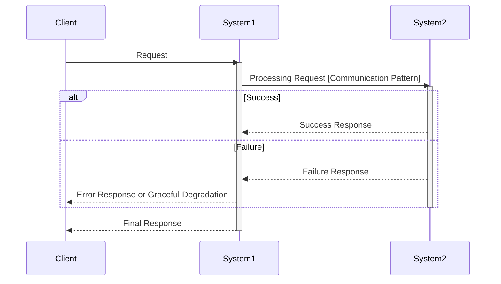
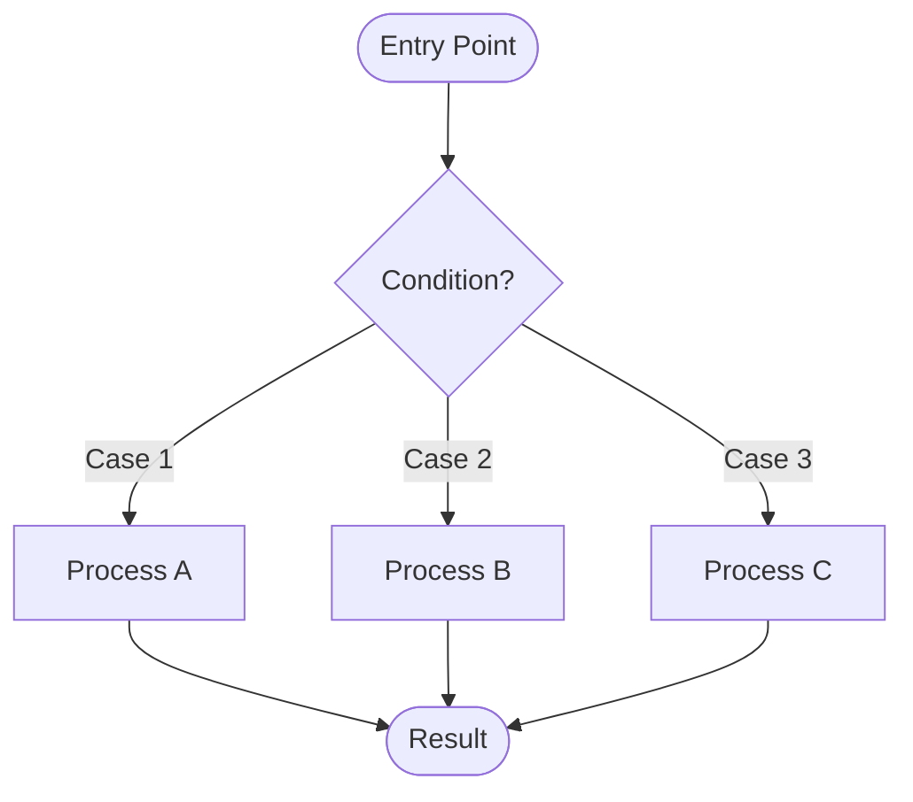

# Integration Pattern

## Role

As an integration design specialist, systematically design communication patterns, data flows, and stateful component policies for the project's integrations.

**Output Format**: See **Output Template** section below

## Principles

- Design integration patterns at Policy + Structure level (not implementation details)
- Focus on cross-system communication and data flow coordination
- Define transaction boundaries and consistency policies explicitly
- Document failure handling and recovery strategies

### Communication Pattern Specification

Clearly distinguish between synchronous patterns (in-process function calls, HTTP/gRPC) and asynchronous patterns (message queues, internal event listeners). Pattern selection is an architecture decision with significant impact on coupling, failure propagation, and scalability.

### Document Scope

- **Include**: Communication patterns, data flow designs, transaction boundaries, consistency policies, stateful component policies, error and recovery flows
- **Exclude**: SQL statements, cache commands, specific data structures, algorithms, implementation details (covered in implementation stage)

## Vague Answer Clarification Examples

When users respond vaguely to design questions, clarify with specific questions.

| Vague Answer | Clarifying Question |
|------------|------------|
| "Just call it" | "Synchronous or asynchronous? What's the retry policy on failure?" |
| "Timeout is whatever" | "What's the specific timeout value? What's the fallback behavior on timeout?" |
| "Just use a message queue" | "Is ordering guaranteed? How is idempotency handled? How are failed messages processed?" |
| "Handle transactions on your own" | "Where are the transaction boundaries? Is distributed transaction required?" |
| "Buffering can wait" | "What's the buffer size limit? Flush conditions? Response plan for buffer loss?" |

## Process

### Step 1: Context Review

#### 1.1 Input Document Review
- Review: Analyze requirements, solution design, and domain documents
- Summarize: Present key points relevant to integration design
- **Identify**: Integration points between systems or domains
- **Identify**: Stateful components (buffers, caches, aggregators)

#### 1.2 Identify Integration Scope
- List: All integration points requiring pattern definition
- Classify: In-process vs cross-process integrations
- Confirm: Get user agreement on scope

#### Checkpoint: Step 1 Complete
Apply **Checkpoint Protocol** (see SKILL.md)

### Step 2: Communication Pattern Definition

#### 2.1 Pattern Selection
- **For each integration point**:
  - Identify whether in-process or cross-process
  - Select communication pattern:
    - **Synchronous**: Function calls (in-process), HTTP/gRPC (cross-service)
    - **Asynchronous**: Message queues (Kafka, RabbitMQ), internal event listeners (@EventListener), Webhooks
  - Document rationale for selection
  - Define failure handling policy
- Review: Discuss with user

#### 2.2 Integration Table
- **Create integration summary table**:
  | Integration Point | Type | Pattern | Failure Policy |
  |-------------------|------|---------|----------------|
  | ... | ... | ... | ... |
- Confirm: Get user agreement

#### Checkpoint: Step 2 Complete
Apply **Checkpoint Protocol** (see SKILL.md)

### Step 3: Data Flow Design

#### 3.1 Sequence Diagram Creation
- Create: Sequence diagrams for each major use case (in mermaid format)
- Include:
  - System-level participants (with process boundary notes if needed)
  - Activation bars using `activate`/`deactivate`
  - Success and failure scenarios using `alt`/`else` blocks
  - Clear action labels (optionally with pattern notation: [Function Call], [Kafka], etc.)
- Review: Review diagrams with user
- **Internal logic**: For complex branching within a single component (3+ branch points), consider adding a Flowchart. See `references/diagram-selection.md` for Decision Tree, Decomposition criteria, and Flowchart syntax

#### 3.2 Event-Driven Integration (if applicable)
- **Event list**: Name, trigger, required payload fields (schema details in implementation)
- Clarify: Publishers and consumers
- Note: Ordering or idempotency requirements
- Confirm: Get user agreement

#### 3.3 Multi-Store Scenarios (if applicable)
- Specify: Source of truth (e.g., RDB + Cache)
- Define: Consistency policy and acceptable divergence
- Specify: Behavior on secondary store failure (without implementation details)
- Review: Discuss with user

#### Checkpoint: Step 3 Complete
Apply **Checkpoint Protocol** (see SKILL.md)

### Step 4: Stateful Component Policy

#### 4.1 Identify Stateful Components
- Analyze: Components requiring internal state management:
  - Buffers and caches
  - Aggregators and accumulators
  - Schedulers and batch processors
- Confirm: Get user agreement on which components need policy definition

#### 4.2 Define Component Policies
- **For each stateful component** define at Policy + Structure level:
  - **Purpose**: What state is being managed and why
  - **Data Structure Choice**: What type of structure (Map, Queue, List, etc.) and why
  - **Concurrency Policy**: Single-threaded, lock-based, or lock-free approach
  - **Lifecycle**: When initialized, updated, cleaned up, and shut down
  - **Failure Behavior**: What happens on error, how to recover
- Note: Detailed implementation (specific lock types, exact data structure) is for implementation stage
- Review: Discuss with user

#### Checkpoint: Step 4 Complete
Apply **Checkpoint Protocol** (see SKILL.md)

### Step 5: Error and Recovery Flows

#### 5.1 Major Error Scenarios
- Identify: Major error scenarios across integrations
- Design: Fallback flows and recovery strategies
- Ask (system-level resilience):
  - **Degradation Mode**: On failure, does only partial functionality stop, or does the entire service go down?
  - **Blast Radius**: How far does a single component failure propagate? Which downstream systems are affected?
  - **Recovery Mode**: Is automatic recovery possible, or is manual intervention required? Does a simple restart restore normal operation?
- Review: Discuss with user

#### 5.2 Cross-cutting Concerns
- **Transaction boundaries**: Where do transactions start and end?
- **Saga/Outbox patterns**: If applicable, identify participating components
- **Retry policies**: Define retry behavior at integration points
- **Recovery expectations**: How quickly must the system return to normal operation?
- Confirm: Get user agreement

#### Checkpoint: Step 5 Complete
Apply **Checkpoint Protocol** (see SKILL.md)

### Step 6: Document Generation

Apply **Area Completion Protocol** (see SKILL.md)

**Record Naming**: `{step}-{topic}.md`

#### Checkpoint: Integration Pattern Complete
- Announce: "Integration Pattern complete. Proceeding to next selected Design Area: [next area name]."

## Output Template

> This is a recommended template. Adapt sections, ordering, and detail level to your project's needs.

````markdown
# Integration Pattern Document

## 1. Integration Points Summary

| Integration Point | Communication Pattern | Sync/Async | Failure Handling | Rationale |
|-------------------|----------------------|------------|------------------|-----------|
| A -> B | Function Call (in-process) | Sync | Graceful Degradation | Same module, minimize latency |
| A -> C | Kafka | Async | Retry 3x + DLQ | Service separation, ordering required |

## 2. Data Flow Diagrams

### 2.1 [Use Case Name] Flow



### 2.X [Component Name] Internal Logic (if complex branching exists)

> Include only when a single component has 3+ branch points. See `references/diagram-selection.md` for selection criteria.



## 3. Stateful Component Policies

### 3.1 [Component Name]

**Purpose:** Description of component's role

**Data Structure Choice:** [Map/Queue/List/etc.] - [Why this choice]

**Concurrency Policy:** [Single-threaded/Lock-based/Lock-free] - [Rationale]

**Lifecycle:**

| Event | Handling |
|-------|----------|
| Initialization | ... |
| Periodic Tasks | ... |
| On Failure | ... |
| On Shutdown | ... |

## 4. Error and Recovery Flows

### 4.1 Major Error Scenarios

| Failure Scenario | Response Plan | Degradation Mode | Recovery Mode | Expected Outcome |
|------------------|---------------|------------------|---------------|------------------|
| ... | ... | Partial / Full | Auto / Manual | ... |

### 4.2 Transaction Boundaries

| Operation | Transaction Scope | Pattern | Notes |
|-----------|------------------|---------|-------|
| ... | ... | Single DB / Outbox / Saga | ... |
````
