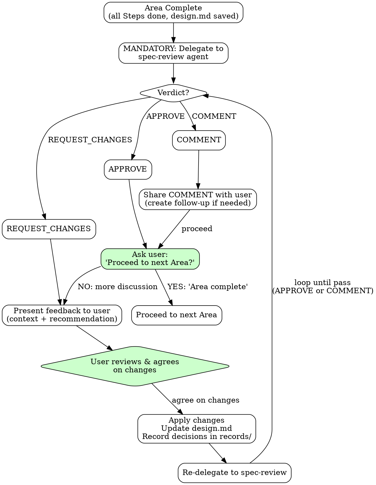

# Multi-AI Review Integration

**MANDATORY at Area completion.** After completing all Steps in an Area, ALWAYS delegate to spec-review. This is part of the Area Completion Protocol and cannot be skipped.

The spec-review decides whether a full review is needed or returns "No review needed" (with APPROVE verdict) for simple cases. Either way, the verdict MUST be handled according to the Verdict-Based Flow Control.

### Feedback Loop Workflow



### Human-in-the-Loop

The final decision on feedback is always made by the **user**, but spec-review pass (APPROVE or COMMENT) is a prerequisite for Area completion.

| Item | Description |
|------|-------------|
| spec-review Role | Quality gate — pass (APPROVE or COMMENT) required before Area can complete |
| AI (spec) Role | Present feedback, form recommendation, facilitate consensus |
| User Role | Review feedback, agree on changes, declare "Area complete" after pass |
| Gate Order | spec-review pass first → then user "Area complete" declaration |

### Delegating to spec-review

After completing all Steps in an Area, always delegate to the spec-review agent via Task tool. The spec-review will assess whether a full review is needed and return a verdict.

**Delegation prompt structure:**

```markdown
Review the following design and provide multi-AI advisory feedback.

## 0. Review Perspective
[Current Area's Review Perspective from reference file — verbatim]

## 1. Current Design Under Review
[Content of current step's design.md]

### Key Decisions
[Key decision points requiring review]

### Questions for Reviewers
[Specific questions or concerns]

## 2. Previously Finalized Designs (Constraints)
[Summarize relevant decisions from earlier steps that constrain this design]

## 3. Deliberate Divergence (re-submission only)
[If re-submitting: list concerns from previous review that were discussed
 with the user and intentionally not adopted, with rationale.
 Omit this section on initial delegation.]

## 4. Context
[Project context, tech stack, constraints]
```

#### Deliberate Divergence (Re-submission)

The `## 3. Deliberate Divergence` section is included ONLY on re-submission, never on the initial delegation. For each concern that was raised in a previous review and discussed with the user but intentionally not adopted, document:

- **Concern summary**: What the reviewer flagged
- **User's rationale for rejection**: Why the user chose not to adopt it
- **Classification**: Whether it was deemed out-of-scope per the current Area's Review Perspective, or a deliberate trade-off within scope

Purpose: stateless reviewers have no memory of prior rounds. Without this section, they will re-raise the same concerns on every re-submission, creating an infinite loop. Listing rejected concerns with rationale signals to reviewers that these points have been considered and decided.

**What you receive back:**

**If review is needed:**
- **Consensus**: Points where all reviewers agree
- **Divergence**: Points where opinions differ
- **Concerns Raised**: Potential issues identified
- **Recommendation**: Synthesized advice
- **Review Verdict**: APPROVE / REQUEST_CHANGES / COMMENT (with blocking concerns list and rationale)

**If no review is needed:**
- **Status**: "No Review Needed"
- **Verdict**: APPROVE
- **Reason**: Brief explanation (e.g., "Simple CRUD with clear requirements")

The spec-review operates in a separate context and returns advisory feedback with a verdict. You must then handle the verdict accordingly and present it to the user.

### Presenting Feedback to User

After receiving spec-review feedback, YOU must:

1. **State the verdict** - APPROVE, REQUEST_CHANGES, or COMMENT — make it explicit
2. **Analyze the feedback** - What do you agree with? What seems overblown?
3. **Add context** - How does this relate to earlier decisions? What trade-offs exist?
4. **Form your recommendation** - What do YOU think the user should do? Frame recommendations as options with trade-offs, not as the single right answer.
5. **Present holistically** - Do not just dump reviewer output. Synthesize it.
6. **All sections mandatory** - Present every section spec-review returns (Consensus, Divergence, Concerns, Recommendation, Verdict). No section omission.

**Verdict-specific presentation:**

| Verdict | Presentation |
|---------|-------------|
| **APPROVE** | "spec-review APPROVE. [Brief summary]. Proceed to next Area?" |
| **REQUEST_CHANGES** | "spec-review REQUEST_CHANGES. [Summary of blocking concerns + recommendations]. How about making the following changes? [Specific change proposals]" |
| **COMMENT** | "spec-review COMMENT. [Summary of non-blocking improvement recommendations]. I'll proceed with these in mind. [Follow-up created if needed]" |

**Example (REQUEST_CHANGES):**

> "spec-review **REQUEST_CHANGES**. Reviewers raised a blocking concern about the event-sourcing approach for order state management. The main points were the team's limited ES experience and concerns about complexity. However, since the need for a full audit trail was confirmed in Solution Design, I propose keeping event-sourcing while adding a detailed implementation guide to the spec. Do you agree with this direction?"

### Feedback Consensus Protocol

**IRON RULE: When spec-review returns REQUEST_CHANGES: ZERO EDITS to any design document before user consensus. Present → Discuss → Agree → THEN edit. Violating this rule — editing design.md, requirements, or any spec artifact based on reviewer feedback without user agreement — is forbidden.**

For each blocking concern, present it using this per-concern format:

- **Situation**: What the reviewer found
- **Reason**: Why the reviewer considers it a problem
- **Scope assessment**: Is this concern within the current Area's Review Perspective? If it matches an Overstepping Signal, state this explicitly.
- **Recommendation**: Incorporate / modify and incorporate / defer to implementation / reject
- **User decision**: Wait for explicit agreement before proceeding

After all concerns have been discussed with the user:

1. Apply ONLY the changes the user explicitly agreed to
2. Record decisions (including rationale for rejections) in `records/`
3. Record rejected concerns as Deliberate Divergence entries for the re-submission delegation prompt (`## 3. Deliberate Divergence`)

### Verdict-Based Flow Control

| Verdict | User Interaction | Next Action |
|---------|-----------------|-------------|
| **APPROVE** | Ask "Proceed to next Area?" | User declares "Area complete" → Next Area |
| **REQUEST_CHANGES** | Present blocking concerns + change proposals | User agrees → Apply changes → Re-call spec-review |
| **COMMENT** | Share non-blocking improvement recommendations | User confirms → Follow-up may be created → Ask "Proceed to next Area?" |

**REQUEST_CHANGES Loop:**
1. Present blocking concerns and recommended changes to user
2. User reviews and agrees on specific changes (user may modify recommendations)
3. Apply agreed changes to design.md, record decisions in `records/`
4. Re-delegate to spec-review
5. Repeat until pass received

> **Note:** Deliberate trade-offs against previous review findings are now documented in the `## 3. Deliberate Divergence` section of the re-delegation prompt (see above). This mechanism is mandatory on re-submission — not optional.

**CRITICAL: Area completion cannot be declared unless spec-review passes (APPROVE or COMMENT).** Even if the user declares "Area complete" while a REQUEST_CHANGES verdict is in effect, the Area cannot be completed until a pass is received.
