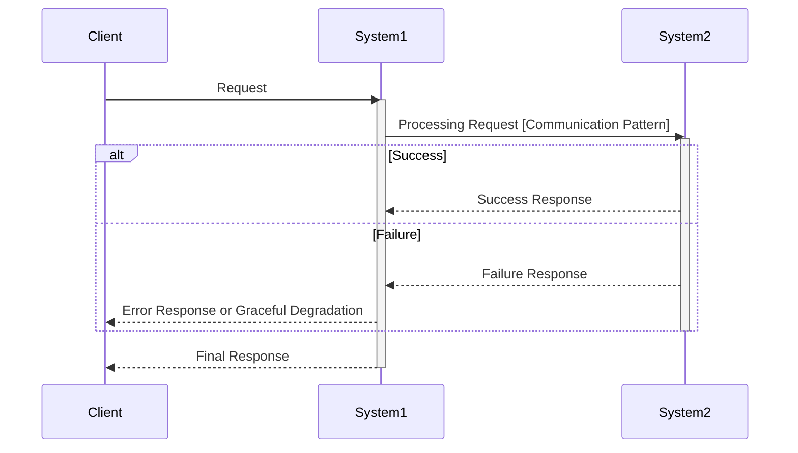
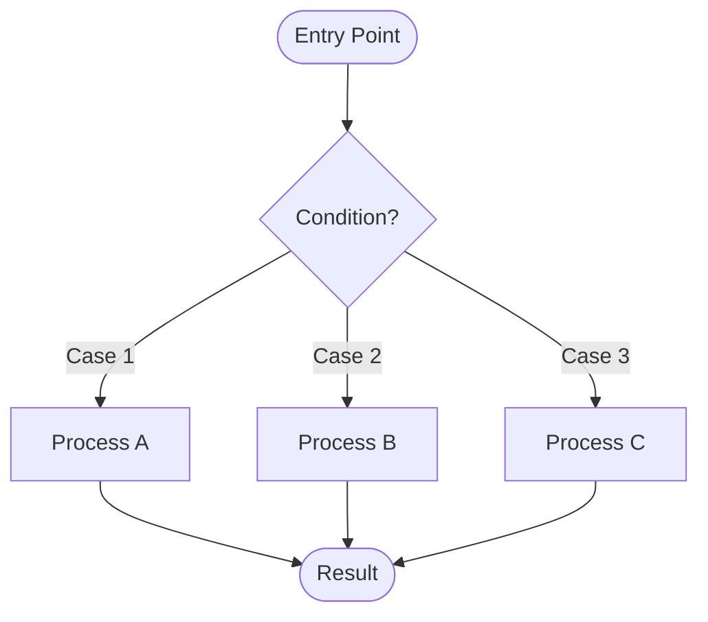

# Solution Design

## Role

As a software solution design expert, establish the technical context appropriate for the project, explore optimal solutions, and organize them into a single integrated document.

**Output Format**: See **Output Template** section below

## Principles

- Understand the current architecture before proposing solutions
- Focus on problem-solving approaches rather than implementation details
- Match the depth of solutions to the complexity of requirements
- Connect architecture decisions to project context and team values

### Explicit Definition of Integration Contracts

For each system/domain boundary, specify communication patterns, failure handling policies, and consistency requirements. Do not leave them implicit in sequence diagrams.

### Communication Pattern Specification

Architecture-level communication pattern selection is recorded here. For detailed pattern specifications and integration tables, see `references/integration-pattern.md`.

### Document Scope

- **Included**: System structure, component responsibilities, data flow between systems, communication patterns, failure handling policies, transaction boundaries, consistency policies
- **Excluded**: SQL statements, specific data structures (e.g., Redis ZSET), cache commands, algorithms, internal component design (covered in detailed design)

## Process

### Step 1: Initial Assessment

#### 1.1 Requirements Review
- Review: Analyze requirements documents provided by the user
- Summarize: Present key points that drive architecture decisions

#### 1.2 Complexity Classification
- Analyze: Classify requirements into one of the following categories:
  - **Small-scale**: Single API/feature addition, minimal changes to existing system
  - **Medium-scale**: Multiple component modifications, introduction of new patterns
  - **Large-scale**: System architecture changes, multi-system integration
- Confirm: Get user agreement on complexity classification before proceeding

#### Checkpoint: Step 1 Complete
Apply **Checkpoint Protocol** (see SKILL.md)

### Step 2: Existing Architecture Analysis

#### 2.1 Current Architecture Understanding
- Question: What is the current architecture and technical context related to this requirement?
- Scope by complexity:
  - Small-scale: Focus on directly affected components
  - Medium/Large-scale: Analyze broader system interactions

#### 2.2 Technology Stack Identification
- Gather: Collect relevant technology stack information
- Confirm: Verify understanding with user

#### 2.3 Current Architecture Sketch
- Draw: Simplified architecture diagram focusing on relevant components
- Review: Review accuracy with user

#### Checkpoint: Step 2 Complete
Apply **Checkpoint Protocol** (see SKILL.md)

### Step 3: Solution Alternative Exploration

#### 3.1 Alternative Generation
- Generate alternatives based on complexity:
  - **Small-scale**: Focused alternatives
  - **Medium-scale**: Multiple alternatives
  - **Large-scale**: Comprehensive alternatives

#### 3.2 Analysis of Each Alternative
- For each alternative, provide:
  - Clear description of the solution approach
  - How it addresses key requirements
  - Specific pros and cons with rationale
  - Architecture impact analysis
- Present: Share analysis with user
- Discuss: Collect user feedback on each alternative

#### Checkpoint: Step 3 Complete
Apply **Checkpoint Protocol** (see SKILL.md)

### Step 4: Solution Selection

#### 4.1 Solution Recommendation
- Recommend: Present the most suitable solution with detailed rationale
- Provide: Specific reasons for the selection
- Connect: Link each reason to project context and team values (refer to README.md)
- Explain: Why this solution was chosen over other alternatives
- Confirm: Get user agreement on the selected solution

#### Design Decision Significance Check

Steps 4.2, 4.3, and 4.4 each contain design decisions that may have multiple viable alternatives. At each decision point:

- Are there 2+ viable alternatives?
  - **YES** → Present alternatives with trade-offs (Rich Context Pattern), then get user selection
  - **NO** → Select best practice and document rationale

#### 4.2 Core Architecture Component Definition

- **Abstraction Level Target: Level 2 (Container/Component)**
  - L1 (System Context): Too high — "our system" as single box with external actors
  - **L2 (Container/Component): TARGET** — independently deployable units with clear operational boundaries
  - L3 (Code): Too low — classes, modules, packages, utility functions

- **L2 Verification Questions** (apply to EACH proposed component):
  1. **Independent Deployment**: Can this component be deployed without redeploying others?
  2. **Isolated Failure Domain**: If this component fails, does it have a bounded blast radius?
  3. **Team Ownership**: Could a team independently own and operate this component?
  - If any answer is "No" → component is likely L3 (code-level), merge into its L2 parent

- **Internal vs External Separation**:
  - **Internal Components**: Systems YOU design and build — these are your design targets
  - **External Dependencies**: Systems you integrate WITH — these are constraints, not design targets
  - Present in two separate sections (see **Output Template** section below)

- Apply **Design Decision Significance Check** to component structure decisions (e.g., microservices vs modular monolith vs hybrid)
- Identify: Major internal components involved in the solution (L2 level)
- Define: Responsibilities of each internal component
- Identify: External systems and their integration points
- **Cross-cutting concerns**:
  - Transaction boundaries: Where do transactions start and end?
  - If distributed transaction patterns are involved, note the decision here. For detailed Saga/Outbox component design, see Integration Pattern area.
- Review: Confirm with user

#### 4.3 Communication Pattern Definition
- **For each integration point** (system-to-system or domain-to-domain):
  - Identify whether in-process or cross-process
  - Select communication pattern (apply **Design Decision Significance Check**)
  - For significant decisions (2+ viable alternatives): Present alternatives with trade-offs, get user selection
  - For non-significant decisions: Select best practice, document rationale
- For detailed pattern specifications, failure handling policies, and integration table creation, see Integration Pattern area.
- Review: Review with user

#### 4.4 Data Flow Design
- Apply **Design Decision Significance Check** to approach decisions within data flow (e.g., external system access methods, flow structure choices)
- Create: Sequence diagrams for each major use case (in mermaid format)
- Include: System-level participants with clear action labels
- For detailed diagram specifications (activation bars, alt/else blocks, pattern notation), event-driven integration details, and multi-store consistency policies, see Integration Pattern area.
- Review: Review diagrams with user
- **Internal logic**: For complex branching within a single component (3+ branch points), consider adding a Flowchart. See `references/diagram-selection.md` for Decision Tree, Decomposition criteria, and Flowchart syntax

#### Checkpoint: Step 4 Complete
Apply **Checkpoint Protocol** (see SKILL.md)

### Step 5: Document Generation

Apply **Area Completion Protocol** (see SKILL.md)

#### Checkpoint: Step 5 Complete
- Announce: "Solution Design complete. Select Design Areas for this project."

### Step 6: Design Area Identification

#### 6.1 Analyze Project Complexity
- Review: Requirements and Solution Design outputs to determine which Design Areas are needed
- For each Design Area, evaluate criteria:
  - **Domain Model**: 3+ state transitions, complex business rules, aggregate boundaries
  - **Data Schema**: DB/file/cache storage needed
  - **Interface Contract**: External interface exposed (API, CLI, Event)
  - **Integration Pattern**: External system integration, async processing, transaction boundaries
  - **AI Responsibility Contract**: AI/LLM delegation exists with quality-sensitive output
  - **Operations Plan**: Production deployment, monitoring, operational settings
  - **Frontend / UX Surface**: Frontend/UI is significant part of system, component architecture decisions needed, state management or styling strategy undecided
  - **Data / ML Pipeline**: Data pipeline is core component, multiple data sources, data quality strategy needed, ML serving involved
  - **Security / Privacy**: Custom auth strategy needed, sensitive/personal data handling, multi-tenant access control, regulatory compliance

#### 6.2 Present Design Area Selection

Use the following AskUserQuestion format to present Design Area selection to the user:

```yaml
AskUserQuestion:
  header: "Design Areas"
  question: "Based on the Solution Design, the following Design Areas are recommended for this project:

    **Recommended:**
    - [Area Name]: [Specific reason based on project analysis]

    **Optional:**
    - [Area Name]: [Why it may or may not be needed]

    Which Design Areas should we proceed with?"
  multiSelect: true
  options:
    - label: "Domain Model (Recommended)"
      description: "[Specific justification - e.g., 'Order entity has 5 state transitions with complex business rules']"
    - label: "Data Schema (Recommended)"
      description: "[Specific justification - e.g., 'Requires new RDB tables for order and payment data']"
    - label: "Interface Contract (Recommended)"
      description: "[Specific justification - e.g., 'New REST API endpoints for order management']"
    - label: "Integration Pattern"
      description: "[Specific justification or 'Not needed - no external system integration required']"
    - label: "Operations Plan"
      description: "[Specific justification or 'Standard deployment sufficient - no custom monitoring needed']"
    - label: "AI Responsibility Contract"
      description: "[Specific justification - e.g., 'AI/LLM delegation boundaries and output quality contracts needed for recommendation engine']"
    - label: "Frontend / UX Surface"
      description: "[Specific justification - e.g., 'Component architecture decisions needed for multi-page SPA with shared design system']"
    - label: "Data / ML Pipeline"
      description: "[Specific justification - e.g., 'ETL pipeline design needed for 3 data sources with real-time processing requirements']"
    - label: "Security / Privacy"
      description: "[Specific justification - e.g., 'Custom auth strategy and GDPR compliance needed for user data handling']"
```

**Custom Concerns**: The AskUserQuestion options above are defaults. If the user identifies
additional design concerns (e.g., "마이그레이션 전략", "보안 모델"), apply the Emergent Concern
Protocol triage from SKILL.md. Custom concerns are not constrained to the predefined Design Areas.

**Recommendation Criteria**: Use SKILL.md Area Entry Criteria to determine which Design Areas to recommend.

**AI Proactive Check**: Review Solution Design output for concerns that may not map to any recommended Area (e.g., migration strategy, security model, workflow orchestration). If found, recommend to user as additional concern.

#### 6.3 Validate Selection
- If user selects NO Design Areas: Ask for justification before proceeding
- If user deselects AI-recommended area: Ask for justification before proceeding
- Document: Record selected Design Areas for subsequent execution

#### Checkpoint: Step 6 Complete
Apply **Checkpoint Protocol** (see SKILL.md)

#### Checkpoint: Solution Design Complete
- Announce: "Solution Design complete. Selected Design Areas: [list]. Proceeding to first Design Area: [name]."

## Output Template

````markdown
# Solution Design Document

## 1. Design Context

### 1.1 Core Challenges to Solve
- Summary of core problems to solve
- Business/technical requirements

### 1.2 Current Architecture Impact
- Relevant current system structure
- Existing system characteristics affecting the solution

### 1.3 Technology Stack Overview
- Technology stack being utilized

## 2. Solution Alternative Analysis

### Alternative 1: [Alternative Name]
- **Description**: Description of the solution approach
- **Problem Resolution**: How it meets the requirements
- **Pros**:
  - Pro 1
  - Pro 2
- **Cons**:
  - Con 1
  - Con 2
- **Architecture Impact**: Impact on existing systems

[Repeat for Alternative 2, 3 if needed]

## 3. Selected Solution

### 3.1 Decision Summary
- Brief description of the selected solution
- Reasons for the decision (with clear rationale)

### 3.2 Solution Structure

#### Core Architecture Components

> Target: Level 2 (Container/Component) — independently deployable units with clear operational boundaries.
> Apply L2 verification for each: (1) Independent deployment? (2) Isolated failure domain? (3) Team ownership?

**Internal Components** (systems you design and build):

| Component | Responsibilities |
|-----------|-----------------|
| [Component Name] | - Responsibility 1<br>- Responsibility 2 |
| [Component Name] | - Responsibility 1<br>- Responsibility 2 |

**External Dependencies** (systems you integrate with — constraints, not design targets):

| System | Interface Type | Integration Point |
|--------|---------------|-------------------|
| [External System] | REST API / SDK / Message Queue | [How your system connects] |
| [External System] | REST API / SDK / Message Queue | [How your system connects] |

#### Data Flow

**1. [Use Case Name] Flow**



#### Internal Logic Flowchart (if complex branching exists)

> Include only when a single component has 3+ branch points. See `references/diagram-selection.md` for selection criteria.



### 3.3 Inter-system Integration

| Integration Point | Communication Pattern | Sync/Async | Failure Handling | Rationale |
|-------------------|----------------------|------------|------------------|-----------|
| A -> B | Function Call (in-process) | Sync | Graceful Degradation | Same module, minimize latency |
| A -> C | Kafka | Async | Retry 3x + DLQ | Service separation, ordering required |
| A -> D | HTTP | Sync | Timeout with Fallback | Separate service, real-time response needed |

### 3.4 Data Consistency Policy (if applicable)

| Storage Relationship | Source of Truth | Consistency Policy | Rationale |
|---------------------|-----------------|-------------------|-----------|
| RDB <-> Cache | RDB | Ignore cache failures, periodic sync | Approximation acceptable |

### 3.5 Transaction Boundaries (if applicable)

| Operation | Transaction Scope | Pattern | Notes |
|-----------|------------------|---------|-------|
| ... | ... | Single DB / Outbox / Saga | ... |

### 3.6 Event Contracts (for event-driven integration)

**Consumed Events:**

| Event Name | Required Fields | Publisher |
|------------|-----------------|-----------|
| ... | ... | ... |

**Published Events:**

| Event Name | Required Fields | Consumer |
|------------|-----------------|----------|
| ... | ... | ... |
````
