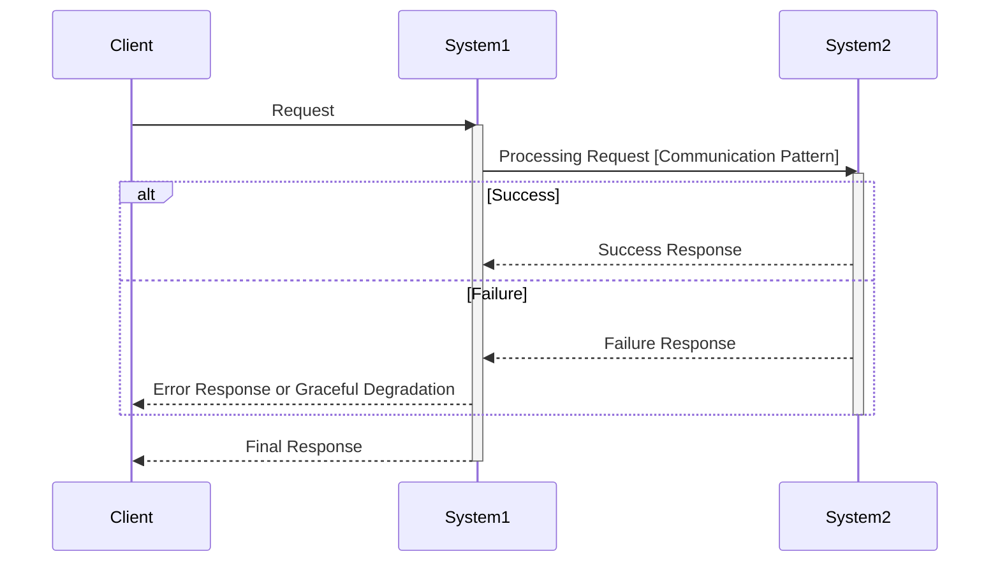
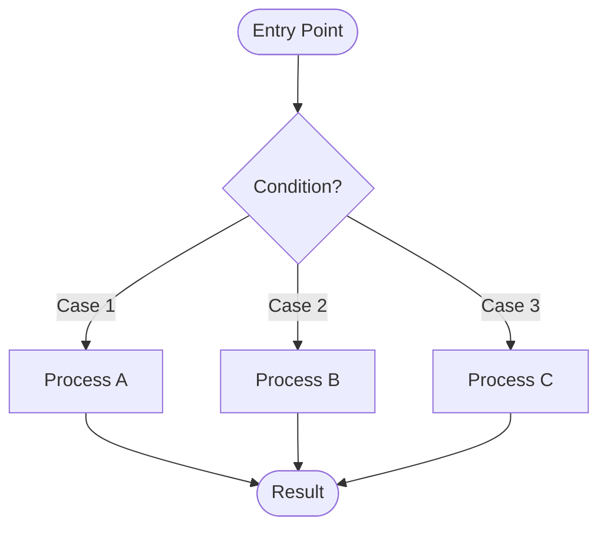
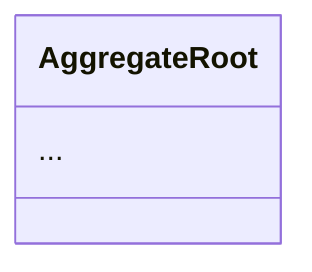
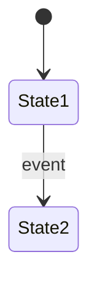

# Phase Output Formats

Output format templates for each phase of the spec skill.

---

## Design Area Selection Template

After completing Phase 2 (Solution Design), use the following template to present Design Area selection to the user:

### AskUserQuestion Format

```yaml
AskUserQuestion:
  header: "Design Areas"
  question: "Based on the Solution Design, the following Design Areas are recommended for this project:

    **Recommended:**
    - [Area Name]: [Specific reason based on project analysis]

    **Optional:**
    - [Area Name]: [Why it may or may not be needed]

    Which Design Areas should we proceed with?"
  multiSelect: true
  options:
    - label: "Domain Model (Recommended)"
      description: "[Specific justification - e.g., 'Order entity has 5 state transitions with complex business rules']"
    - label: "Data Schema (Recommended)"
      description: "[Specific justification - e.g., 'Requires new RDB tables for order and payment data']"
    - label: "Interface Contract (Recommended)"
      description: "[Specific justification - e.g., 'New REST API endpoints for order management']"
    - label: "Integration Pattern"
      description: "[Specific justification or 'Not needed - no external system integration required']"
    - label: "Operations Guide"
      description: "[Specific justification or 'Standard deployment sufficient - no custom monitoring needed']"
```

### Recommendation Criteria

Use the following criteria to determine which Design Areas to recommend:

| Design Area | Recommend When | Skip When |
|-------------|----------------|-----------|
| Domain Model | 3+ state transitions, complex business rules, aggregate boundaries to define | Simple CRUD, no state management, straightforward entity relationships |
| Data Schema | New DB tables needed, schema changes, migration required | No persistent storage, using existing schema |
| Interface Contract | External API/CLI/Event interfaces exposed, consumer documentation needed | Internal-only functionality, no external interface |
| Integration Pattern | Cross-system communication, async processing, external service calls, stateful components | Single system scope, no external integration |
| Operations Guide | Custom monitoring needed, non-standard deployment, production-specific concerns | Standard APM sufficient, conventional deployment |

### Validation Rules

1. **No Selection**: If user selects zero Design Areas, ask for justification before proceeding
2. **Deselecting Recommended**: If user removes a recommended Design Area, ask for specific reason
3. **Adding Non-Recommended**: User may always add Design Areas not initially recommended

---

## Phase 1: Requirements Analysis

```markdown
# Requirements Analysis Document: [Project Name]

## 1. Project Overview

### 1.1 Problem to Solve
[Description of the core problem this project aims to solve]

### 1.2 Project Objectives
[Description of project objectives and expected business value]

### 1.3 Expected Benefits
[Description of expected benefits and success metrics]

### 1.4 Project Completion Criteria
This project is considered complete when all of the following conditions are satisfied.
First, ... Second, ... Third, ...

---

## 2. Domain Glossary

| Term | Definition |
|-----|-----|
| ... | ... |

### 2.1 User Action Definitions
[Include only if the system tracks user actions]

**[Action Name]:** [When it occurs], [How duplicates are handled], [Behavior on cancellation]

### 2.2 Business Rules

**[Rule Name]:**
[Rule description in clear prose. Include business rationale - why this rule exists.]

**Example:**
[Specific example with numbers illustrating the rule]

---

## 3. Primary Users and Goals

### 3.1 [User Type 1]
[User goals described in prose]

### 3.2 [User Type 2]
[User goals described in prose]

---

## 4. Use Case Specifications

### US-1: [Use Case Name]

**User Story:**
[As-Want-So that format, written in prose]

**Acceptance Criteria:**
1. [Testable condition]
2. [Testable condition]
3. ...

**Exception Scenarios:**
1. [Error condition and expected system behavior]
2. ...

[If no error cases: "N/A: [specific reason]"]

---

## 5. Non-Functional Requirements

### 5.1 [Requirement Category]
[Requirement description in prose, followed by verification criteria]

**Verification Criteria:** [Specific, measurable criteria]

---

## 6. Validation Scenarios

### 6.1 [Scenario Name]
[E2E scenario with specific numbers and expected results. Should read like a test case.]

### 6.2 [Scenario Name]
[Additional scenarios covering edge cases, time-based behavior, etc.]
```

---

## Phase 2: Solution Design

```markdown
# Solution Design Document

## 1. Design Context

### 1.1 Core Challenges to Solve
- Summary of core problems to solve
- Business/technical requirements

### 1.2 Current Architecture Impact
- Relevant current system structure
- Existing system characteristics affecting the solution

### 1.3 Technology Stack Overview
- Technology stack being utilized

## 2. Solution Alternative Analysis

### Alternative 1: [Alternative Name]
- **Description**: Description of the solution approach
- **Problem Resolution**: How it meets the requirements
- **Pros**:
  - Pro 1
  - Pro 2
- **Cons**:
  - Con 1
  - Con 2
- **Architecture Impact**: Impact on existing systems

[Repeat for Alternative 2, 3 if needed]

## 3. Selected Solution

### 3.1 Decision Summary
- Brief description of the selected solution
- Reasons for the decision (with clear rationale)

### 3.2 Solution Structure

#### Core Architecture Components

**1. [System Name]**
- Responsibility 1
- Responsibility 2
- Responsibility 3

#### Data Flow

**1. [Use Case Name] Flow**



#### Internal Logic Flowchart (if complex branching exists)

> Include only when a single component has 3+ branch points. See `references/diagram-selection.md` for selection criteria.



### 3.3 Inter-system Integration

| Integration Point | Communication Pattern | Sync/Async | Failure Handling | Rationale |
|-------------------|----------------------|------------|------------------|-----------|
| A -> B | Function Call (in-process) | Sync | Graceful Degradation | Same module, minimize latency |
| A -> C | Kafka | Async | Retry 3x + DLQ | Service separation, ordering required |
| A -> D | HTTP | Sync | Timeout with Fallback | Separate service, real-time response needed |

### 3.4 Data Consistency Policy (if applicable)

| Storage Relationship | Source of Truth | Consistency Policy | Rationale |
|---------------------|-----------------|-------------------|-----------|
| RDB <-> Cache | RDB | Ignore cache failures, periodic sync | Approximation acceptable |

### 3.5 Transaction Boundaries (if applicable)

| Operation | Transaction Scope | Pattern | Notes |
|-----------|------------------|---------|-------|
| ... | ... | Single DB / Outbox / Saga | ... |

### 3.6 Event Contracts (for event-driven integration)

**Consumed Events:**

| Event Name | Required Fields | Publisher |
|------------|-----------------|-----------|
| ... | ... | ... |

**Published Events:**

| Event Name | Required Fields | Consumer |
|------------|-----------------|----------|
| ... | ... | ... |
```

---

## Design Area Outputs

The following output formats are used for dynamically selected Design Areas.

---

### Domain Model Design Area

```markdown
# Domain Modeling Document

## 1. Class Diagram



### Key Structure
- Aggregate composition and responsibilities
- Design intent and reference relationship explanation

### Value Object Invariants

| Value Object | Invariant | Notes |
|-------------|-----------|-------|
| Money | amount >= 0 | Constructor validation |
| ... | ... | ... |

### Repository/Port Interfaces

Define operations needed from domain perspective in business terms. For implementation details (SQL, cache commands, etc.), refer to detailed-design.

**[Repository/Port Name]**

| Method | Business Meaning |
|--------|-----------------|
| save(entity) | Save entity |
| findById(id) | Find by ID |
| ... | ... |

## 2. Domain Rules

### 2.1 [Rule Category Name]
- Rule 1
- Rule 2

### 2.2 [Rule Category Name]
- Rule 1
- Rule 2

[Use table format for calculation logic]

| Condition | Calculation Method | Example |
|-----------|-------------------|---------|
| ... | ... | ... |

### 2.X Domain Service Usage Rules (if multiple methods exist)

**[Service Name] Method Relationships**

| Situation | Method to Use | Description |
|-----------|--------------|-------------|
| ... | ... | ... |

## 3. State Diagram



### State Transition Rules

| Current State | Event | Next State | Transition Condition | Side Effects |
|--------------|-------|------------|---------------------|--------------|
| ... | ... | ... | ... | ... |

## 4. Domain Events

### Current Usage Status
[Used/Not used with clear reasoning]

### Event List (if used)

**Publisher Side**:

| Event Name | Publisher | Trigger Condition |
|------------|-----------|------------------|
| OrderCreatedEvent | OrderService | After successful order creation |

**Consumer Side**:

| Event Name | Consumer | Processing Content |
|------------|----------|-------------------|
| OrderCreatedEvent | NotificationEventListener | Delegates to NotificationService.sendOrderConfirmation() |

**Payload**:

| Event Name | Fields | Description |
|------------|--------|-------------|
| OrderCreatedEvent | orderId, customerId, totalAmount, occuredAt | Order identification and basic information |

Note: Publishing and consuming can be developed/tested/deployed independently. The event payload is the contract connecting them.

### Potential Future Events (if not used)
- Event 1: Timing/conditions for introduction
- Event 2: Timing/conditions for introduction
```

---

### Data Schema Design Area

```markdown
# Data Schema Document

## 1. Table Schema

### 1.1 [Table Name] Table

```sql
CREATE TABLE table_name (
    ...
);
```

**Column Descriptions:**
- `column_name`: Description

## 2. Repository Implementation Details

Implementation details for Repository/Port interfaces defined in domain modeling.

### 2.1 [Repository/Port Name]

| Method | Implementation Approach | Performance Characteristics |
|--------|------------------------|----------------------------|
| upsertMetric() | INSERT ... ON CONFLICT DO UPDATE | O(log n), row lock |
| getTopN(n) | ZREVRANGE key 0 n-1 WITHSCORES | O(log n + m) |

**Key SQL/Commands:**

```sql
-- upsertMetric implementation
INSERT INTO table_name (...)
VALUES (...)
ON CONFLICT (key) DO UPDATE SET ...
```

## 3. Index Strategy

[Write only if additional indexes are needed. Otherwise note "Existing constraints are sufficient"]

## 4. Migration Strategy

[Write only if migration is required]
```

---

### Integration Pattern Design Area

```markdown
# Integration Pattern Document

## 1. Integration Points Summary

| Integration Point | Communication Pattern | Sync/Async | Failure Handling | Rationale |
|-------------------|----------------------|------------|------------------|-----------|
| A -> B | Function Call (in-process) | Sync | Graceful Degradation | Same module, minimize latency |
| A -> C | Kafka | Async | Retry 3x + DLQ | Service separation, ordering required |

## 2. Data Flow Diagrams

### 2.1 [Use Case Name] Flow


### 2.X [Component Name] Internal Logic (if complex branching exists)

> Include only when a single component has 3+ branch points. See `references/diagram-selection.md` for selection criteria.


## 3. Stateful Component Policies

### 3.1 [Component Name]

**Purpose:** Description of component's role

**Data Structure Choice:** [Map/Queue/List/etc.] - [Why this choice]

**Concurrency Policy:** [Single-threaded/Lock-based/Lock-free] - [Rationale]

**Lifecycle:**

| Event | Handling |
|-------|----------|
| Initialization | ... |
| Periodic Tasks | ... |
| On Failure | ... |
| On Shutdown | ... |

## 4. Error and Recovery Flows

### 4.1 Major Error Scenarios

| Failure Scenario | Response Plan | Expected Outcome |
|------------------|---------------|------------------|
| ... | ... | ... |

### 4.2 Transaction Boundaries

| Operation | Transaction Scope | Pattern | Notes |
|-----------|------------------|---------|-------|
| ... | ... | Single DB / Outbox / Saga | ... |
```

---

### Operations Guide Design Area

```markdown
# Operations Guide Document

## 1. Observability Design

### 1.1 Custom Metrics

[Write only project-specific metrics]

| Metric Name | Type | Labels | Description |
|-------------|------|--------|-------------|
| ... | Counter/Gauge/Histogram | ... | ... |

### 1.2 Custom Logging

[Write only project-specific logging]

| Log Event | Level | Fields | Description |
|-----------|-------|--------|-------------|
| ... | INFO/WARN/ERROR | ... | ... |

## 2. Deployment Strategy

### 2.1 Deployment Order
1. ...

### 2.2 Backward Compatibility
- ...

### 2.3 Rollback Strategy
- ...

## 3. Failure and Recovery Plan

### 3.1 Failure Scenarios

| Failure Scenario | Detection | Response Plan | Expected Outcome |
|------------------|-----------|---------------|------------------|
| ... | ... | ... | ... |

### 3.2 Recovery Procedures

[Recovery procedures for critical failure scenarios]
```

---

### Interface Contract Design Area

```markdown
# Interface Contract Document

## 1. Key Design Decisions and Background

### 1.1 Business Context
[Core problems, solution objectives, business requirements addressed by the interfaces]

### 1.2 Major Design Decisions
[Major interface design decisions and their rationale]

## 2. Interface Specifications

### 2.1 [Interface Name]

**Type**: [REST API / CLI / Event / gRPC / etc.]
**Endpoint/Command/Topic**: [Specification]

**Description**: [Interface function description]

**Request**:
```
[Request parameters or body structure]
```

**Response**:
```json
{
  "field": "value"
}
```

**Business Rules**:
- [Rule 1]
- [Rule 2]

**Error Cases**:

| Condition | Status/Code | Error Code | Message |
|-----------|-------------|------------|---------|
| ... | ... | ... | ... |

[Repeat for additional interfaces]

## 3. Interface Changes

### 3.1 Interfaces Being Added

| Type | Endpoint/Command | Description | Impact |
|------|------------------|-------------|--------|
| ... | ... | ... | ... |

### 3.2 Interfaces Being Modified (if applicable)

- **Target**: [Type] [Endpoint/Command]
- **Change Type**: [Field addition/removal/modification, path change, etc.]
- **Change Details**: [Specific change details]
- **Reason for Change**: [Background and reason for change]
- **Backward Compatibility**: [Maintained/Broken]
- **Migration Period**: [Specify if needed]

### 3.3 Deleted/Deprecated Interfaces (if applicable)

- **Target Interface**: [Type] [Endpoint/Command]
- **Action**: [Deletion/Deprecation]
- **Reason**: [Reason for action]
- **Replacement Interface**: [If a replacement exists]
- **End of Support Date**: [Date]
```

---

## Wrapup

Wrapup produces context files rather than a single output document. See `wrapup.md` in `references/` directory for details.

- `project.md` - Tech stack, constraints, team values
- `conventions.md` - Established patterns
- `decisions.md` - ADR-format decision records
- `gotchas.md` - Known pitfalls to avoid
