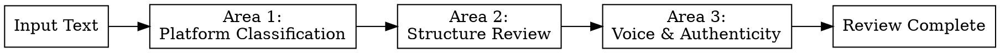

# Technical Copywriting Review

Reviews teaser/promotion text that accompanies technical blog post shares. 3-phase sequential review: Platform Classification → Structure Review → Voice & Authenticity.

## The Iron Law

- Perform all 3 Review Areas in order. Do not skip any Area.
- After completing each Area, present review results to the user and get approval.
- All principles are recommendations. Apply flexibly based on context.

## Non-Negotiable Rules

| Rule | Description |
|------|-------------|
| Sequential Execution | Platform → Structure → Voice order |
| Per-Area Approval | User confirmation after each Area |
| Before/After | All improvement suggestions in Before/After format |
| Cite Principle | Each suggestion must cite its principle ID (CP1~CP12) |

## Review Areas



### Area 1: Platform Classification

- **Reviews**: Platform identification, constraint compliance (char limits, link placement, format rules)
- **Enter when**: Review target text exists
- **Skip when**: User already specified platform and requested no platform verification
- **Reference**: `references/platform.md`

### Area 2: Structure Review

- **Reviews**: Hook quality, value delivery (takeaways), CTA appropriateness
- **Enter when**: Area 1 completed
- **Skip when**: Only voice-level review requested
- **Reference**: `references/structure.md`

### Area 3: Voice & Authenticity Review

- **Reviews**: Developer audience tone, authenticity, platform-specific manner, anti-marketing-speak
- **Enter when**: Area 2 completed (or Area 1 if Area 2 skipped)
- **Skip when**: Only structure-level review requested
- **Reference**: `references/voice.md`

## Review Output Format

Each Area's review results use this format:

```markdown
## Area N: {Area Name} Review

### Summary
- 총 {N}건의 개선 제안
- 심각도: Critical {N} / Suggestion {N}

### Findings

#### Finding 1: {제목}
- **원칙**: {원칙 ID} - {원칙 이름}
- **심각도**: Critical / Suggestion
- **Before**:
  > {원본 텍스트}
- **After**:
  > {개선된 텍스트}
- **근거**: {왜 이 변경이 필요한지}
```

**Severity criteria:**
- **Critical**: Text violates platform constraints, contains no hook, or has zero takeaways (reader scrolls past or gets no value)
- **Suggestion**: Tone/voice improvement, proportion adjustment, minor format optimization

## Area Completion Protocol

After completing each Area:
1. Present review results in Review Output Format
2. Ask user: "Area N 리뷰 결과를 확인해주세요. 다음 Area로 진행할까요?"
3. Proceed to next Area after user approval

## Review Completion

After all 3 Areas are complete:
1. Present overall review summary (finding count per Area, Critical/Suggestion ratio)
2. Priority-ordered improvement list (Critical → Suggestion)
3. Generate improved full teaser text upon user request

## Language

- Review results are written in Korean
- Principle IDs remain in English codes (CP1, CP2, etc.)
- Before/After examples maintain the original language
