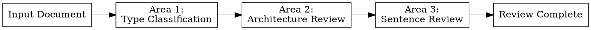

# Technical Writing Review

기술 문서를 리뷰하고 개선을 제안한다. 3단계 순차 리뷰: 유형 분류 → 정보 구조 → 문장 다듬기.

## The Iron Law

- 3개 Review Area를 순서대로 수행한다. Area를 건너뛰지 않는다.
- 각 Area 완료 시 리뷰 결과를 사용자에게 제시하고 승인을 받는다.
- 모든 원칙은 권장 사항이다. 상황에 따라 유연하게 적용한다.

## Non-Negotiable Rules

| Rule | Description |
|------|-------------|
| 순차 수행 | Type → Architecture → Sentence 순서 |
| Area별 승인 | 각 Area 완료 후 사용자 확인 |
| Before/After | 모든 개선 제안은 Before/After 형식으로 제시 |
| 근거 명시 | 각 제안에 해당 원칙 ID(T1~T15, P1~P15) 명시 |

## Review Areas



### Area 1: Type Classification

- **Reviews**: 문서 유형 분류, 유형별 필수 요소 검증
- **Enter when**: 리뷰 대상 문서가 존재
- **Skip when**: 사용자가 유형을 이미 명시하고 유형 검증 불필요 요청
- **Reference**: `references/type.md`

### Area 2: Architecture Review

- **Reviews**: 제목, 개요, 페이지 구성, 예측 가능성, 가치 우선, 배경 설명
- **Enter when**: Area 1 완료
- **Skip when**: 문장 수준 리뷰만 요청
- **Reference**: `references/architecture.md`

### Area 3: Sentence Review

- **Reviews**: 주체, 간결성, 구체성, 일관성, 한국어 자연성
- **Enter when**: Area 2 완료 (또는 Area 2 스킵 시 Area 1 완료)
- **Skip when**: 구조 수준 리뷰만 요청
- **Reference**: `references/sentence.md`

## Review Output Format

각 Area의 리뷰 결과는 다음 형식으로 제시:

```markdown
## Area N: {Area Name} Review

### Summary
- 총 {N}건의 개선 제안
- 심각도: Critical {N} / Suggestion {N}

### Findings

#### Finding 1: {제목}
- **원칙**: {원칙 ID} - {원칙 이름}
- **심각도**: Critical / Suggestion
- **Before**:
  > {원본 텍스트}
- **After**:
  > {개선된 텍스트}
- **근거**: {왜 이 변경이 필요한지}
```

**심각도 기준:**
- **Critical**: 독자가 정보를 잘못 이해하거나 못 찾을 수 있음 (주체 누락, 개요 없음, 유형 불일치)
- **Suggestion**: 가독성·자연스러움 개선 (메타담화, 번역체, 간결성)

## Area Completion Protocol

각 Area 완료 시:
1. 리뷰 결과를 Review Output Format으로 제시
2. 사용자 확인: "Area N 리뷰 결과를 확인해주세요. 다음 Area로 진행할까요?"
3. 사용자 승인 후 다음 Area 진행

## Review Completion

3개 Area 완료 후:
1. 전체 리뷰 요약 제시 (Area별 Finding 수, Critical/Suggestion 비율)
2. 우선순위 순 개선 제안 목록 (Critical → Suggestion)
3. 사용자 요청 시 개선된 전체 문서 생성

## Language

- 리뷰 결과는 한국어로 작성
- 원칙 ID는 영문 코드 유지 (T1, P1 등)
- Before/After 예시는 원문 언어 유지
