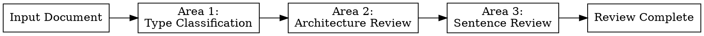

# Technical Writing Review

Reviews technical documents and suggests improvements. 3-phase sequential review: Type Classification → Information Architecture → Sentence Refinement.

## Why Technical Writing

The purpose of technical documentation is to **convey information** accurately to readers, not to evoke emotion.

Technical writing is difficult for three reasons: (1) writers already know the answer and struggle to imagine what readers do not know (the curse of knowledge), (2) accuracy and brevity are both required, creating constant trade-offs, and (3) documents evolve alongside code and products rather than being written once, making consistency difficult to maintain.

## The Iron Law

- Perform all 3 Review Areas in order. Do not skip any Area.
- After completing each Area, present review results to the user and get approval.
- All principles are recommendations. Apply flexibly based on context.

## Non-Negotiable Rules

| Rule | Description |
|------|-------------|
| Sequential Execution | Type → Architecture → Sentence order |
| Per-Area Approval | User confirmation after each Area |
| Before/After | All improvement suggestions in Before/After format |
| Cite Principle | Each suggestion must cite its principle ID (sentence T1~T16; architecture P1~P15, PA16/PA17, P26; type P16~P24) |

## Review Areas


```dot
digraph review_flow {
    rankdir=LR;
    node [shape=box];

    "Input Document" -> "Area 1:\nType Classification";
    "Area 1:\nType Classification" -> "Area 2:\nArchitecture Review";
    "Area 2:\nArchitecture Review" -> "Area 3:\nSentence Review";
    "Area 3:\nSentence Review" -> "Review Complete";
}
```

### Area 1: Type Classification

- **Reviews**: Document type classification, required elements verification per type
- **Enter when**: Review target document exists
- **Skip when**: User already specified type and requested no type verification
- **Reference**: `references/type.md`

### Area 2: Architecture Review

- **Reviews**: Headings, overview, page structure, predictability, value-first, background explanation
- **Enter when**: Area 1 completed
- **Skip when**: Only sentence-level review requested
- **Reference**: `references/architecture.md`

### Area 3: Sentence Review

- **Reviews**: Subject clarity, conciseness, specificity, consistency, Korean naturalness
- **Enter when**: Area 2 completed (or Area 1 if Area 2 skipped)
- **Skip when**: Only structure-level review requested
- **Reference**: `references/sentence.md`

## Review Output Format

Each Area's review results use this format:

```markdown
## Area N: {Area Name} Review

### Summary
- 총 {N}건의 개선 제안
- 심각도: Critical {N} / Suggestion {N}

### Findings

#### Finding 1: {Title}
- **원칙**: {Principle ID} - {Principle name}
- **심각도**: Critical / Suggestion
- **Before**:
  > {Original text}
- **After**:
  > {Improved text}
- **근거**: {Why this change is needed}
```

**Severity criteria:**
- **Critical**: Reader may misunderstand or fail to find information (missing subject, no overview, type mismatch)
- **Suggestion**: Readability/naturalness improvement (meta-discourse, translationese, conciseness)

## Area Completion Protocol

After completing each Area:
1. Present review results in Review Output Format
2. Ask user: "Area N 리뷰 결과를 확인해주세요. 다음 Area로 진행할까요?"
3. Proceed to next Area after user approval

## Review Completion

After all 3 Areas are complete:
1. Present overall review summary (finding count per Area, Critical/Suggestion ratio)
2. Priority-ordered improvement list (Critical → Suggestion)
3. Generate improved full document upon user request

## Completion gate — required deliverable

Do NOT report this work as done until the deliverable below exists. If it is missing or incomplete, you MUST, in order:

1. **Study the guideline** — read the reference that governs the deliverable before producing it.
2. **Produce** the deliverable exactly per that guideline.
3. **Deliver** it to its stated path.

| Deliverable | Guideline to study | Delivered to |
|---|---|---|
| The completed 3-Area review (Before/After findings cited to a principle ID, per Review Output Format), and the improved full document when the user requests it | SKILL.md's 3-area protocol (Iron Law + Non-Negotiable Rules) and each Area's own reference (`references/type.md`, `references/architecture.md`, `references/sentence.md`) | Presented to the user in the conversation, in Korean |

A "done" claim with an Area skipped, a finding missing its Before/After or principle citation, or (when requested) no improved document produced is a failed completion, not a shortcut: study the guideline, produce the deliverable, then finish.

## Language

- Review results are written in Korean
- Principle IDs remain in English codes (T1, P1, etc.)
- Before/After examples maintain the original language
